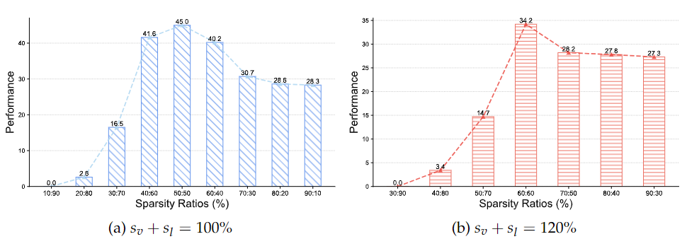
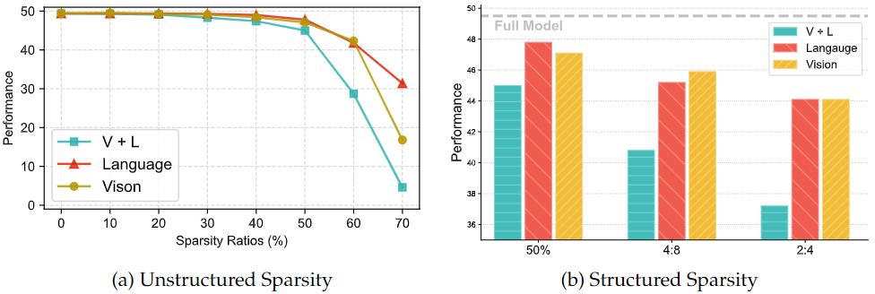
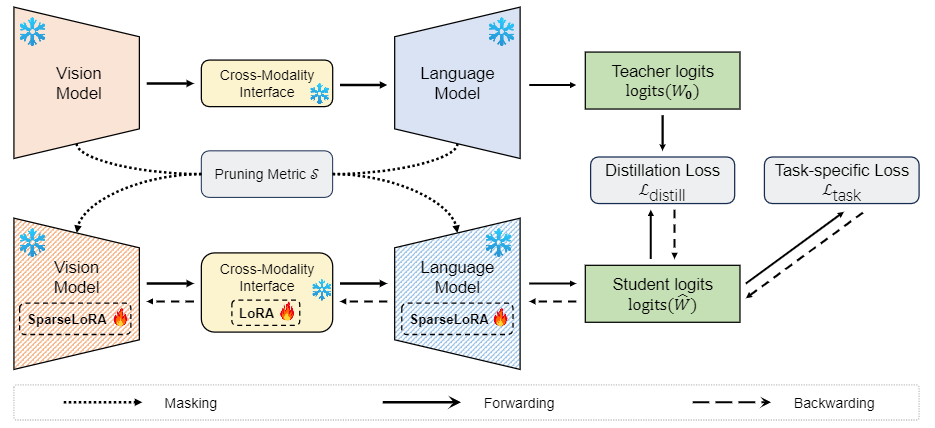
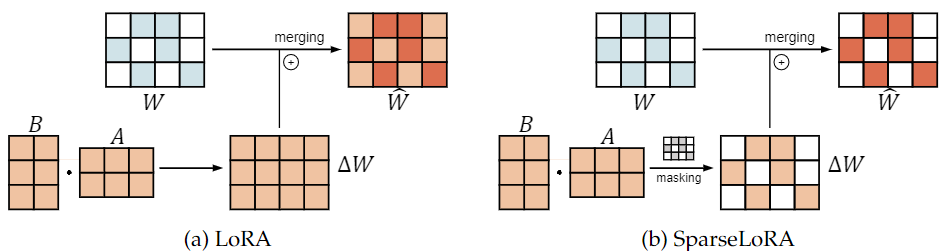
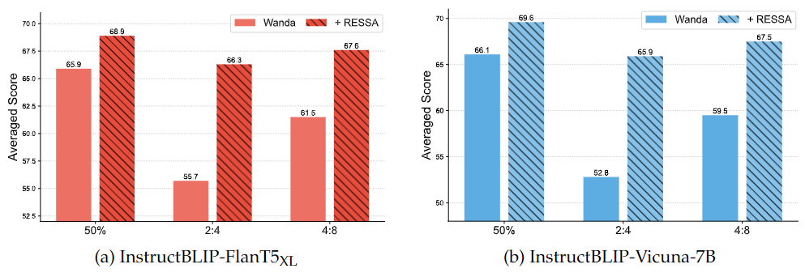

# RESSA: Repair Sparse Vision-Language Models via Sparse Cross-Modality Adaptation
This is the official repository for [**RESSA**](https://arxiv.org/abs/2404.02424).  
[Shwai He](https://shwai-he.github.io/), [Tianlong Chen](https://tianlong-chen.github.io/)

Vision-Language Models (VLMs) encompass models from different modalities, namely vision and language. In this study, we initially investigate the allocation of sparsity ratios across these diverse models.

On one hand, while maintaining a constant sum of sparsity ratios for both the vision and language models, we experimented with various combinations of sparsity ratios. Interestingly, we observed that pruning the vision and language models with identical sparsity ratios yielded nearly optimal performance.



On the other hand, we observed that compared to pruning both the vision and language models simultaneously, focusing solely on pruning the language model, which typically contains the majority of parameters, resulted in a significant recovery of performance.



To further repair the performance of sparse VLMs, we introduce RESSA, a method that leverages cross-modality adaptation and SparseLoRA finetuning.



In contrast to traditional LoRA finetuning, which cannot be integrated with sparse weights and introduces additional latency, we introduce SparseLoRA, a method that applies binary masks to LoRA weights:


The "Prune and then RESSA" paradigm demonstrates substantial improvements for sparse VLMs across various modal architectures and tasks.




## Requirements
pip install -r requirements

### Dataset
Follow the scripts in `lavis/datasets/download_scripts/` to download the datasets.

### Scripts
```bash
## InstructBLIP-FlanT5-XL experiments 

# prune and retrain
sh scripts/T5/train.sh

# Wanda
sh scripts/T5/wanda.sh

# SparseGPT
sh scripts/T5/sparsegpt.sh

# DSnoT
sh scripts/T5/dsnot.sh
```
You can also adapt the script to your own needs.

## Citation
Please cite the paper if the resource in this repo or the paper is helpful to you.
```
@misc{he2024ressa,
      title={RESSA: Repair Sparse Vision-Language Models via Sparse Cross-Modality Adaptation}, 
      author={Shwai He and Tianlong Chen},
      year={2024},
      eprint={2404.02424},
      archivePrefix={arXiv},
      primaryClass={cs.LG}
}
```