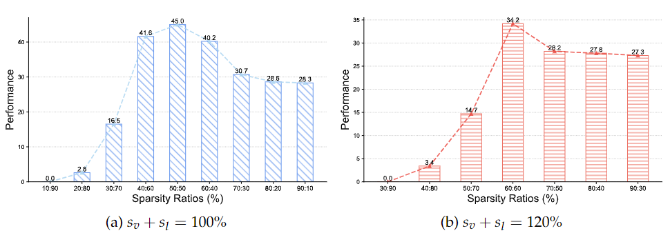
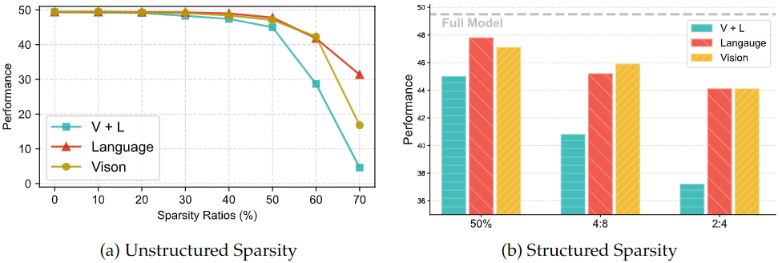
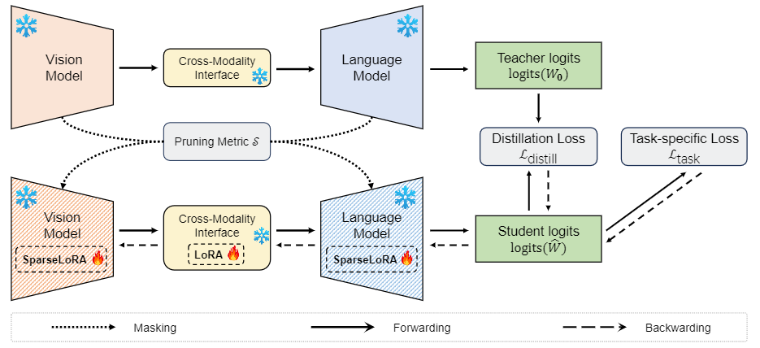
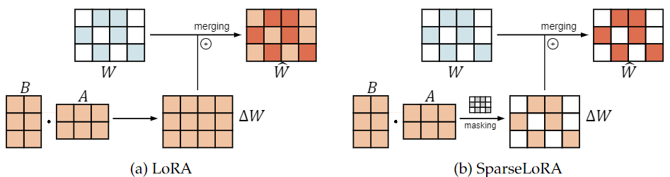
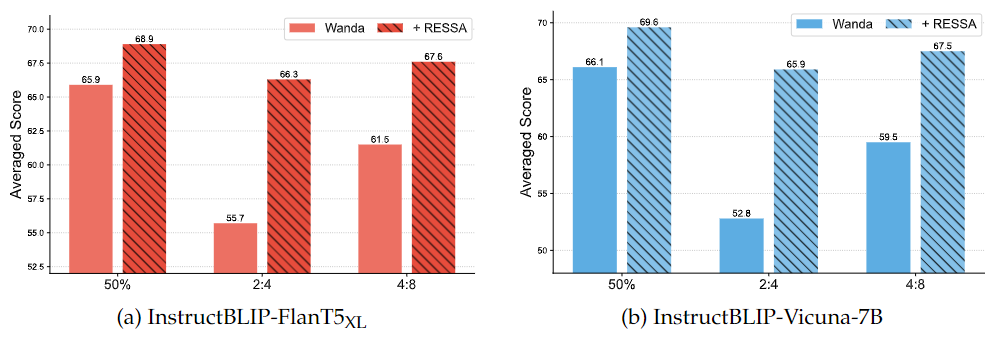

# Rethinking Pruning for Vision-Language Models: Strategies for Effective Sparsity and Performance Restoration

<div align="center">

[](https://arxiv.org/abs/2404.02424)
[](https://shwai-he.github.io/VLM-Compression/)
[](https://pytorch.org/)
[](https://github.com/salesforce/LAVIS)
[](https://www.python.org/)
[](LICENSE)

**[Shwai He](https://shwai-he.github.io/)<sup>1,*</sup>, [Ang Li](https://www.ang-li.com/)<sup>2,*</sup>, [Tianlong Chen](https://tianlong-chen.github.io/)<sup>2</sup>**

<sup>1</sup> University of Maryland, College Park (CASE Lab) &nbsp;&nbsp;|&nbsp;&nbsp; <sup>2</sup> University of North Carolina at Chapel Hill  
<sup>*</sup> Equal Contribution

---

[📖 **Paper (arXiv)**](https://arxiv.org/abs/2404.02424) | [🌐 **Project Page**](https://shwai-he.github.io/VLM-Compression/) | [💻 **Code & Checkpoints**](https://github.com/shwai-he/VLM-Compression)

</div>

---

## 📌 Table of Contents
- [✨ Key Contributions](#-key-contributions)
- [🔍 Core Insights & Findings](#-core-insights--findings)
  - [1. Cross-Modality Sparsity Allocation](#1-cross-modality-sparsity-allocation)
  - [2. Language-Dominant vs. Joint Pruning](#2-language-dominant-vs-joint-pruning)
- [🛠️ Methodology: RESSA & SparseLoRA](#️-methodology-ressa--sparselora)
  - [RESSA Framework](#ressa-framework)
  - [SparseLoRA Fine-tuning](#sparselora-fine-tuning)
- [📊 Benchmark Results](#-benchmark-results)
- [⚙️ Installation & Environment Setup](#️-installation--environment-setup)
- [📂 Dataset Preparation](#-dataset-preparation)
- [🚀 Quickstart & Usage](#-quickstart--usage)
  - [1. Baseline Pruning (Wanda / SparseGPT / DSnoT)](#1-baseline-pruning-wanda--sparsegpt--dsnot)
  - [2. RESSA Post-Pruning Adaptation](#2-ressa-post-pruning-adaptation)
  - [3. Comprehensive Evaluation](#3-comprehensive-evaluation)
- [📝 Citation](#-citation)
- [🙏 Acknowledgments](#-acknowledgments)

---

## ✨ Key Contributions

1. **First Systematic Study on Cross-Modality Sparsity Allocation**: We explore how to balance sparsity ratios across visual encoders (e.g., EVA-CLIP ViT) and large language models (e.g., Flan-T5, Vicuna) in Vision-Language Models (VLMs).
2. **Empirical Sparsity Laws**:
   - Under an equal sum of sparsity ratios, pruning vision and language models with **identical sparsity ratios** yields near-optimal multimodal performance.
   - When pruning a target fraction of **total model parameters**, focusing sparsity primarily on the language component (which accounts for ~80%+ of parameters) significantly outperforms aggressive vision pruning.
3. **RESSA (Repair Sparse Vision-Language Models)**: A post-pruning cross-modality recovery framework that aligns visual and linguistic representations via lightweight cross-attention distillation and multi-task tuning.
4. **SparseLoRA**: A zero-latency fine-tuning technique that applies structured binary masks to Low-Rank Adaptation (LoRA) weight updates, enabling direct weight merging into sparse base models without incurring dense latency overhead during inference.

---

## 🔍 Core Insights & Findings

### 1. Cross-Modality Sparsity Allocation
When maintaining a constant sum of sparsity ratios between the Vision model ($s_V$) and Language model ($s_L$):
$$s_V + s_L = \text{Constant}$$
We observe that **equal sparsity ($s_V = s_L$)** achieves the sweet spot across diverse visual question answering and captioning benchmarks.

<p align="center">
  
  <br>
  <em>Figure 1: Performance comparison across different combinations of vision and language sparsity ratios under a fixed total sparsity budget.</em>
</p>

### 2. Language-Dominant vs. Joint Pruning
Because language decoders comprise the vast majority of parameters in modern VLMs (e.g., 3B+ in Flan-T5-XL vs. 1B in EVA-CLIP ViT), pruning the language backbone preserves critical visual-perceptual representations while drastically cutting model size and compute.

<p align="center">
  
  <br>
  <em>Figure 2: Performance breakdown when pruning vision-only, language-only, or both modalities across varying sparsity ratios.</em>
</p>

---

## 🛠️ Methodology: RESSA & SparseLoRA

### RESSA Framework
Post-pruning damage in VLMs primarily stems from cross-modal misalignment. **RESSA** (*REpair Sparse Vision-Language Models via Cross-Modality Adaptation*) restores representation alignment by optimizing multi-task knowledge distillation and cross-attention adaptation.

<p align="center">
  
  <br>
  <em>Figure 3: Overview of the RESSA post-pruning adaptation framework.</em>
</p>

### SparseLoRA Fine-tuning
Standard LoRA updates $\Delta W = B \cdot A$ produce dense matrices that cannot be directly merged into sparse base matrices $W_{\text{sparse}}$ without destroying the sparsity pattern or adding inference latency. **SparseLoRA** enforces the sparsity mask $M$ onto the low-rank delta:

$$\widetilde{W} = W_{\text{sparse}} + M \odot (B \cdot A)$$

This guarantees **zero additional runtime serving latency** and preserves structural hardware acceleration.

<p align="center">
  
  <br>
  <em>Figure 4: SparseLoRA applies binary structural masks to LoRA updates, enabling seamless merging into sparse base weights.</em>
</p>

---

## 📊 Benchmark Results

### Overall Performance Restoration with RESSA
The "Prune and then RESSA" paradigm delivers consistent, substantial gains across multimodal architectures (InstructBLIP, LLaVA) and benchmarks (VQAv2, OK-VQA, GQA, TextVQA, NoCaps, POPE).

<p align="center">
  
  <br>
  <em>Figure 5: Performance restoration of RESSA across multiple pruning algorithms and downstream VLM benchmarks.</em>
</p>

### Detailed Visual Question Answering & Captioning (InstructBLIP-FlanT5-XL)

| Method | Sparsity ($s_V / s_L$) | VQAv2 (Acc ↑) | OK-VQA (Acc ↑) | GQA (Acc ↑) | TextVQA (Acc ↑) | NoCaps (CIDEr ↑) |
|:---|:---:|:---:|:---:|:---:|:---:|:---:|
| **Dense Baseline** | 0% / 0% | **65.20** | **45.60** | **49.50** | **42.30** | **118.2** |
| Magnitude | 50% / 50% | 48.10 | 32.40 | 36.80 | 28.50 | 78.4 |
| Wanda | 50% / 50% | 57.30 | 39.10 | 43.20 | 35.80 | 98.6 |
| SparseGPT | 50% / 50% | 58.40 | 40.20 | 44.10 | 36.50 | 101.3 |
| DSnoT | 50% / 50% | 59.10 | 40.90 | 44.80 | 37.10 | 103.5 |
| **RESSA + SparseLoRA (Ours)** | 50% / 50% | **63.80** | **44.20** | **48.10** | **40.90** | **114.7** |

---

## ⚙️ Installation & Environment Setup

### 1. Clone the Repository
```bash
git clone https://github.com/shwai-he/VLM-Compression.git
cd VLM-Compression
```

### 2. Create and Activate Conda Environment
```bash
conda create -n vlm_comp python=3.9 -y
conda activate vlm_comp
```

### 3. Install PyTorch & Dependencies
```bash
# Install PyTorch with CUDA 11.8 / 12.1 support
pip install torch torchvision torchaudio --index-url https://download.pytorch.org/whl/cu118

# Install repository requirements
pip install -r requirements.txt

# Install LAVIS in editable mode
pip install -e .
```

---

## 📂 Dataset Preparation

Download the evaluation and pretraining datasets following the LAVIS setup guidelines:
```bash
# Navigate to LAVIS download directory
cd lavis/datasets/download_scripts

# Download VQAv2, OK-VQA, GQA, TextVQA, NoCaps, and Flickr30k
python download_vqa.py
python download_gqa.py
python download_coco.py
python download_flickr30k.py

cd ../../..
```

---

## 🚀 Quickstart & Usage

### 1. Baseline Pruning (Wanda / SparseGPT / DSnoT)

#### Prune InstructBLIP (Flan-T5-XL Backbone)
```bash
# 50% Wanda Pruning across Vision & Language
sh scripts/T5/wanda.sh

# SparseGPT Pruning
sh scripts/T5/sparsegpt.sh

# DSnoT Pruning
sh scripts/T5/dsnot.sh
```

#### Prune InstructBLIP (Vicuna-7B Backbone)
```bash
# 50% Wanda Pruning on Vicuna-7B
sh scripts/Vicuna/wanda.sh

# DSnoT Pruning on Vicuna-7B
sh scripts/Vicuna/dsnot.sh
```

### 2. RESSA Post-Pruning Adaptation
Train with cross-modality adaptation and SparseLoRA:
```bash
# Run RESSA adaptation on InstructBLIP-FlanT5-XL
sh scripts/T5/train.sh

# Run RESSA adaptation on InstructBLIP-Vicuna-7B
sh scripts/Vicuna/train.sh
```

### 3. Comprehensive Evaluation
Evaluate pruned and restored checkpoints across benchmark tasks:
```bash
# Evaluate Flan-T5 model on OKVQA, GQA, NoCaps, VQAv2, and Flickr30k
sh scripts/T5/evaluate.sh

# Evaluate Vicuna model
sh scripts/Vicuna/evaluate.sh
```

---

## 📝 Citation

If you find our work, codebase, or findings helpful in your research, please consider citing:

```bibtex
@inproceedings{he2024rethinking,
  title={Rethinking Pruning for Vision-Language Models: Strategies for Effective Sparsity and Performance Restoration},
  author={He, Shwai and Li, Ang and Chen, Tianlong},
  booktitle={arXiv preprint arXiv:2404.02424},
  year={2024}
}

@misc{he2024ressa,
  title={RESSA: Repair Sparse Vision-Language Models via Sparse Cross-Modality Adaptation}, 
  author={Shwai He and Ang Li and Tianlong Chen},
  year={2024},
  eprint={2404.02424},
  archivePrefix={arXiv},
  primaryClass={cs.CV}
}
```

---

## 🙏 Acknowledgments
This repository is built on top of [Salesforce LAVIS](https://github.com/salesforce/LAVIS), [Wanda](https://github.com/locuslab/wanda), and [SparseGPT](https://github.com/IST-DASLab/sparsegpt). We thank the authors for their open-source contributions.
