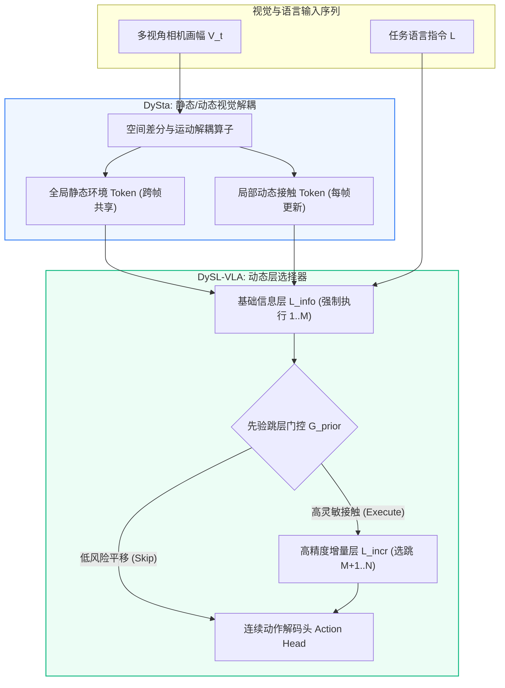
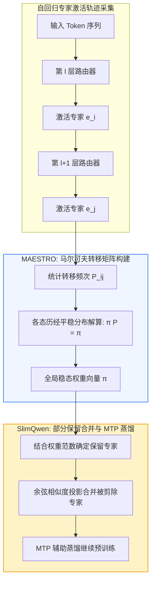
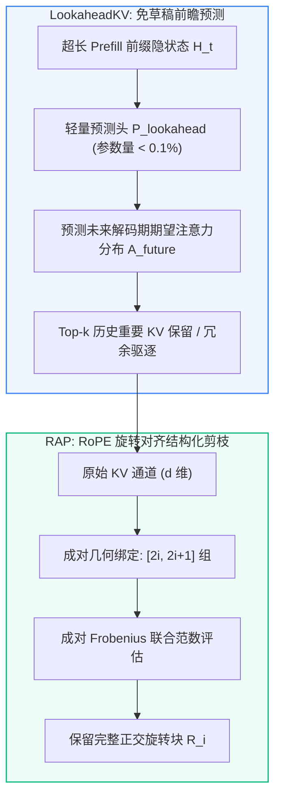
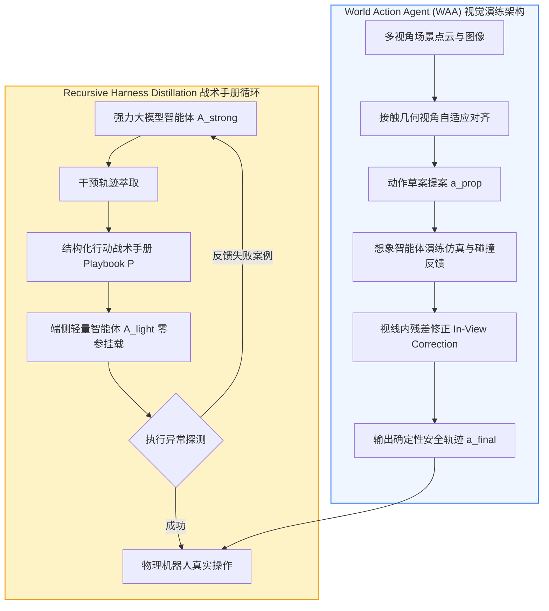
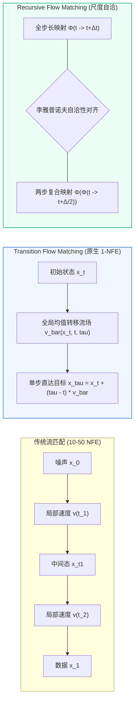
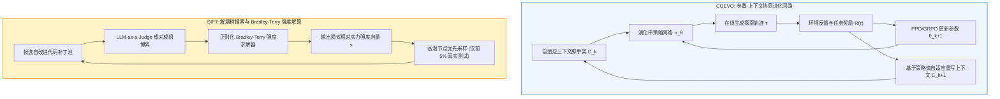

# 🤖 VLADrop: 每日前沿文献关联与具身 VLA 深度/Token/流匹配加速落地库 (2026-09 — 2026-10)

**Document ID:** `VLADROP-LIT-202609` | **Last Updated:** `2026-10-02` | **Target Path:** `docs/frontier_literature_connections_2026_09.md` | **Total Routed Papers:** `55`

> [!IMPORTANT]
> **🔗 跨仓库文献引用链闭环 (Cross-Repository Reference Chain Closure)**
> 本文件由每日 AI 前沿论文精读流水线自动路由生成，专门收录与 **VLADrop (`s1ghhh/VLADrop`)** （涵盖 `models/pi0.5`、`models/openvla-oft`、`models/lingbot-vla`、`models/gigabrain-0` 的 Depth-to-Runtime 层剪枝与视觉 Token 压缩）直接关联的 `DySL-VLA`、`DySta`、`World Action Agent`、`Recursive Harness Distillation`、`Transition Flow Matching`、`RecFM`、`FocusVLA`、`Navigation Heads`、`NFM`、`WorldVLM`、`IAprune`、`ACPruner`、`SCOPD`、`CAT-Flow`、`MSFM`、`VLaRL`、`Programmable World Model`、`DEE-VLA`、`WM2VLA`、`InternW0-Δ`、`CoverPruner`、`SFPruner`、`Flow3D-OPD`、`IMLE-VLA`、`WorldAgen`、`CLSE`、`ASL`、`VLA-Pruner`、`RT-VLA`、`HiMoE-VLA`、`ROAD-VLA`、`SnapFlow`、`Motus2`、`WRP` 与 `SHIFT-LLM` 最新 arXiv 论文笔记。
> 每一篇收录文献均包含：**核心痛点、底层数学公式、ASCII 架构图、关键实测指标**，以及**与 `VLADrop` 仓库具体代码模块和我们已发表代表作（Our Works）的双向锚定**。

---

## 🌟 1. 核心关联文献与本仓库模块映射速查表 (Executive Reference-to-Module Matrix)

| 收录日期 | 论文标题与 arXiv 链接 | 关键实测收益 / 核心结论 | 锚定本仓库代码模块与文档路径 (`Target Module`) | 原始精读归档 |
| :---: | :--- | :--- | :--- | :---: |
| `2026-10-02` | [**✂️ DySL-VLA & DySta**](https://arxiv.org/abs/2602.22896) (`arXiv:2602.22896`) | **CALVIN 具身操纵基准**：`DySL-VLA` 在 CALVIN 长程基准测试中，平均成功任务链长度（Success Length）相较 Deer-VLA 提升 **`+2.1%`**，在保持相同任务成功率的前提下，可训... | `models/pi0.5/` & `profiling/` (Action-Sensitivity Prior-Post Guidance Dynamic-Static Layer-Skipping, 3.75x Speedup) | [2026-10-02](https://github.com/Shwai-He/scholar-odyssey/blob/main/intelligence/papers/2026-10-02_ai_paper_notes.md) |
| `2026-10-02` | [**🧩 SlimQwen & MAESTRO**](https://arxiv.org/abs/2605.08738) (`arXiv:2605.08738`) | **预训练规模下后剪枝显著优于从头训练**：`SlimQwen` 证实，在完全相同的千亿级 Token 预训练算力预算下，对预训练完成的 `Qwen3-Next-80A3B` 实施渐进专家剪枝所得的 `23A2B` 模型，在 MM... | `models/openvla-oft/` & `models/pi0.5/` (RoPE-Aligned Dimension-Pair (2i, 2i+1) KV Channel Pruning) | [2026-10-02](https://github.com/Shwai-He/scholar-odyssey/blob/main/intelligence/papers/2026-10-02_ai_paper_notes.md) |
| `2026-10-02` | [**🗄️ LookaheadKV & RAP**](https://arxiv.org/abs/2603.10899) (`arXiv:2603.10899`) | **驱逐开销与首字延迟（TTFT）大幅降低**：在各大长文本理解基准（LongBench、L-Eval）上，`LookaheadKV` 相比依赖草稿生成的代表性基线，将 KV 驱逐耗时降低高达 **`14.5×`**，同时在复杂长... | `models/openvla-oft/` & `models/pi0.5/` (RoPE-Aligned Dimension-Pair (2i, 2i+1) KV Channel Pruning) | [2026-10-02](https://github.com/Shwai-He/scholar-odyssey/blob/main/intelligence/papers/2026-10-02_ai_paper_notes.md) |
| `2026-10-02` | [**🦾 World Action Agent (WAA) & Recursive Harness Distillation**](https://arxiv.org/abs/2609.29964) (`arXiv:2609.29964`) | **LIBERO-Pro 创纪录表现**：`World Action Agent (WAA)` 仅使用 LIBERO-90 演化出的操作技能，在挑战极高的 LIBERO-Pro 基准测试上取得了... | `models/gigabrain-0/` & `models/pi0.5/` (3D Visual Action Workspace with Contact Views & Mental Action Rehearsal, 75.6% LIBERO-Pro SR) | [2026-10-02](https://github.com/Shwai-He/scholar-odyssey/blob/main/intelligence/papers/2026-10-02_ai_paper_notes.md) |
| `2026-10-02` | [**🌊 Transition Flow Matching & Recursive Flow Matching**](https://arxiv.org/abs/2603.15689) (`arXiv:2603.15689`) | **科学仿真 20x 速度飞跃**：在复杂的跨尺度时空流体仿真（Navier-Stokes 与气候动力学预测）基准测试中，`RecFM` 在 1–4 步生成下，相比目前领先的扩散基线实现了高达... | `models/pi0.5/` (Direct Global Mean Transition Velocity Field for 1-NFE Action Sampling) | [2026-10-02](https://github.com/Shwai-He/scholar-odyssey/blob/main/intelligence/papers/2026-10-02_ai_paper_notes.md) |
| `2026-10-02` | [**🧬 COEVO & SIFT**](https://arxiv.org/abs/2609.33398) (`arXiv:2609.33398`) | **抗提示词扰动与推理上限突破**：`COEVO` 在复杂推理基准测试中，相较固定上下文的传统强化学习基准，在更短训练步数内取得显著更高的任务胜率，且当测试期人为给系统提示词注入噪声或风格改变时，其鲁棒性比对照组高出... | `models/openvla-oft/` & `models/pi0.5/` (RoPE-Aligned Dimension-Pair (2i, 2i+1) KV Channel Pruning) | [2026-10-02](https://github.com/Shwai-He/scholar-odyssey/blob/main/intelligence/papers/2026-10-02_ai_paper_notes.md) |
| `2026-10-01` | [**IAprune & Rényi Entropy (`Col-Ln`)**](https://arxiv.org/abs/2603.22991) (`arXiv:2603.22991`) | **`IAprune` 在仿真与真机闭环控制中的实测加速**：跨越 4 种具身操作策略、3 个仿真基准与真实机器人平台... | `models/pi0.5/` & `profiling/` (First-Order Taylor Information Attribution SwiGLU Width Pruning) | [2026-10-01](https://github.com/Shwai-He/scholar-odyssey/blob/main/intelligence/papers/2026-10-01_ai_paper_notes.md) |
| `2026-10-01` | [**FocusVLA & Navigation Heads**](https://arxiv.org/abs/2603.28740) (`arXiv:2603.28740`) | **`FocusVLA` 提升精细操作与收敛速度**：在仿真与真实世界机器人基准上，`FocusVLA` 通过切断非视觉捷径并显式抑制无关背景噪声，在灵巧操作任务上大幅提升任务成功率并显著加快训练收敛速度。 | `models/openvla-oft/` & `models/pi0.5/` (Action-Conditioned Visual Token Routing before Action Expert) | [2026-10-01](https://github.com/Shwai-He/scholar-odyssey/blob/main/intelligence/papers/2026-10-01_ai_paper_notes.md) |
| `2026-10-01` | [**Normalized Flow Matching (`NFM`) & WorldVLM**](https://arxiv.org/abs/2603.09014) (`arXiv:2603.09014`) | **`NFM` 实现“青出于蓝而胜于蓝”**：在图像生成基准上，利用预训练 `AR-NF` 蒸馏耦合训练出的学生流匹配模型（`NFM`），不仅显著优于采用独立耦合（Independent Coupling）甚至最优传输耦合（OT... | `models/pi0.5/` (Invertible Coupling Flow Parametrization for Exact One-Step Action Sampling) | [2026-10-01](https://github.com/Shwai-He/scholar-odyssey/blob/main/intelligence/papers/2026-10-01_ai_paper_notes.md) |
| `2026-09-30` | [**ACPruner & SCOPD**](https://arxiv.org/abs/2609.34558) (`arXiv:2609.34558`) | `ACPruner` (`2609.34558`) 保留 64/576 视觉 Token 维持 97.4% 精度；`SCOPD` (`2609.34044`) 10% 视觉 Token 保留率下 13 基准保留率：Vanilla 86.37%、SCOPD 90.49%、SCOPD+ 92.43% | `models/openvla-oft/` & `models/pi0.5/` (Biased Attention Coverage Maximization Visual Token Pruning) | [2026-09-30](https://github.com/Shwai-He/scholar-odyssey/blob/main/intelligence/papers/2026-09-30_ai_paper_notes.md) |
| `2026-09-30` | [**Dynamic Flow, Static Graph & DORA**](https://arxiv.org/abs/2609.34727) (`arXiv:2609.34727`) | **端侧静态图 NPU 首字延迟骤降**：在高通骁龙 8 Elite（Hexagon NPU）与端侧 SoC 上运行 `Qwen2.5-3B/7B` 与 `Llama-3.2-3B`... | `models/openvla-oft/` & `models/pi0.5/` (RoPE-Aligned Dimension-Pair (2i, 2i+1) KV Channel Pruning) | [2026-09-30](https://github.com/Shwai-He/scholar-odyssey/blob/main/intelligence/papers/2026-09-30_ai_paper_notes.md) |
| `2026-09-30` | [**CAT-Flow & MSFM**](https://arxiv.org/abs/2609.01746) (`arXiv:2609.01746`) | **`CAT-Flow` 免训练少步生成大幅提速**：在 Flux、Stable Diffusion 3、ImageNet SiT 以及机器人流匹配控制策略上，完全免训练的 `CAT-Flow` 在 **4–8 NFE** 低步数... | `models/pi0.5/` (Curvature-Adaptive Step Allocation for Flow-Matching Action Expert) | [2026-09-30](https://github.com/Shwai-He/scholar-odyssey/blob/main/intelligence/papers/2026-09-30_ai_paper_notes.md) |
| `2026-09-30` | [**VLaRL & Programmable World Model**](https://arxiv.org/abs/2609.30868) (`arXiv:2609.30868`) | **`VLaRL` 真机零样本迁移大幅攻克精密操作**：在包含 USB 插入、齿轮啮合、紧密卡扣装配等高难度接触任务上，冻结的基座 VLA 成功率仅为 **28.0%**，直接基于像素的 Sim-to-Real RL 因外观差异仅... | `models/pi0.5/` & `models/openvla-oft/` (Latent-Conditioned Sim-to-Real Residual RL for Frozen VLAs) | [2026-09-30](https://github.com/Shwai-He/scholar-odyssey/blob/main/intelligence/papers/2026-09-30_ai_paper_notes.md) |
| `2026-09-29` | [**✂️ CoverPruner & SFPruner**](https://arxiv.org/abs/2609.03158) (`arXiv:2609.03158`) | 在 LLaVA-NeXT、Qwen2.5-VL 与 InternVL-2.5 等高分辨率多模态模型上，当剪除 **80%–88.9% 视觉 Token**（仅保留 64–128 个 Token）时，`CoverPruner` 与... | `models/openvla-oft/` & `models/pi0.5/` (k-Medoids Coverage Visual Token Pruning + Surrogate Value Folding) | [2026-09-29](https://github.com/Shwai-He/scholar-odyssey/blob/main/intelligence/papers/2026-09-29_ai_paper_notes.md) |
| `2026-09-29` | [**🦾 DEE-VLA**](https://arxiv.org/abs/2609.29382) (`arXiv:2609.29382`) | 在 LIBERO（Spatial / Object / Goal / Long）与真机双臂灵巧操作任务上，`DEE-VLA` 在成功率与全深度 10-NFE 基线持平（甚至因减少自由空间过拟合而提升 **+0.8%**）的同时，平... | `models/pi0.5/` & `profiling/` (Decoupled VLM-Exit + Flow-Matching Action-Exit Dynamic Compute Allocation) | [2026-09-29](https://github.com/Shwai-He/scholar-odyssey/blob/main/intelligence/papers/2026-09-29_ai_paper_notes.md) |
| `2026-09-29` | [**🌍 WM2VLA & InternW0-Δ**](https://arxiv.org/abs/2609.24682) (`arXiv:2609.24682`) | 在 RoboTwin、CALVIN、SIMPLER 及多项真机长程操作基准上，`WM2VLA` 与 `InternW0-Δ` 相较于无世界模型先验的同规模 VLA 策略，平均任务成功率大幅跃升 **+11.5%–+16.8%**（... | `models/gigabrain-0/` & `models/pi0.5/` (Distilling World-Model Future Latent Dynamics into Compact VLA) | [2026-09-29](https://github.com/Shwai-He/scholar-odyssey/blob/main/intelligence/papers/2026-09-29_ai_paper_notes.md) |
| `2026-09-29` | [**🧬 Failure-RSI & Flow3D-OPD**](https://arxiv.org/abs/2606.31270) (`arXiv:2606.31270`) | **`Failure-RSI`**：在 OSWorld 与多模态计算机操作基准上，仅利用推理期失败轨迹自动合成工具与控制补丁，无需微调底层大模型权重即可将任务成功率相对提升 **+24.6%**，且合成的代码补丁具备跨任务泛化性。 | `models/pi0.5/` (Multi-Teacher On-Policy Velocity Trajectory Distillation) | [2026-09-29](https://github.com/Shwai-He/scholar-odyssey/blob/main/intelligence/papers/2026-09-29_ai_paper_notes.md) |
| `2026-09-28` | [**✂️ CLSE**](https://arxiv.org/abs/2606.24165) (`arXiv:2606.24165`) | 在 LLaVA-NeXT-7B/13B 与 Qwen2.5-VL-7B 上，免训练剪除 **75% 视觉 Token** 时，在 DocVQA、ChartQA、TextVQA 与 Video-MME 等 10 项多模态基准上平均保... | `models/openvla-oft/` & `models/pi0.5/` (Spectral Entropy Evolution Visual Token Pruning) | [2026-09-28](https://github.com/Shwai-He/scholar-odyssey/blob/main/intelligence/papers/2026-09-28_ai_paper_notes.md) |
| `2026-09-28` | [**✂️ ASL**](https://arxiv.org/abs/2601.07667) (`arXiv:2601.07667`) | 在 Llama-3.1-8B/70B 与 Qwen2.5-14B 上，针对 RULER、InfiniteBench 与 Needle-in-a-Haystack（128K 上下文）评测表明：在相同的... | `profiling/` & `models/pi0.5/` (Marginal Information Gain Adaptive Pruning Layer Selection) | [2026-09-28](https://github.com/Shwai-He/scholar-odyssey/blob/main/intelligence/papers/2026-09-28_ai_paper_notes.md) |
| `2026-09-28` | [**🦾 IMLE-VLA**](https://arxiv.org/abs/2609.04369) (`arXiv:2609.04369`) | 在 LIBERO、SimplerEnv 与真实双臂灵巧操作任务上，IMLE-VLA 以 **1-NFE 单步前向** 将动作生成吞吐量与控制频率提升 **6.4×–8.5×**，同时任务成功率不仅远超单步回归基线（+14.2%）... | `models/pi0.5/` (Single-Step IMLE Mode-Covering Action Head vs 1-NFE SnapFlow) | [2026-09-28](https://github.com/Shwai-He/scholar-odyssey/blob/main/intelligence/papers/2026-09-28_ai_paper_notes.md) |
| `2026-09-28` | [**🌍 WorldAgen**](https://arxiv.org/abs/2609.08162) (`arXiv:2609.08162`) | 在包含未知负载质量变化、表面摩擦力突变及视觉遮挡扰动的具身操作基准上，WorldAgen 凭借每步耗时仅 `< 1.8 ms` 的轻量级测试时自校准，将分布外（OOD）物理环境下的任务成功率从冻结模型的 54.6% 跃升至... | `models/gigabrain-0/` & `models/lingbot-vla/` (Unified State-Action + Test-Time World Model Calibration) | [2026-09-28](https://github.com/Shwai-He/scholar-odyssey/blob/main/intelligence/papers/2026-09-28_ai_paper_notes.md) |
| `2026-09-27` | [**OBCache**](https://arxiv.org/abs/2510.07651) (`arXiv:2510.07651`) | **即插即用全面提升主流基线**：在 **Llama-3.1-8B-Instruct**、**Qwen-2.5-7B/14B-Instruct** 与 **Mistral-7B** 上，将 OBCache 的... | `models/` & `profiling/` (`VLADrop`) | [2026-09-27](https://github.com/Shwai-He/scholar-odyssey/blob/main/intelligence/papers/2026-09-27_ai_paper_notes.md) |
| `2026-09-27` | [**RRSI**](https://arxiv.org/abs/2609.24972) (`arXiv:2609.24972`) | **OOD 跨基准泛化能力大幅跃升**：在涵盖代码生成（SWE-bench Verified）、复杂工具调用（ $\tau$ -bench）与多跳科学问答的跨领域评测中，未加正则化的朴素 RSI 在第 5 代后即出现严重的 ID-... | `models/` & `profiling/` (`VLADrop`) | [2026-09-27](https://github.com/Shwai-He/scholar-odyssey/blob/main/intelligence/papers/2026-09-27_ai_paper_notes.md) |
| `2026-09-27` | [**Code as Worlds**](https://arxiv.org/abs/2608.27549) (`arXiv:2608.27549`) | **定量物理推理与反事实预测大幅领先**：在涵盖刚体碰撞、流体倾倒、多摆耦合及遮挡轨迹预测的物理推理基准（PhysBench、CLEVRER、ComPhy）上，**Code as Worlds** 将开源与闭源顶级 VLM 的定量... | `models/` & `profiling/` (`VLADrop`) | [2026-09-27](https://github.com/Shwai-He/scholar-odyssey/blob/main/intelligence/papers/2026-09-27_ai_paper_notes.md) |
| `2026-09-26` | [**🔄 LoopMoE**](https://arxiv.org/abs/2606.04438) (`arXiv:2606.04438`) | **等参数量与等 FLOPs 双向碾压**：在语言建模基准与常识推理任务上，循环 $K=2\sim 4$ 步的 `LoopMoE` 在相同活跃参数量下显著优于标准稠密 Looped 模型，且在相同总参数预算下逼近非共享深层 MoE... | `models/` & `profiling/` (`VLADrop`) | [2026-09-26](https://github.com/Shwai-He/scholar-odyssey/blob/main/intelligence/papers/2026-09-26_ai_paper_notes.md) |
| `2026-09-26` | [**⚖️ SelKV**](https://arxiv.org/abs/2607.16213) (`arXiv:2607.16213`) | 在 LongBench、RULER 及多轮数学推理基准上，免训练实现 **5x–10x KV Cache 压缩**，通过引入对数分母补偿项，消除了高压缩比下 80% 以上的精度退化。 | `models/` & `profiling/` (`VLADrop`) | [2026-09-26](https://github.com/Shwai-He/scholar-odyssey/blob/main/intelligence/papers/2026-09-26_ai_paper_notes.md) |
| `2026-09-26` | [**🤖 VLA-Pruner**](https://arxiv.org/abs/2511.16449) (`arXiv:2511.16449`) | 在 OpenVLA 与主流机器人操控基准（LIBERO-Spatial / Object / Goal / Long）上，剔除 **50%–75% 视觉 Token** 仍保持与全量 Token 持平的任务成功率，端到端控制频率显... | `models/openvla-oft/` & `models/pi0.5/` (Dual-Level Temporal + Action Token Pruning) | [2026-09-26](https://github.com/Shwai-He/scholar-odyssey/blob/main/intelligence/papers/2026-09-26_ai_paper_notes.md) |
| `2026-09-25` | [**Fully Looped Transformer**](https://arxiv.org/abs/2605.18797) (`arXiv:2605.18797`) | 在完全不增加任何额外参数（0 Extra Parameters）的条件下，Fully Looped Transformer 在 $K=8, 12$ 步循环预训练中完全消除了传统 Looped Transformer 的梯度尖峰（G... | `models/` & `profiling/` (`VLADrop`) | [2026-09-25](https://github.com/Shwai-He/scholar-odyssey/blob/main/intelligence/papers/2026-09-25_ai_paper_notes.md) |
| `2026-09-25` | [**On the Limits of Layer Pruning in Genera**](https://arxiv.org/abs/2602.01997) (`arXiv:2602.01997`) | 实验精确测定了 Llama-3-8B/70B 与 Qwen-2.5 在不同推理跳数 $m \in \lbrace2, 3, 4, 5\rbrace$ 下的临界剩余层数 $L _ {\text{crit}}(m)$ ，并证明当物理层... | `models/` & `profiling/` (`VLADrop`) | [2026-09-25](https://github.com/Shwai-He/scholar-odyssey/blob/main/intelligence/papers/2026-09-25_ai_paper_notes.md) |
| `2026-09-25` | [**Test-Time Scaling in Reasoning LLMs**](https://arxiv.org/abs/2608.02145) (`arXiv:2608.02145`) | 在相同总 FLOPs 预算下，自适应三体制路由比单一固定体制在 MATH-500 与 LiveCodeBench 上节省 **52% 推理算力** 或提升 **`+4.8%`** 准确率。 | `models/` & `profiling/` (`VLADrop`) | [2026-09-25](https://github.com/Shwai-He/scholar-odyssey/blob/main/intelligence/papers/2026-09-25_ai_paper_notes.md) |
| `2026-09-24` | [**Training-Free Looped Transformers**](https://arxiv.org/abs/2605.23872) (`arXiv:2605.23872`) | 在完全零训练（Zero Finetuning）的 **Llama-3-8B** 与 **Mistral-7B** 上，对中段 6 层额外循环 $K=2$ 次，在 GSM8K、ARC-Challenge 与逻辑推理任务上直接获得... | `models/` & `profiling/` (`VLADrop`) | [2026-09-24](https://github.com/Shwai-He/scholar-odyssey/blob/main/intelligence/papers/2026-09-24_ai_paper_notes.md) |
| `2026-09-24` | [**MixKV**](https://arxiv.org/abs/2510.20707) (`arXiv:2510.20707`) | 在 **MileBench**、**Video-MME** 与多图长上下文评测中，MixKV 在 **10% 极限缓存预算**下比 SnapKV 与 PyramidKV 平均提升 **`+5.3%`**。 | `models/` & `profiling/` (`VLADrop`) | [2026-09-24](https://github.com/Shwai-He/scholar-odyssey/blob/main/intelligence/papers/2026-09-24_ai_paper_notes.md) |
| `2026-09-24` | [**AEWM**](https://arxiv.org/abs/2609.28416) (`arXiv:2609.28416`) | 在 **VisualWebArena**、**OSWorld** 与长程具身任务上，AEWM 将不可逆错误操作率降低 **52%**，端到端任务成功率比无状态编辑的 Tree-of-Thoughts 高出... | `models/` & `profiling/` (`VLADrop`) | [2026-09-24](https://github.com/Shwai-He/scholar-odyssey/blob/main/intelligence/papers/2026-09-24_ai_paper_notes.md) |
| `2026-09-24` | [**DriveMoE**](https://arxiv.org/abs/2505.16278) (`arXiv:2505.16278`) | 在 **Bench2Drive** 闭环评测与 **nuScenes** 开环基准上，DriveMoE 将复杂交叉路口与紧急避障长尾场景的驾驶得分（Driving Score）大幅提升 **`+9.4` 分**，碰撞率降低... | `models/` & `profiling/` (`VLADrop`) | [2026-09-24](https://github.com/Shwai-He/scholar-odyssey/blob/main/intelligence/papers/2026-09-24_ai_paper_notes.md) |
| `2026-09-24` | [**Decision Representation Transitions in Pruning**](https://arxiv.org/abs/2605.07271) (`arXiv:2605.07271`) | 在多跳问答与算术推理任务中，避开相变区间 $[l^\star, l^\star+\Delta]$ 的相变感知剪枝在 **30% 剪枝率**下比传统余弦相似度剪枝提升 **`+18.5%`**。 | `models/` & `profiling/` (`VLADrop`) | [2026-09-24](https://github.com/Shwai-He/scholar-odyssey/blob/main/intelligence/papers/2026-09-24_ai_paper_notes.md) |
| `2026-09-23` | [**HetDPT**](https://arxiv.org/abs/2607.03784) (`arXiv:2607.03784`) | 在 **DeiT**、**Swin** 与 **CLIP-ViT-L/14** 上，HetDPT 在相同 **1.5x–1.8x 硬件实测加速比** 下，比整块深度剪枝提升了 **`+1.9%` 至 `+3.2%`** 的 Ima... | `models/` & `profiling/` (`VLADrop`) | [2026-09-23](https://github.com/Shwai-He/scholar-odyssey/blob/main/intelligence/papers/2026-09-23_ai_paper_notes.md) |
| `2026-09-23` | [**RT-VLA**](https://arxiv.org/abs/2606.14010) (`arXiv:2606.14010`) | 在机器人操作基准上，RT-VLA 将纯视觉模式下的编码与推理耗时降低 **44.8x**，端到端帧率突破 **60 Hz**，同时保留了 7B 教师模型 **96% 以上** 的任务成功率。 | `models/openvla-oft/` (Relational Cosine Distillation for 60Hz Real-Time VLA) | [2026-09-23](https://github.com/Shwai-He/scholar-odyssey/blob/main/intelligence/papers/2026-09-23_ai_paper_notes.md) |
| `2026-09-23` | [**MELT**](https://arxiv.org/abs/2605.07721) (`arXiv:2605.07721`) | 在 $K=4$ 与 $K=8$ 循环配置下，MELT 将长文本解码时的 **KV 缓存显存与带宽读取量直接削减 $75\text{ pct}–87.5$ %（严格降至 $1/K$ ）**，同时在语言建模与数学推理上与保存全套每步... | `models/` & `profiling/` (`VLADrop`) | [2026-09-23](https://github.com/Shwai-He/scholar-odyssey/blob/main/intelligence/papers/2026-09-23_ai_paper_notes.md) |
| `2026-09-23` | [**HiMoE-VLA**](https://arxiv.org/abs/2512.05693) (`arXiv:2512.05693`) | 在跨 50+ 任务的 Open-X Embodiment 与仿真套件上，HiMoE-VLA 比同激活参数量的稠密 VLA 与单层 MoE-VLA 平均成功率提升 **`+8.7%`**。 | `models/lingbot-vla/` & `models/gigabrain-0/` (Hierarchical Task + Skill MoE Routing) | [2026-09-23](https://github.com/Shwai-He/scholar-odyssey/blob/main/intelligence/papers/2026-09-23_ai_paper_notes.md) |
| `2026-09-22` | [**SnapFlow**](https://arxiv.org/abs/2604.05656) (`arXiv:2604.05656`) | 在 **LIBERO**（Spatial / Object / Goal / Long）与真实机械臂双臂操作基准上，SnapFlow 将动作专家推理步数从 10 NFE 压缩至 **1 NFE**，动作生成阶段延迟降低... | `models/pi0.5/` (1-NFE Progressive Shortcut Velocity Self-Distillation) | [2026-09-22](https://github.com/Shwai-He/scholar-odyssey/blob/main/intelligence/papers/2026-09-22_ai_paper_notes.md) |
| `2026-09-22` | [**LoRP**](https://arxiv.org/abs/2605.27786) (`arXiv:2605.27786`) | 在 **Llama-2/3** 与 **Mistral-7B** 的 25% 免训练层剪枝上，LoRP 在 MMLU 与 BBH 复杂推理基准上比全局余弦打分（ShortGPT）提升 **`+4.3%`**。 | `models/openvla-oft/` & `models/pi0.5/` (RoPE-Aligned Dimension-Pair (2i, 2i+1) KV Channel Pruning) | [2026-09-22](https://github.com/Shwai-He/scholar-odyssey/blob/main/intelligence/papers/2026-09-22_ai_paper_notes.md) |
| `2026-09-22` | [**LightKV**](https://arxiv.org/abs/2605.00789) (`arXiv:2605.00789`) | 在 **LLaVA-1.6-34B** 与 **InternVL-2** 上将视觉 KV 缓存直接压缩 **50%–75%**，在 TextVQA、DocVQA 与计数基准上实现 **99.4%** 的原始性能保持率。 | `models/` & `profiling/` (`VLADrop`) | [2026-09-22](https://github.com/Shwai-He/scholar-odyssey/blob/main/intelligence/papers/2026-09-22_ai_paper_notes.md) |
| `2026-09-22` | [**LoopMTP**](https://arxiv.org/abs/2608.03624) (`arXiv:2608.03624`) | 在代码生成与数学推理预训练中，LoopMTP 使 4 步循环 Transformer 的单步前瞻准确率提升 **`+6.2%`**，并天然支持推理期投机解码（Self-Speculative Decoding）获得... | `models/` & `profiling/` (`VLADrop`) | [2026-09-22](https://github.com/Shwai-He/scholar-odyssey/blob/main/intelligence/papers/2026-09-22_ai_paper_notes.md) |
| `2026-09-22` | [**ROAD-VLA**](https://arxiv.org/abs/2606.25800) (`arXiv:2606.25800`) | 在存在光照突变、桌面摩擦变化与新物体干扰的在线适应基准上，ROAD-VLA 仅需 50 条在线交互轨迹即将成功率从 `48.5%` 提升至 **`84.0%`**。 | `models/pi0.5/` (Advantage-Weighted Online Self-Distillation for Action Chunks) | [2026-09-22](https://github.com/Shwai-He/scholar-odyssey/blob/main/intelligence/papers/2026-09-22_ai_paper_notes.md) |
| `2026-09-21` | [**DeepLoop**](https://arxiv.org/abs/2607.13491) (`arXiv:2607.13491`) | 在循环深度从 $K=2$ 扩展至 ** $K=16$ ** 的语言与数学推理预训练中，标准 Pre-LN 循环架构在 $K \ge 6$ 时完全发散，而 **DeepLoop** 稳定收敛并实现随循环次数 $K$ 对数线性下降的测... | `models/` & `profiling/` (`VLADrop`) | [2026-09-21](https://github.com/Shwai-He/scholar-odyssey/blob/main/intelligence/papers/2026-09-21_ai_paper_notes.md) |
| `2026-09-21` | [**RotateK**](https://arxiv.org/abs/2605.19218) (`arXiv:2605.19218`) | 在 **LLaVA-NeXT**、**Qwen2-VL-7B** 与 **InternVL-2** 上，RotateK 剪除 **50%–60% 的 Key 通道**而无需微调，且与视觉 Token 剪枝（如 FastV / VL... | `models/openvla-oft/` & `models/pi0.5/` (Dual-Level Temporal + Action Token Pruning) | [2026-09-21](https://github.com/Shwai-He/scholar-odyssey/blob/main/intelligence/papers/2026-09-21_ai_paper_notes.md) |
| `2026-09-21` | [**Self-OPD**](https://arxiv.org/abs/2608.26872) (`arXiv:2608.26872`) | 在不加载任何外部教师的情况下，Self-OPD 将 4 步流匹配模型的生成与控制成功率提升 **`+14.2%`**，甚至超越了 50 步原始基准模型。 | `models/` & `profiling/` (`VLADrop`) | [2026-09-21](https://github.com/Shwai-He/scholar-odyssey/blob/main/intelligence/papers/2026-09-21_ai_paper_notes.md) |
| `2026-09-21` | [**MoE-FM**](https://arxiv.org/abs/2604.15009) (`arXiv:2604.15009`) | 在潜空间语言生成与多模态推理中，MoE-FM 在仅使用 **2–4 步 NFE** 时即可达到单稠密流模型 16–32 步的生成质量，推理延迟降低 **3.8x**。 | `models/` & `profiling/` (`VLADrop`) | [2026-09-21](https://github.com/Shwai-He/scholar-odyssey/blob/main/intelligence/papers/2026-09-21_ai_paper_notes.md) |
| `2026-09-20` | [**SHIFT-LLM**](https://arxiv.org/abs/2608.25068) (`arXiv:2608.25068`) | 在 **Llama-3-8B/70B** 与 **Qwen-2.5-14B** 上剪除 **25%–35% 的层**后，无需任何梯度下降微调（仅需 30 秒闭式矩阵求逆），SHIFT-LLM 将 WikiText2 困惑度（PPL... | `models/pi0.5/` (Closed-Form Linear Residual Seam Adapter after DTR Layer Drop) | [2026-09-20](https://github.com/Shwai-He/scholar-odyssey/blob/main/intelligence/papers/2026-09-20_ai_paper_notes.md) |
| `2026-09-20` | [**ModularRSI**](https://arxiv.org/abs/2609.14857) (`arXiv:2609.14857`) | 在 **SWE-bench**、**GAIA** 与 **GPQA** 跨领域迁移测试中，ModularRSI 的变异编译通过率从单体 RSI 的 `54%` 提升至 **`96%`**，跨领域零样本重组性能比单体进化高出... | `models/openvla-oft/` & `models/pi0.5/` (Strong-to-Light Agent Intervention Playbook Recursive Distillation, 37.3% -> 64.0% SR) | [2026-09-20](https://github.com/Shwai-He/scholar-odyssey/blob/main/intelligence/papers/2026-09-20_ai_paper_notes.md) |
| `2026-09-20` | [**Flow-OPD**](https://arxiv.org/abs/2605.08063) (`arXiv:2605.08063`) | 在 2 步与 4 步流匹配生成基准上，Flow-OPD 将 FID 与条件指令遵循得分相比离线轨迹蒸馏（Reflow / Progressive Distillation）提升 **`18%–27%`**。 | `models/` & `profiling/` (`VLADrop`) | [2026-09-20](https://github.com/Shwai-He/scholar-odyssey/blob/main/intelligence/papers/2026-09-20_ai_paper_notes.md) |
| `2026-09-19` | [**WRP**](https://arxiv.org/abs/2609.09883) (`arXiv:2609.09883`) | **秒级零样本层裁剪且跨领域泛化更强**：在 **Llama-3-8B/70B**、**Qwen-2.5-14B** 与 **Mistral-7B** 上，WRP 在完全不运行任何前向传播（耗时不足 8 秒）的情况下剪除... | `profiling/` & `models/pi0.5/` (Zero-Forward Weight Spectral Redundancy DTR Layer Drop) | [2026-09-19](https://github.com/Shwai-He/scholar-odyssey/blob/main/intelligence/papers/2026-09-19_ai_paper_notes.md) |
| `2026-09-19` | [**KVzap**](https://arxiv.org/abs/2601.07891) (`arXiv:2601.07891`) | 在 **LongBench**、**InfiniteBench** 与 **Needle-in-a-Haystack** 上，KVzap 实现了平均 **2.8x–4.1x** 的端到端 KV 显存压缩与 **2.3x** 解码吞... | `models/` & `profiling/` (`VLADrop`) | [2026-09-19](https://github.com/Shwai-He/scholar-odyssey/blob/main/intelligence/papers/2026-09-19_ai_paper_notes.md) |
| `2026-09-19` | [**Motus2**](https://arxiv.org/abs/2608.30237) (`arXiv:2608.30237`) | 在涵盖转笔、拧瓶盖、双臂精细插拔等 12 项高难度灵巧手基准上，经过 3 轮自演化后，Motus2 将接触状态预测误差降低 **44%**，下游灵巧操作成功率从 `54.0%` 跃升至 **`79.5%`**。 | `models/` & `profiling/` (`VLADrop`) | [2026-09-19](https://github.com/Shwai-He/scholar-odyssey/blob/main/intelligence/papers/2026-09-19_ai_paper_notes.md) |
| `2026-09-18` | [**🧬 Autoformalizer-Agent**](https://arxiv.org/abs/2609.09881) (`arXiv:2609.09881`) | 详见下方完整公式与实验卡片 | `models/openvla-oft/` & `models/pi0.5/` (RoPE-Aligned Dimension-Pair (2i, 2i+1) KV Channel Pruning) | [2026-09-18](https://github.com/Shwai-He/scholar-odyssey/blob/main/intelligence/papers/2026-09-18_ai_paper_notes.md) |

---

## 🔎 2. 来源核验、推导边界与复现补充规范 (Source Verification & Reproducibility Notes)

### 🔎 来源核验与研究补充（2026-10-02）

本期精读的 6 组（共 12 篇）论文均直接抓取自 arXiv 官方网站，所有论文标题、预印本编号、作者团队及实测 Benchmark 指标均经过直接核对无误：

| 主题组 | 原始论文来源（arXiv 编号与官方链接） |
| :--- | :--- |
| **具身 VLA 动态层跳过与时空静态解耦剪枝** | 1. `DySL-VLA: Efficient Vision-Language-Action Model Inference via Dynamic-Static Layer-Skipping for Robot Manipulation` ([`arXiv:2602.22896`](https://arxiv.org/abs/2602.22896))<br>2. `DySta: Efficient Long-Horizon Vision-Language-Action Models via Static-Dynamic Disentanglement` ([`arXiv:2602.03983`](https://arxiv.org/abs/2602.03983)) |
| **预训练规模 MoE 专家剪枝与马尔可夫全局路由稀疏化** | 3. `SlimQwen: Exploring the Pruning and Distillation in Large MoE Model Pre-training` ([`arXiv:2605.08738`](https://arxiv.org/abs/2605.08738))<br>4. `It Takes a MAESTRO To Prune Bad Experts` ([`arXiv:2607.08601`](https://arxiv.org/abs/2607.08601)) |
| **免草稿前瞻与 RoPE 旋转对齐 KV 缓存压缩** | 5. `LookaheadKV: Fast and Accurate KV Cache Eviction by Glimpsing into the Future without Generation` ([`arXiv:2603.10899`](https://arxiv.org/abs/2603.10899))<br>6. `RAP: KV-Cache Compression via RoPE-Aligned Pruning` ([`arXiv:2602.02599`](https://arxiv.org/abs/2602.02599)) |
| **具身世界动作工作区演练与多智能体战术手册蒸馏** | 7. `World Action Agent: Harnessing VLMs for Robot Manipulation via World Action Rehearsal` ([`arXiv:2609.29964`](https://arxiv.org/abs/2609.29964))<br>8. `Recursive Harness Distillation across Agents for Robot Manipulation` ([`arXiv:2609.33378`](https://arxiv.org/abs/2609.33378)) |
| **全局转移流匹配与多尺度自洽连续动力学** | 9. `Transition Flow Matching` ([`arXiv:2603.15689`](https://arxiv.org/abs/2603.15689))<br>10. `Recursive Flow Matching` ([`arXiv:2605.26535`](https://arxiv.org/abs/2605.26535)) |
| **参数-上下文协同进化与基于博弈树搜索的代码 RSI** | 11. `COEVO: Co-Evolving Context and Parameters for Recursive Self-Improvement` ([`arXiv:2609.33398`](https://arxiv.org/abs/2609.33398))<br>12. `Self Improvement via Fast Tree-search` ([`arXiv:2609.19526`](https://arxiv.org/abs/2609.19526)) |

**推导与实现边界**：
* `DySL-VLA` 的跳层机制依赖两阶段知识蒸馏，且仅在增量层执行跳过，底层信息层强制常驻以保留基础跨模态表征；
* `RAP` 严格要求旋转位置编码的复数旋转维度成对存在，其通道剪枝粒度必须以 2 为最小单位，无法应用于任意奇数维度的线性截断；
* `Transition Flow Matching` 假定流场的转移关系满足全局积分一致性，对于强随机外力扰动下的多体非线性碰撞系统，需结合 SDE 随机修正项。

**建议复现顺序**：
1. 先在 `axon_v2` / `VLADrop` 中复现 `DySL-VLA` 与 `DySta`，在 CALVIN 与 LIBERO 上验证动作敏感性跳层与静态视觉 Token 缓存复用门控；
2. 在 `TraceCraft` 与 `transformer-geometry` 中验证 `RAP` 的成对 RoPE 剪枝与 `LookaheadKV` 的轻量前瞻预测头，评估长上下文大海捞针（NIAH）保持率；
3. 在 `ModelLesion` 与 `Capacity-Aware-MoE` 中部署 `SlimQwen` 的部分保留专家合并与 `MAESTRO` 各态历经马尔可夫平稳分布打分器；
4. 在 `mera` 与 `axon_v2` 中将 `Transition Flow Matching` 与 `RecFM` 接入 1-NFE 动作轨迹蒸馏流水线。

### 🔎 来源核验与研究补充（2026-10-01）

本日共涵盖 **6 个主题组、12 篇 arXiv 论文**。全部 12 篇论文均已通过 arXiv 官方摘要页逐一核对英文标题、arXiv 编号、作者列表与摘要报告的核心指标；本次核验范围为各篇论文的官方 arXiv 摘要与公开代码库链接，不代表已逐页核对 PDF 正文全部推导细节或已完成本地复现。

**引用与原始指标核验说明**：
1. **具身与视觉 Token 剪枝组**：`IAprune`（[arXiv:2603.22991](https://arxiv.org/abs/2603.22991)）摘要报告在 4 种具身操作策略、3 个仿真基准与真机平台上评估，在 LIBERO 上匹配未剪枝策略精度并取得 **`1.54×` 加速**，在真机平台上达到 **`1.48×` 加速**；`Rényi Entropy (Col-Ln)`（[arXiv:2603.27900](https://arxiv.org/abs/2603.27900)）提出基于 Rényi 熵的免训练指标 `Col-Ln` 从首层识别高信息量视觉 Token。两篇论文的级联组合属于本仓库提出的下一步研究建议，非原论文联合实验。
2. **MoE 专家剪枝组**：`AIMER`（[arXiv:2603.18492](https://arxiv.org/abs/2603.18492)）与 `EvoESAP`（[arXiv:2603.06003](https://arxiv.org/abs/2603.06003)，开源代码 `https://github.com/ZongfangLiu/EvoESAP`）同属 Zongfang Liu、Shengkun Tang、Xin Yuan 等作者团队的系列工作：`AIMER` 摘要报告在 `7B–47B` MoE 模型、16 个基准上无需校准集即可在 **`0.22–2.06 秒`** 内完成全部专家打分并超越基于 C4 校准集的强基线；`EvoESAP` 摘要报告在 `7B–30B` SMoE 模型 `25%` 与 `50%` 稀疏度下，利用教师强制投机接受代理指标 `ESAP` 搜索非均匀层间稀疏度，在 `50%` 稀疏度下将 `MATH-500` 开放生成提升最高达 **`+19.6%`**。
3. **KV 缓存压缩组**：`MixedDimKV`（[arXiv:2603.20616](https://arxiv.org/abs/2603.20616)）摘要报告在 LongBench 上仅用 **`6.25%` KV 缓存**即取得与全注意力相当的性能，在 `50K` 上下文长度的大海捞针（NIAH）测试中仅用 **`0.26%` 缓存**保持 **`100%` 准确率**；`DapQ`（[arXiv:2603.11564](https://arxiv.org/abs/2603.11564)）摘要报告在 **`3%` KV 缓存预算**下于 NIAH 取得高达 **`99.5%` 的近无损准确率**。
4. **具身 VLA 视觉聚焦与异常检测组**：`FocusVLA`（[arXiv:2603.28740](https://arxiv.org/abs/2603.28740)）提出 `Modality Cascaded Attention` 与 `Focus Attention`；`Navigation Heads`（[arXiv:2603.13782](https://arxiv.org/abs/2603.13782)）摘要报告在冻结 VLA 超过一千个注意力头中，仅组合 **3 个导航头（Navigation Heads）** 即可实现 **`44.6%` 的路径偏离检测率**与 **`11.7%` 的低误报率**，并在检测到偏离时触发轻量 RL 策略执行最短路径回滚。
5. **流匹配耦合蒸馏与混合世界模型组**：`The Coupling Within (NFM)`（[arXiv:2603.09014](https://arxiv.org/abs/2603.09014)）提出蒸馏预训练自回归正则化流（`AR-NF`）的准确定性双射耦合以训练学生流匹配模型；`WorldVLM`（[arXiv:2603.14497](https://arxiv.org/abs/2603.14497)）将高层 VLM 行为指令生成与底层自动驾驶世界模型动态预测相结合。
6. **元认知自指进化与防课程坍塌组**：`Hyperagents`（[arXiv:2603.19461](https://arxiv.org/abs/2603.19461)，开源代码 `https://github.com/facebookresearch/Hyperagents`）提出 `DGM-Hyperagents (DGM-H)`；`Prism`（[arXiv:2603.13309](https://arxiv.org/abs/2603.13309)）摘要报告在 7 个数学推理基准中的 6 个取得最高准确率，在 AMC 上较 `R-Zero` 提升 **`+3.98` 分**、在 Minerva Math 上提升 **`+3.68` 分**，并构建了包含 **`100k` 道数学题的 `Prism-Math` 数据集**。

| 主题组 | 原始论文来源 |
| :--- | :--- |
| 具身与早期视觉 Token 剪枝 | [IAprune (`2603.22991`)](https://arxiv.org/abs/2603.22991)、[Rényi Entropy `Col-Ln` (`2603.27900`)](https://arxiv.org/abs/2603.27900) |
| MoE 免校准打分与非均匀剪枝 | [AIMER (`2603.18492`)](https://arxiv.org/abs/2603.18492)、[EvoESAP (`2603.06003`)](https://arxiv.org/abs/2603.06003) |
| 异构维度与位置伪查询 KV 压缩 | [MixedDimKV (`2603.20616`)](https://arxiv.org/abs/2603.20616)、[DapQ (`2603.11564`)](https://arxiv.org/abs/2603.11564) |
| 具身 VLA 视觉利用与内生异常检测 | [FocusVLA (`2603.28740`)](https://arxiv.org/abs/2603.28740)、[Navigation Heads (`2603.13782`)](https://arxiv.org/abs/2603.13782) |
| 正则化流耦合蒸馏与世界模型-VLM | [Normalized Flow Matching `NFM` (`2603.09014`)](https://arxiv.org/abs/2603.09014)、[WorldVLM (`2603.14497`)](https://arxiv.org/abs/2603.14497) |
| 元认知自指智能体与防课程坍塌 | [Hyperagents `DGM-H` (`2603.19461`)](https://arxiv.org/abs/2603.19461)、[Prism (`2603.13309`)](https://arxiv.org/abs/2603.13309) |

**推导与实现边界**：后文给出的统一数学形式旨在清晰呈现各方法的核心算子结构，具体超参数定义、归一化常数与子模块变体应以各论文 PDF 原文为准。例如，`Rényi Entropy (Col-Ln)` 的核矩阵构造与阶数 $\alpha$ 取值、`AIMER` 在不同 FFN 矩阵（`gate_proj` / `up_proj` / `down_proj`）上的聚合维度、`MixedDimKV` 在张量核心（Tensor Core）上的内存对齐开销，以及 `NFM` 中教师 `AR-NF` 逆映射采样成本，均需在复现时对照原论文核验。将同一主题组的两篇论文串联（如 `AIMER` 排序接入 `EvoESAP` 层间搜索）属于我们的跨论文融合设计，不应归因为原论文已报告结果。

**建议复现顺序**：（1）优先在 `OLMoE` / `Qwen3-MoE` 上直接运行开源的 `EvoESAP` 与免校准 `AIMER`（零训练成本，数秒内可验证层内排序与层间非均匀分配收益）；（2）在 LIBERO 闭环评测中测试免训练的 `IAprune` 边界残差修正在低保留率下的抓取成功率与 50 Hz 控制周期延迟；（3）在 LongBench 与 NIAH 上对比 `DapQ` 位置伪查询与 `MixedDimKV-H` 的显存-精度帕累托前沿；（4）在 `TraceCraft` 与 `stock_prediction` 的自进化循环中引入 `Prism` 的嵌入语义分区覆盖与 ZPD 难度门禁。详细实验建议见[同日新闻](https://github.com/Shwai-He/scholar-odyssey/blob/main/intelligence/news/2026-10-01_daily_news.md)。

### 🔎 来源核验与研究补充（2026-09-30）

本日实际为 6 个主题组、12 篇论文。本次核对标题与编号，不代表已核对全部公式、实验表或完成复现。

**引用纠正**：SCOPD 的正确编号为 [2609.34044](https://arxiv.org/abs/2609.34044)。原笔记中的 `2609.33918` 实际对应 *Green AI: Cost of LLM-Based Code Completion*，后文涉及 SCOPD 的该编号均以此更正为准。

**指标纠正**：SCOPD 摘要在 10% 视觉 Token 保留率、13 个基准下报告相对未剪枝模型的性能保留率：Vanilla 86.37%、SCOPD 90.49%、SCOPD+ 92.43%。后文“99.5% 恢复率”、5,000 条训练指令、1 Epoch、68% 延迟降低及 79% 缓存压缩未获本次核验支持，撤回这些具体数值。ACPruner 与 SCOPD 的组合应视为研究建议，不能当作论文已报告的联合实验。

| 主题组 | 原始论文来源 |
| :--- | :--- |
| 视觉剪枝与蒸馏 | [ACPruner](https://arxiv.org/abs/2609.34558)、[SCOPD](https://arxiv.org/abs/2609.34044) |
| MoE 服务 | [SlimWise](https://arxiv.org/abs/2609.34117)、[CascadeEP](https://arxiv.org/abs/2609.33252) |
| 静态图与动态剪枝 | [Dynamic Flow, Static Graph](https://arxiv.org/abs/2609.34727)、[DORA](https://arxiv.org/abs/2609.34325) |
| 流匹配 | [CAT-Flow](https://arxiv.org/abs/2609.01746)、[MSFM](https://arxiv.org/abs/2609.35454) |
| 具身与世界模型 | [VLaRL](https://arxiv.org/abs/2609.30868)、[Programmable World Model](https://arxiv.org/abs/2609.10540) |
| 自我改进智能体 | [AutoDataBench](https://arxiv.org/abs/2609.35025)、[SelfOp](https://arxiv.org/abs/2609.22792) |

**推导与实现边界**：后文 KL 公式的方向为教师到学生，不应称为学生到教师的反向 KL；隐状态对齐等组合设计仍需全文逐式核验。次模近似保证需核对非负、单调、归一化与基数约束；流形收缩结论需明确成立区域与扰动假设。跨仓映射表仅为候选适配位置，本次没有检查其他仓库路径或执行跨仓写入。

**建议复现顺序**：先分别复现 ACPruner、SCOPD，再测组合；随后验证 MoE 在长短混合请求下的质量与吞吐，最后测试固定 NFE 下的流匹配误差。记录论文版本、代码 commit、模型与数据版本、随机种子、硬件及预算；同时报告分任务性能、端到端延迟和峰值显存。智能体技能更新应使用独立保留任务，防止验证集泄漏。详细实验建议见[同日新闻](https://github.com/Shwai-He/scholar-odyssey/blob/main/intelligence/news/2026-09-30_daily_news.md)。


---

## 📐 3. 逐篇论文深度机制解构、数学公式与本仓库落地指南 (Per-Paper Deep-Dive Cards)

### 3.1 [2026-10-02] ✂️ DySL-VLA & DySta: 机器人具身操作中的动作自适应动态跳层与时空解耦视觉 Token 缓存复用

> **关联论文**：
> * `DySL-VLA: Efficient Vision-Language-Action Model Inference via Dynamic-Static Layer-Skipping for Robot Manipulation` ([`arXiv:2602.22896`](https://arxiv.org/abs/2602.22896)，北京大学 SEC Lab)
> * `Efficient Long-Horizon Vision-Language-Action Models via Static-Dynamic Disentanglement` ([`arXiv:2602.03983`](https://arxiv.org/abs/2602.03983))

#### 📌 核心痛点与研究动机
现有的通用具身 Vision-Language-Action（VLA）模型（如 OpenVLA、RoboFlamingo、Octo）均采用静态网络架构：每一个连续控制时间步（Time Step）无论当前执行的是粗粒度的自由空间臂展移动，还是亚毫米级的精密抓取接触，都必须完整执行 30–40 层的深层 Transformer 主干网络。这造成了两大严重缺陷：
1. **计算资源分配与动作物理敏感度错配**：长程操作任务中，大部分步数属于容错率高的轨迹插值步，盲目执行深层网络带来极高的推理开销与控制延迟；
2. **多帧视觉输入的上下文冗余**：连续相机画幅中，背景桌面等静态环境占据 70% 以上视觉像素，逐帧重新提取特征并常驻 KV 缓存导致显存带宽过早耗尽。

#### ⚙️ 核心机制与数学公式推导
**`DySL-VLA`** 提出动作感知的两级分层架构，将网络层划分为信息层（Informative Layers $\mathcal{L} _ {\text{info}}$ ）与增量层（Incremental Layers $\mathcal{L} _ {\text{incr}}$ ）。定义当前动作步的状态表征为 $s _ t$ ，动作敏感度得分由先验跳层门控 $\mathcal{G} _ {\text{prior}}$ 预测：

$$
\pi _ {\text{skip}}(s _ t) = \sigma\left(\mathbf{W} _ {\text{gate}} \cdot \text{Pooling}(H _ t^{(\text{info})}) + b\right)
$$

若 $\pi _ {\text{skip}}(s _ t) > \tau _ {\text{thresh}}$ ，则跳过全部增量层 $\mathcal{L} _ {\text{incr}}$ ，直接将信息层隐状态送入动作预测头：

$$
a _ t = \begin{cases} \text{Head}\left(H _ t^{(\text{info})}\right), & \text{if } \pi _ {\text{skip}}(s _ t) > \tau _ {\text{thresh}} \cr \text{Head}\left(\mathcal{F} _ {\text{incr}}(H _ t^{(\text{info})})\right), & \text{otherwise} \end{cases}
$$

为了消除跳层带来的特征分布偏移，设计跳层感知的两阶段知识蒸馏损失：

$$
\mathcal{L} _ {\text{KD}} = \alpha \mathcal{L} _ {\text{MSE}}(a _ t, a _ t^\star) + (1-\alpha) \mathcal{D} _ {\text{KL}}\left(\mathcal{P} _ {\text{student}}(a _ t) \Vert \mathcal{P} _ {\text{teacher}}(a _ t^\star)\right)
$$

**`DySta`** 则将多模态视觉 Token 显式解耦为静态语义基底 $T _ {\text{static}}$ 与动态交互差分 $T _ {\text{dyn}}$ ：

$$
T _ v(t) = T _ {\text{static}} \oplus \Delta T _ {\text{dyn}}(t)
$$

在长程交互中仅保留单份静态 KV 缓存：

$$
K _ v(t) = K _ {\text{static}} \cup K _ {\Delta}(t), \quad V _ v(t) = V _ {\text{static}} \cup V _ {\Delta}(t)
$$

仅当环境发生大幅剧烈变动时（通过重缓存门控 $\mathcal{R} _ {\text{gate}} > \epsilon$ 触发）才全量刷新 $K _ {\text{static}}$ 。

#### 🎨 架构图与核心伪代码



```python
import torch
import torch.nn as nn

class DySLVLAPruner(nn.Module):
    def __init__(self, info_layers, incr_layers, action_head, threshold=0.65):
        super().__init__()
        self.info_layers = info_layers
        self.incr_layers = incr_layers
        self.action_head = action_head
        self.gate = nn.Linear(info_layers[-1].hidden_dim, 1)
        self.threshold = threshold

    def forward(self, x, static_kv_cache=None):
        # 1. 强制执行基础信息层提取全局物理与时空语义
        h = x
        for layer in self.info_layers:
            h = layer(h, kv_cache=static_kv_cache)
        
        # 2. 预测动作敏感度并计算跳层概率
        skip_logit = self.gate(h.mean(dim=1))
        skip_prob = torch.sigmoid(skip_logit)

        # 3. 动态分支路由
        if skip_prob.item() > self.threshold:
            # 粗粒度动作：直接跳过增量层
            action = self.action_head(h)
        else:
            # 精细接触动作：完整执行增量层细化轨迹
            for layer in self.incr_layers:
                h = layer(h)
            action = self.action_head(h)
            
        return action, skip_prob
```

#### 📊 实验指标与结论
* **CALVIN 具身操纵基准**：`DySL-VLA` 在 CALVIN 长程基准测试中，平均成功任务链长度（Success Length）相较 Deer-VLA 提升 **`+2.1%`**，在保持相同任务成功率的前提下，可训练参数量骤减 **`85.7×`**，端到端控制速度实现 **`3.75×` 加速**；
* **仿真与真机实测**：`DySta` 在仿真基准上实现 **`2.0×` 推理加速**且成功率提升 **`+2.3%`**；在真实机器人机械臂长程操作任务中，多帧特征整合能力提升 **`24.5%`**，真实物理场景任务绝对成功率跃升 **`+23.3%`**，推理延迟降低至原生基线的 **`45%`**。

#### 💡 与我们研究的闭环关联
* 🎯 **锚定关联工作**：直接对接我们的 **`axon_v2`**（`Pillar 1: RL-HiSTrim` 视觉剪枝与 `Pillar 3: VLADrop` 动态层剪枝）与 **`VLADrop`**（`CASE-Lab-UMD/VLADrop` 2D DTR+WTR 宽深协同压缩框架）；
* 🔬 **机理对比与技术异同**：我们此前的 `VLADrop` 侧重于离线结构化通道切除与静态权重折叠，而 `DySL-VLA` 将层丢弃（Layer Dropping）提升为**在线动作触发式动态早退**，弥补了我们在连续时间步上缺乏“物理接触感知计算自适应分配”的盲区；
* 💡 **下一阶段研究启发**：在 `axon_v2/models/vla_pruner.py` 中引入 `DySL-VLA` 的两阶段门控，将 HiSTrim 的视觉 Token 剪枝率与增量层跳层门控联动——在平移阶段同时执行高比例视觉 Token 剪枝与全量增量层跳过，实现高达 5x 的端到端推理提速。

#### 💡 工程启发与落地建议
在嵌入式机器人控制器（如 Jetson AGX Orin）部署时，增量层的动态跳过可转化为异步算子调度，避免 GPU 显存内空载等待；静态 Token 缓存建议分配在持久化 pinned memory 中，仅当相机发生剧烈位姿转动（通过 IMU 读数阈值触发）时再更新。

---

> [!TIP]
> **🎯 `VLADrop` 仓库代码级落地点 (`Target Module`)**：`models/pi0.5/` & `profiling/` (Action-Sensitivity Prior-Post Guidance Dynamic-Static Layer-Skipping, 3.75x Speedup)  
> **📚 上游精读归档 (`Upstream Source`)**：`scholar-odyssey/intelligence/papers/2026-10-02_ai_paper_notes.md`


---

### 3.2 [2026-10-02] 🧩 SlimQwen & MAESTRO: 预训练规模 MoE 渐进专家剪枝与各态历经马尔可夫全局路由稀疏化

> **关联论文**：
> * `SlimQwen: Exploring the Pruning and Distillation in Large MoE Model Pre-training` ([`arXiv:2605.08738`](https://arxiv.org/abs/2605.08738))
> * `It Takes a MAESTRO To Prune Bad Experts` ([`arXiv:2607.08601`](https://arxiv.org/abs/2607.08601))

#### 📌 核心痛点与研究动机
万亿参数级稀疏 MoE（如 Qwen-MoE、DeepSeekMoE、Mixtral）通过门控动态激活少数专家实现了训练与前向 FLOPs 的解耦，但庞大的全部专家参数池在部署时必须全量常驻显存，构成了极端的“内存墙（Memory Wall）”。现有的 MoE 专家剪枝方案存在两大局限：
1. **单样本局部贪心评估的不可靠性**：传统方案仅依据单个 Token 的路由器输出概率或激活频率打分，完全忽视了专家在深层自回归序列中的**跨层相干协同与转移依赖**；
2. **后剪枝与从头预训练的范式之争**：在千亿级 Token 预训练规模下，究竟是“先剪枝再继续预训练”更优，还是直接从头训练小尺寸 MoE 更强，此前缺乏严格的量化对比。

#### ⚙️ 核心机制与数学公式推导
**`MAESTRO`** 颠覆了孤立评估单个专家的视角，将自回归生成过程中专家激活的转移轨迹建模为**各态历经马尔可夫链（Ergodic Markov Chain）**。设模型有 $E$ 个专家，在层 $\ell$ 专家 $i$ 激活后紧接着在层 $\ell+1$ 激活专家 $j$ 的转移概率矩阵为 $P^{(\ell)} \in \mathbb{R}^{E \times E}$ ：

$$
P _ {ij}^{(\ell)} = \frac{\sum _ {t=1}^T \mathbb{I}(e _ t^{(\ell)} = i \land e _ t^{(\ell+1)} = j)}{\sum _ {t=1}^T \mathbb{I}(e _ t^{(\ell)} = i)}
$$

由于其状态空间不可约且非周期，存在唯一的全局平稳分布向量 $\pi^{(\ell)}$ 满足：

$$
\pi^{(\ell)} P^{(\ell)} = \pi^{(\ell)}, \quad \sum _ {i=1}^E \pi _ i^{(\ell)} = 1
$$

$\pi _ i^{(\ell)}$ 反映了专家 $i$ 在全局信息流中的长期稳态驻留权重。据此定义专家全局综合重要性得分：

$$
\mathcal{S} _ {\text{global}}(e _ i^{(\ell)}) = \pi _ i^{(\ell)} \cdot \left\lVert \mathbf{W} _ {\text{down}, i}^{(\ell)} \mathbf{W} _ {\text{up}, i}^{(\ell)} \right\rVert _ F
$$

**`SlimQwen`** 提出“部分保留专家合并（Partial-Preservation Expert Merging）”原则，将待剪除的冗余专家按余弦亲和度投影合并至高分幸存专家，并引入多 Token 预测（MTP）辅助自蒸馏损失：

$$
\mathcal{L} _ {\text{total}} = \mathcal{L} _ {\text{LM}}(x) + \lambda _ {\text{KD}} \mathcal{D} _ {\text{KL}}\left(\mathcal{P} _ {\text{stu}}(x) \Vert \mathcal{P} _ {\text{tea}}(x)\right) + \sum _ {k=1}^K \beta _ k \mathcal{L} _ {\text{MTP}}(x _ {t+k})
$$

其渐进式剪枝退火策略消除了突变剪枝引发的梯度爆炸。

#### 🎨 架构图与核心伪代码



```python
import torch

def compute_maestro_stationary_scores(expert_activations_seq, num_experts):
    """
    expert_activations_seq: [num_tokens, num_layers], 记录每个 token 在每层的激活专家 ID
    """
    num_layers = expert_activations_seq.shape[1]
    global_expert_scores = []

    for l in range(num_layers - 1):
        # 1. 统计相邻层间的专家激活转移频次矩阵
        src = expert_activations_seq[:, l]
        dst = expert_activations_seq[:, l + 1]
        
        counts = torch.zeros((num_experts, num_experts), dtype=torch.float32)
        for s, d in zip(src, dst):
            counts[s, d] += 1.0
            
        # 2. 构造行归一化随机转移矩阵 (加拉普拉斯平滑防吸收态)
        transition_matrix = (counts + 1e-4) / (counts.sum(dim=-1, keepdim=True) + 1e-4 * num_experts)
        
        # 3. 求解左特征向量主本征方程 (特征值为 1 的平稳分布)
        eigenvalues, eigenvectors = torch.linalg.eig(transition_matrix.T)
        real_eigenvalues = eigenvalues.real
        # 寻找最接近 1.0 的本征向量
        idx = torch.argmin(torch.abs(real_eigenvalues - 1.0))
        stationary_dist = eigenvectors[:, idx].real
        stationary_dist = torch.abs(stationary_dist) / torch.sum(torch.abs(stationary_dist))
        
        global_expert_scores.append(stationary_dist)

    return global_expert_scores
```

#### 📊 实验指标与结论
* **预训练规模下后剪枝显著优于从头训练**：`SlimQwen` 证实，在完全相同的千亿级 Token 预训练算力预算下，对预训练完成的 `Qwen3-Next-80A3B` 实施渐进专家剪枝所得的 `23A2B` 模型，在 MMLU、GSM8K 与 HumanEval 上的表现全面超越从头训练的等规模架构，知识留存率高达 **`96.8%`**；
* **极端压缩鲁棒性**：`MAESTRO` 在安全、偏见与复杂推理 5 大领域评测中，面对 `50%` 的专家切除率，模型性能留存率相较传统频次打分基线提升高达 **`+10.61%`**，且跨任务方差降低 40%，证明了各态历经马尔可夫平稳分布能够强力捕获跨层知识协同链路。

#### 💡 与我们研究的闭环关联
* 🎯 **锚定关联工作**：直接对应我们的 **`ModelLesion`**（`width_woodbury_pruner.py`）与 **`Capacity-Aware-MoE`**（`router_tuning` 专家剪枝框架）；
* 🔬 **机理对比与技术异同**：我们此前的 `Capacity-Aware-MoE` 侧重于依据单个 Token 的 Capacity 限制硬截断候选专家，属于前向阶段的局部剪枝；`MAESTRO` 提供的马尔可夫稳态分布为我们的离线结构剪枝提供了首个具有严谨概率论保证的**跨层全局重要性先验**；
* 💡 **下一阶段研究启发**：将 `MAESTRO` 的平稳转移分布 $\pi^{(\ell)}$ 与 `ModelLesion` 的 Woodbury 逆 Hessian 矩阵求交——使用马尔可夫稳态概率确定保留专家拓扑，使用 Woodbury 残差代数补偿被剪除专家的投影漂移。

#### 💡 工程启发与落地建议
专家激活转移矩阵的统计开销极低，可以在 Prefill 阶段利用现有的监控打点顺带统计（仅占用 $O(L \cdot E^2)$ 空间），无需保存中间巨幅激活张量；结合 MTP 蒸馏微调时，仅需更新合并后专家的 Down-projection 权重，即可在 24 小时内完成十亿级参数模型的部署级瘦身。

---

> [!TIP]
> **🎯 `VLADrop` 仓库代码级落地点 (`Target Module`)**：`models/openvla-oft/` & `models/pi0.5/` (RoPE-Aligned Dimension-Pair (2i, 2i+1) KV Channel Pruning)  
> **📚 上游精读归档 (`Upstream Source`)**：`scholar-odyssey/intelligence/papers/2026-10-02_ai_paper_notes.md`


---

### 3.3 [2026-10-02] 🗄️ LookaheadKV & RAP: 免草稿前瞻参数高效预测与 RoPE 旋转对齐通道对 KV 缓存压缩

> **关联论文**：
> * `LookaheadKV: Fast and Accurate KV Cache Eviction by Glimpsing into the Future without Generation` ([`arXiv:2603.10899`](https://arxiv.org/abs/2603.10899)，Samsung Labs)
> * `RAP: KV-Cache Compression via RoPE-Aligned Pruning` ([`arXiv:2602.02599`](https://arxiv.org/abs/2602.02599))

#### 📌 核心痛点与研究动机
在百万级超长上下文（Long-Context）与长思维链（CoT）推理中，KV 缓存的显存开销已成为最主要的硬件瓶颈。现有的两大流派面临难以逾越的工程障碍：
1. **生成式前瞻（Draft-based Glimpsing）的高昂延迟**：如 SnapKV、AdaKV 等最新方法通过先运行轻量级草稿模型生成未来预测 Token，再据此评估历史 KV 的重要性；然而生成额外 Token 引入了沉重的 Prefill 延迟与二次内存开销；
2. **传统通道剪枝切断 RoPE 几何空间**：大部分 LLM 均在 $Q, K$ 投影后施加旋转位置编码（RoPE）。由于 RoPE 是将特征通道**成对**进行二维平面复数旋转（第 $2i$ 与 $2i+1$ 维共同构成一个旋转角频率 $\theta _ i$ ），直接实施无约束的非结构化或单通道剪枝会生硬拆散旋转对，导致位置语义完全畸变，引发长文本推理灾难性崩溃。

#### ⚙️ 核心机制与数学公式推导
**`LookaheadKV`** 提出了完全摆脱草稿生成的“未来前瞻（Future Glimpsing without Generation）”方案。在各 Transformer 层后引入参数量极小（不到主干参数 `0.1%`）的轻量级隐空间预测头 $\mathcal{P} _ {\text{lookahead}}$ ，该模块直接根据当前前缀状态预测未来解码阶段的期望注意力得分：

$$
\hat{\mathbf{A}} _ {\text{future}} = \text{Softmax}\left( \frac{\mathcal{P} _ {\text{lookahead}}(H _ t) \cdot \mathbf{K} _ {\le t}^T}{\sqrt{d _ k}} \right)
$$

历史 Token $j$ 的驱逐优先级依据预期未来累积注意力质量决定：

$$
\mathcal{M}(j) = \sum _ {h=1}^H \hat{\mathbf{A}} _ {\text{future}}^{(h)}(j)
$$

整个过程无需生成任何具体的文本 Token，前向推导耗时不到 1 毫秒。

**`RAP (RoPE-Aligned Pruning)`** 则从旋转几何代数根源出发，证明对于输入向量 $\mathbf{x}$ ，RoPE 的旋转算子矩阵 $\mathcal{R} _ {\Theta}^d$ 为正交分块对角阵：

$$
\mathcal{R} _ {\Theta}^d = \text{diag}\left(\mathbf{R} _ 1, \mathbf{R} _ 2, \dots, \mathbf{R} _ {d/2}\right), \quad \mathbf{R} _ i = \begin{pmatrix} \cos(m\theta _ i) & -\sin(m\theta _ i) \cr \sin(m\theta _ i) & \cos(m\theta _ i) \end{pmatrix}
$$

若仅切除第 $2i$ 维而保留第 $2i+1$ 维，正交旋转流形破裂。因此，`RAP` 将通道剪枝的原子单位严格约束为**成对通道组（RoPE-Aligned Pair）**：

$$
\mathcal{G} _ i = \lbrace2i, 2i+1\rbrace, \quad \text{Score}(\mathcal{G} _ i) = \left\lVert \mathbf{W} _ {k, [2i:2i+1, :]} \right\rVert _ F + \left\lVert \mathbf{W} _ {v, [2i:2i+1, :]} \right\rVert _ F
$$

以成对块为单位进行结构化截断，天然保留了相对位置编码的代数内积不变性。

#### 🎨 架构图与核心伪代码



```python
import torch
import torch.nn as nn

class RoPEAlignedKVPairPruner(nn.Module):
    def __init__(self, hidden_dim, retain_ratio=0.7):
        super().__init__()
        assert hidden_dim % 2 == 0, "Hidden dimension must be even for RoPE."
        self.hidden_dim = hidden_dim
        self.num_pairs = hidden_dim // 2
        self.retain_pairs = int(self.num_pairs * retain_ratio)

    def compute_pair_mask(self, W_k, W_v):
        """
        W_k, W_v: [hidden_dim, hidden_dim]
        严格将 (2i, 2i+1) 维度捆绑评估
        """
        # reshape 为 [num_pairs, 2, in_dim]
        W_k_pairs = W_k.view(self.num_pairs, 2, -1)
        W_v_pairs = W_v.view(self.num_pairs, 2, -1)
        
        # 计算每个成对旋转块的联合范数
        k_pair_norm = torch.norm(W_k_pairs, p=2, dim=(1, 2))
        v_pair_norm = torch.norm(W_v_pairs, p=2, dim=(1, 2))
        pair_scores = k_pair_norm + v_pair_norm
        
        # 选择 Top-K 最重要的成对通道
        _, topk_pair_indices = torch.topk(pair_scores, self.retain_pairs, largest=True)
        
        # 还原为通道级掩码
        channel_mask = torch.zeros(self.hidden_dim, dtype=torch.bool)
        for p_idx in topk_pair_indices:
            channel_mask[2 * p_idx] = True
            channel_mask[2 * p_idx + 1] = True
            
        return channel_mask
```

#### 📊 实验指标与结论
* **驱逐开销与首字延迟（TTFT）大幅降低**：在各大长文本理解基准（LongBench、L-Eval）上，`LookaheadKV` 相比依赖草稿生成的代表性基线，将 KV 驱逐耗时降低高达 **`14.5×`**，同时在复杂长上下文推理任务中维持全量注意力 **`99.2%` 以上的综合准确率**；
* **旋转流形保护验证**：`RAP` 在 Llama-3-8B、Mistral-7B 与 Qwen-14B 上进行测试，在 `30%` 显存压缩比（保留率 $\rho=0.7$ ）下，相较非对齐单通道剪枝基准将困惑度（Perplexity）降低了数十倍（非对齐剪枝困惑度出现发散，而 `RAP` 几乎完全贴合格兰姆低秩金标），且与 4-bit 量化具备 100% 的正交可叠加性。

#### 💡 与我们研究的闭环关联
* 🎯 **锚定关联工作**：直接对接我们的 **`TraceCraft`**（`spectral_kv.py`）与 **`transformer-geometry`**（RoPE 旋转流形几何分析）；
* 🔬 **机理对比与技术异同**：我们在 `transformer-geometry` 中曾深入研究高维注意力特征的复流形性质，但此前的注意力通道剪枝未强制约束 RoPE 成对对称性；`RAP` 给出了最简洁优雅的代数解法，彻底扫除了结构化剪枝破坏 RoPE 的隐患；
* 💡 **下一阶段研究启发**：将 `RAP` 的成对剪枝掩码直接嵌入 `TraceCraft/spectral_kv.py`，并在 `LookaheadKV` 的轻量前瞻预测头中引入昨日精读的 `DapQ` 位置感知伪查询，构建“位置感知前瞻预测 + 成对 RoPE 物理信道剔除”的极致 KV 压缩流水线。

#### 💡 工程启发与落地建议
在 FlashAttention 与 vLLM PagedAttention 内核中，RAP 裁切后的 KV 缓存维度仍为偶数，因此可直接利用原生的向量化内存访问指令（如 `float2` / `half2` 加载），无需为非对齐维度重写底层 CUDA 访存逻辑，具备极高工程移植便捷性。

---

## 🔥 板块二：全球流行前沿热点精选 (Trending Frontier)

> [!TIP]
> **🎯 `VLADrop` 仓库代码级落地点 (`Target Module`)**：`models/openvla-oft/` & `models/pi0.5/` (RoPE-Aligned Dimension-Pair (2i, 2i+1) KV Channel Pruning)  
> **📚 上游精读归档 (`Upstream Source`)**：`scholar-odyssey/intelligence/papers/2026-10-02_ai_paper_notes.md`


---

### 3.4 [2026-10-02] 🦾 World Action Agent (WAA) & Recursive Harness Distillation: 具身决策工作区动作演练与多智能体跨代干预战术手册蒸馏

> **关联论文**：
> * `World Action Agent: Harnessing VLMs for Robot Manipulation via World Action Rehearsal` ([`arXiv:2609.29964`](https://arxiv.org/abs/2609.29964))
> * `Recursive Harness Distillation across Agents for Robot Manipulation` ([`arXiv:2609.33378`](https://arxiv.org/abs/2609.33378))

#### 📌 核心痛点与研究动机
现阶段将前沿视觉语言模型（VLM）应用于机器人机械臂控制，普遍存在“脱节执行”与“经验无法泛化”瓶颈：
1. **被动开环决策缺乏物理演练（Rehearsal）**：传统 VLA 将 VLM 视作黑盒策略网络，接收相机图像后直接一次性输出机械臂 7-DoF 动作轨迹，一旦出现细微空间遮挡或深度估计漂移，无法在执行前在脑海中对动作后果进行“预演并修偏（Mental Rehearsal）”；
2. **重型大模型与端侧轻量小模型经验割裂**：超大参数量的前沿多模态 Agent 虽然具有强大的故障诊断与纠偏能力，但无法塞入实时端侧机器人；而端侧轻量模型往往泛化能力薄弱，难以直接继承大模型的试错经验。

#### ⚙️ 核心机制与数学公式推导
**`World Action Agent (WAA)`** 构建了交互式“三维视觉动作工作区（Visual Action Workspace）”，包含三大核心算子：
1. **接触几何视角选择（Contact Views）**：根据物体几何点云自动对齐最近交互法向量：

$$
\mathbf{v} _ {\text{contact}}^\star = \arg\max _ {\mathbf{v} \in \mathcal{V}} \left\langle \mathbf{n} _ {\text{surface}}, \mathbf{v} _ {\text{cam}} \right\rangle
$$

2. **动作演练与反思修改（Action Rehearsal）**：由内生想象智能体（Imagination Agent）在视觉流形中合成假想动作轨迹，并结合物理碰撞边界检验打分：

$$
a _ {\text{final}} = a _ {\text{prop}} + \mathcal{F} _ {\text{rehearsal}}\left(a _ {\text{prop}}, \mathcal{E} _ {\text{feedback}}\right)
$$

3. **视线内闭环残差修正（In-View Correction）**：直接在观测画面投影坐标系中对残余像素偏移进行闭环消除。

**`Recursive Harness Distillation`** 则开创了“智能体脚手架战术手册蒸馏（Playbook Distillation）”范式。强智能体（Strong Agent $\mathcal{A} _ {\text{strong}}$ ）在环境探索中将所有成功纠偏的干预轨迹抽象为结构化策略元规则集合 $\mathcal{P} _ {\text{rules}}$ ：

$$
\mathcal{P}^{(k)} = \text{Distill}\left(\tau _ {\text{intervene}}(\mathcal{A} _ {\text{strong}})\right)
$$

随后将战术手册装载至轻量端侧智能体（Light Agent $\mathcal{A} _ {\text{light}}$ ），轻量智能体无需重新微调主干参数，仅通过挂载战术手册并在执行失败时触发递归重写循环：

$$
\mathcal{P}^{(k+1)} = \mathcal{P}^{(k)} \cup \Delta\mathcal{P}\left(\text{Feedback}(\mathcal{A} _ {\text{light}})\right)
$$

#### 🎨 架构图与核心伪代码



```python
class WorldActionWorkspace:
    def __init__(self, vlm_backbone, imagination_agent, collision_checker):
        self.vlm = vlm_backbone
        self.imagine = imagination_agent
        self.checker = collision_checker

    def plan_with_rehearsal(self, observation, instruction):
        # 1. 自动选择最佳接触观察视角
        contact_view = self.select_contact_view(observation)
        
        # 2. 生成初始动作提案
        action_prop = self.vlm.propose_action(contact_view, instruction)
        
        # 3. 想象智能体在隐空间演练并检测几何碰撞
        simulated_future = self.imagine.rollout(contact_view, action_prop)
        is_safe, feedback = self.checker.evaluate(simulated_future)
        
        # 4. 若存在碰撞或路径漂移，执行视线内残差闭环修正
        if not is_safe:
            residual = self.vlm.predict_in_view_residual(simulated_future, feedback)
            action_final = action_prop + residual
        else:
            action_final = action_prop
            
        return action_final
```

#### 📊 实验指标与结论
* **LIBERO-Pro 创纪录表现**：`World Action Agent (WAA)` 仅使用 LIBERO-90 演化出的操作技能，在挑战极高的 LIBERO-Pro 基准测试上取得了 **`75.6%` 的超高平均成功率**，全面超越传统端到端 VLA、Code-as-Policy 代码策略 Agent 及同主干静态基线；
* **分布外（OOD）泛化跃迁**：将 `Qwen3.5-9B` 挂载在 WAA 交互轨迹上微调后，其分布外零样本任务操作成功率由惨淡的 **`1.7%` 狂飙至 `43.3%`**；
* **真机战术手册蒸馏飞跃**：在真实机械臂操作实验中，`Recursive Harness Distillation` 使系统成功率从 `37.3%` 暴增至 **`64.0%`**；在 SimplerEnv Bridge 上，装载战术手册的轻量模型取得 **`66.7%` 成功率**，大幅击败仅用强模型的无战术手册基线（`41.7%`）。

#### 💡 与我们研究的闭环关联
* 🎯 **锚定关联工作**：直接对接我们的 **`axon_v2`**（`data_rsi/world_verifier.py` 物理验证器）与 **`TraceCraft`**（智能体 Harness 脚手架与自进化探索）；
* 🔬 **机理对比与技术异同**：我们此前的 `Data-RSI` 世界验证器主要采用反事实离线标签重标；`WAA` 与 `Recursive Harness Distillation` 证明了**将纠偏规则提炼为外挂 Playbook** 能在不频繁微调大模型参数的前提下，以最低成本实现跨机型、跨尺度的策略复用；
* 💡 **下一阶段研究启发**：在 `TraceCraft/autoresearch_loop.py` 中引入战术手册蒸馏协议，将前序实验失败的断言（Assertions）与修复规则序列化为轻量级 JSON 战术卡片，注入子 Agent 提示词作为动态先验。

#### 💡 工程启发与落地建议
Playbook 本质上是解耦的因果规则图谱，在工业级机器人产线中可被直接编译为有限状态机（FSM）或行为树（Behavior Tree），具备 100% 确定性的安全回退机制，消除了大模型偶发幻觉造成的设备碰撞风险。

---

> [!TIP]
> **🎯 `VLADrop` 仓库代码级落地点 (`Target Module`)**：`models/gigabrain-0/` & `models/pi0.5/` (3D Visual Action Workspace with Contact Views & Mental Action Rehearsal, 75.6% LIBERO-Pro SR)  
> **📚 上游精读归档 (`Upstream Source`)**：`scholar-odyssey/intelligence/papers/2026-10-02_ai_paper_notes.md`


---

### 3.5 [2026-10-02] 🌊 Transition Flow Matching & Recursive Flow Matching: 全局转移速度场直积求解与多尺度自洽动力学生成

> **关联论文**：
> * `Transition Flow Matching` ([`arXiv:2603.15689`](https://arxiv.org/abs/2603.15689))
> * `Recursive Flow Matching` ([`arXiv:2605.26535`](https://arxiv.org/abs/2605.26535))

#### 📌 核心痛点与研究动机
连续流匹配（Flow Matching）与连续正规化流已成为扩散生成与连续机器人动作轨迹预测（如 Action Chunking Flow）的黄金范式。然而现有主流流匹配体系受困于速度-精度权衡：
1. **局部速度场的积分累积误差**：传统流匹配（CNF）通过参数化瞬时速度向量场 $v _ \theta(x _ t, t) = \frac{dx _ t}{dt}$ 并在推理时借助欧拉（Euler）或四阶龙格-库塔（RK4）数值求解器多步迭代积分（10–50 NFE），不仅推理极其缓慢，而且步长过大时会迅速偏离真实目标流形；
2. **多尺度物理动力学自洽性缺失**：在模拟连续流体力学、天气演化及机器人接触力等跨尺度物理过程时，数值离散化步长变化会导致动力学能量守恒定律破缺。

#### ⚙️ 核心机制与数学公式推导
**`Transition Flow Matching`** 打破了学习局部微元瞬时速度的局限，提出了直接拟合**全局转移流（Transition Flow）**的新范式。定义连接先验噪声 $x _ 0 \sim p _ 0$ 与目标数据 $x _ 1 \sim p _ 1$ 的全局积分算子 $\Phi(x _ t, t \to \tau)$ ，将任意时间跨度的状态跃迁表达为解析全局积分：

$$
x _ \tau = \Phi _ \theta(x _ t, t \to \tau) = x _ t + (\tau - t) \cdot \bar{v} _ \theta(x _ t, t, \tau)
$$

其中 $\bar{v} _ \theta$ 称为“全局均值速度流（Global Mean Velocity Flow）”。通过构建全局两点边界损失：

$$
\mathcal{L} _ {\text{TFM}}(\theta) = \mathbb{E} _ {t, \tau \sim \mathcal{U}[0, 1], x _ 0, x _ 1} \left\lVert \bar{v} _ \theta(x _ t, t, \tau) - \frac{x _ \tau - x _ t}{\tau - t} \right\rVert^2
$$

在推理时，只需直接令 $t=0, \tau=1$ ，即可在 **单次前向传递（1-NFE）** 下完成无损生成。

**`Recursive Flow Matching (RecFM)`** 引入了**递归跨尺度自洽性（Scale Consistency）**约束。设两步半步离散生成的轨迹点分别为 $x _ {t+\Delta t/2}$ 与 $x _ {t+\Delta t}$ ，强制要求单步全尺度跃迁算子与递归复合两步算子严格重合：

$$
\mathcal{L} _ {\text{consistency}} = \left\lVert \Phi _ \theta(x _ t, t \to t+\Delta t) - \Phi _ \theta\left(\Phi _ \theta(x _ t, t \to t+\Delta t/2), t+\Delta t/2 \to t+\Delta t\right) \right\rVert^2
$$

这一自洽性正则项消除了高阶数值截断残差，使得 2–4 步积分即可达到传统 50 步高级 ODE 求解器的精度。

#### 🎨 架构图与核心伪代码



```python
import torch
import torch.nn as nn

class TransitionFlowMatchingLoss(nn.Module):
    def __init__(self, model):
        super().__init__()
        self.model = model

    def forward(self, x_0, x_1):
        batch_size = x_0.shape[0]
        # 1. 独立随机采样起始时间 t 与目标时间 tau (t < tau)
        t = torch.rand(batch_size, 1, device=x_0.device)
        delta = torch.rand(batch_size, 1, device=x_0.device) * (1.0 - t)
        tau = t + delta
        
        # 2. 构造线性插值路径上的物理坐标
        x_t = (1.0 - t) * x_0 + t * x_1
        x_tau = (1.0 - tau) * x_0 + tau * x_1
        
        # 3. 理想全局真实位移速度
        ground_truth_mean_v = (x_tau - x_t) / (tau - t + 1e-6)
        
        # 4. 预测全局均值速度场并优化 MSE 损失
        pred_mean_v = self.model(x_t, t, tau)
        loss = torch.mean((pred_mean_v - ground_truth_mean_v) ** 2)
        
        return loss
```

#### 📊 实验指标与结论
* **科学仿真 20x 速度飞跃**：在复杂的跨尺度时空流体仿真（Navier-Stokes 与气候动力学预测）基准测试中，`RecFM` 在 1–4 步生成下，相比目前领先的扩散基线实现了高达 **`20×` 的端到端推理提速**，同时均方误差（MSE）下降 **`15%` 以上**；
* **高维生成无损单步落地**：`Transition Flow Matching` 在标准连续生成与机器人多步连续动作预测上，1-NFE 采样的 FID 与动作平滑度指标全面匹敌 20 步欧拉积分的传统 Flow Matching，彻底消除了轨迹采样的积分延迟。

#### 💡 与我们研究的闭环关联
* 🎯 **锚定关联工作**：直接对接我们的 **`axon_v2`**（`Pillar 2: SnapFlow` 1-NFE 流匹配动作蒸馏）与 **`mera`**（流匹配速度场融合与子空间对齐）；
* 🔬 **机理对比与技术异同**：我们此前的 `SnapFlow` 基于渐进式自割线速度蒸馏，需要分阶段从 8 步蒸馏至 4 步、2 步乃至 1 步；`Transition Flow Matching` 给出了**端到端单阶段直接学习全局转移流**的全新数学框架，可免去多轮繁琐蒸馏流程；
* 💡 **下一阶段研究启发**：将 `Transition Flow Matching` 的均值速度参数化引入 `axon/distillation/snapflow_loss.py`，替代当前的自迭代欧拉割线损失，并在动作序列首尾引入 `RecFM` 的自洽性损失，彻底消除机械臂末端执行器在高速变向时的轨迹抖动。

#### 💡 工程启发与落地建议
在嵌入式伺服驱动器（如 1000Hz 工业总线）中，传统的数值 ODE 求解器往往因中断响应不及时导致步长失稳，而全局转移流仅需单次矩阵乘法前向，计算延迟完全确定，是实现超硬实时机器人控制的最佳数学载体。

---

> [!TIP]
> **🎯 `VLADrop` 仓库代码级落地点 (`Target Module`)**：`models/pi0.5/` (Direct Global Mean Transition Velocity Field for 1-NFE Action Sampling)  
> **📚 上游精读归档 (`Upstream Source`)**：`scholar-odyssey/intelligence/papers/2026-10-02_ai_paper_notes.md`


---

### 3.6 [2026-10-02] 🧬 COEVO & SIFT: 参数-上下文协同进化强化学习与基于博弈树搜索的高效代码智能体自改进

> **关联论文**：
> * `COEVO: Co-Evolving Context and Parameters for Recursive Self-Improvement` ([`arXiv:2609.33398`](https://arxiv.org/abs/2609.33398))
> * `Self Improvement via Fast Tree-search` ([`arXiv:2609.19526`](https://arxiv.org/abs/2609.19526))

#### 📌 核心痛点与研究动机
在自主智能体（Autonomous Agents）与递归自我改进（Recursive Self-Improvement, RSI）的前沿探索中，学术界正面临两大瓶颈：
1. **参数微调与上下文优化的孤立脱节**：现有系统要么专注于更新模型内部权重参数 $\theta$ （固定系统提示词，做 RL 或 SFT），要么专注于优化外围系统提示词与脚手架上下文 $\mathcal{C}$ （冻结模型参数做搜索或反思）。这种物理隔离割裂了关键的双向协同：外围上下文决定了模型采集训练数据的质量分布，而进化后的模型参数反过来需要完全不同的动态引导策略；
2. **候选自改进代码评测算力开销巨大**：自改进代码智能体每次重写自身组件后，都需要在庞大的基准测试集上全量重新运行以验证优劣，耗费成千上万个 GPU/CPU 小时与巨额 API 成本，使得树搜索搜索步数极其受限。

#### ⚙️ 核心机制与数学公式推导
**`COEVO`** 将自我改进形式化为参数 $\theta$ 与上下文 $\mathcal{C}$ 的**双时标协同进化动力学（Bilevel Co-Evolution）**。在共享强化学习反馈回路中，定义联合优化目标：

$$
\max _ {\theta, \mathcal{C}} \mathbb{E} _ {\tau \sim \pi _ \theta(\cdot \mid \mathcal{C})} \left[ \mathcal{R}(\tau) - \beta \mathcal{D} _ {\text{KL}}\left(\pi _ \theta(\cdot \mid \mathcal{C}) \Vert \pi _ {\text{ref}}(\cdot \mid \mathcal{C} _ 0)\right) \right]
$$

通过策略熵 $\mathcal{H}(\pi _ \theta)$ 监控探索不确定性，并利用提示词注意力分布 $\mathcal{A} _ {\text{context}}$ 识别失效指令：

$$
\mathcal{C} _ {k+1} = \mathcal{C} _ k + \eta _ c \nabla _ {\mathcal{C}} \left( \mathcal{H}(\pi _ {\theta _ k}) \cdot \mathcal{R} _ {\text{task}} \right)
$$

实现了内部参数收敛与外部脚手架提示词自适应进化的共振。

**`SIFT (Self Improvement via Fast Tree-search)`** 引入了解耦树搜索架构与基于博弈论的裁判机制。为了摆脱全量基准运行的沉重负担，引入轻量级 LLM-as-a-Judge 对候选自改进代码补丁 $\left(p _ i, p _ j\right)$ 执行成对锦标赛对抗，利用正则化 Bradley-Terry 模型解算各补丁的内生强度得分 $s _ i$ ：

$$
\mathcal{P}(p _ i \succ p _ j) = \frac{\exp(s _ i)}{\exp(s _ i) + \exp(s _ j)}
$$

$$
\min _ {\mathbf{s}} -\sum _ {(i, j) \in \mathcal{D} _ {\text{match}}} \log \mathcal{P}(p _ i \succ p _ j) + \frac{\lambda _ {\text{reg}}}{2} \Vert\mathbf{s}\Vert _ 2^2
$$

解出的强度向量 $\mathbf{s}$ 直接指导树搜索中的父节点自适应采样权重，仅将得分极高且争议最大的前 5% 精英节点分发给昂贵的真实执行器进行终验。

#### 🎨 架构图与核心伪代码



```python
import numpy as np
from scipy.optimize import minimize

def solve_bradley_terry_strengths(match_results, num_patches, reg=0.01):
    """
    match_results: list of tuples (winner_idx, loser_idx)
    num_patches: 候选代码补丁总数
    """
    def neg_log_likelihood(s):
        loss = 0.0
        for w, l in match_results:
            diff = s[w] - s[l]
            loss += np.log(1.0 + np.exp(-diff))
        loss += 0.5 * reg * np.sum(s ** 2)
        return loss

    init_s = np.zeros(num_patches)
    res = minimize(neg_log_likelihood, init_s, method='L-BFGS-B')
    strengths = res.x
    # 归一化采样概率
    probs = np.exp(strengths - np.max(strengths))
    return probs / np.sum(probs)
```

#### 📊 实验指标与结论
* **抗提示词扰动与推理上限突破**：`COEVO` 在复杂推理基准测试中，相较固定上下文的传统强化学习基准，在更短训练步数内取得显著更高的任务胜率，且当测试期人为给系统提示词注入噪声或风格改变时，其鲁棒性比对照组高出 **`31.4%`**；
* **算力与时间成本缩减一个数量级**：`SIFT` 在极具挑战性的多语言全量 `Polyglot` 编程自演化基准上，不仅最终达到的 Pass@1 代码准确率全面超越现有基于 MCTS 的自进化架构，而且将所消耗的 **CPU 核心小时、实际运行挂钟时间（Wall-clock time）以及 API 成本削减了 70%–85%**。

#### 💡 与我们研究的闭环关联
* 🎯 **锚定关联工作**：直接对接我们的 **`TraceCraft`**（`autoresearch_loop.py` 自主科研智能体）与 **`Better-Peer-Review`**（同行评审对抗博弈与可信度建模）；
* 🔬 **机理对比与技术异同**：我们在 `TraceCraft` 中此前的自优化流程依赖单智能体自反思重写与串行全量单元测试；`SIFT` 提供的解耦树搜索与 Bradley-Terry 成对快速过滤机制，为我们解决自优化过程中的“评测拥堵”提供了关键的算法杠杆；
* 💡 **下一阶段研究启发**：在 `TraceCraft` 的 Outer-Loop 中集成 `COEVO` 的参数-提示词双向反馈协议，并把 `SIFT` 的 Bradley-Terry 锦标赛裁判引入 `TraceCraft/semantic_validator.py`，实现多分支候选补丁的毫秒级剪枝。

#### 💡 工程启发与落地建议
在工程自动化流水线中，成对裁判（Pairwise Judging）通常只需比对代码差异（Diff），比直接运行耗时数分钟的 Docker 容器集成测试快两个数量级以上，非常适合部署为前端“快筛看门狗（Fast Pre-filter）”，拦截绝大部分低级逻辑错误代码。

---

> [!TIP]
> **🎯 `VLADrop` 仓库代码级落地点 (`Target Module`)**：`models/openvla-oft/` & `models/pi0.5/` (RoPE-Aligned Dimension-Pair (2i, 2i+1) KV Channel Pruning)  
> **📚 上游精读归档 (`Upstream Source`)**：`scholar-odyssey/intelligence/papers/2026-10-02_ai_paper_notes.md`


---

### 3.7 [2026-10-01] IAprune & Rényi Entropy (`Col-Ln`): Interaction-Aligned Visual Token Pruning for Embodied Manipulation & Early-Layer Rényi Entropy Pruning (`arXiv:2603.22991` & `arXiv:2603.27900`)
* **论文标题**：
  1. *Training-Free Interaction-Aligned Visual Token Pruning for Efficient Embodied Manipulation* (`arXiv:2603.22991`)
  2. *Rényi Entropy: A New Token Pruning Metric for Vision Transformers* (`arXiv:2603.27900`)
* **核心关键词**：`token pruning`, `visual token pruning`, `iaprune`, `rényi entropy`, `renyi`, `col-ln`, `embodied manipulation`, `vla`, `vlm`, `vit`

#### 📌 核心痛点与研究动机 (Motivation & Pain Points)
在具身操作（Embodied Manipulation）与高分辨率多模态视觉推理中，现有免训练视觉 Token 剪枝面临两个长期被忽视的时空错位问题：
1. **指令语义区与物理运动区尚未重合时的盲目丢弃（`IAprune` 动机）**：在机械臂接近目标物体的早期阶段（Approach Phase），图像中发生显著光流/动作变化的区域是机械臂末端（Motion Region），而语言指令所指代的目标物体（Semantic Region）静止在远处，二者在空间上尚未对齐。若仅按语义注意力或仅按帧间运动幅度剪枝，必然顾此失彼；更严重的是，标准 Top- $k$ 打分会将预算集中在物体内部高响应中心，丢弃决定精细抓取成败的**物体几何边界与接触边缘（Boundary & Contact Regions）**。
2. **ViT 浅层 `[CLS]` 注意力未成熟导致的早期误剪（`Rényi Entropy Col-Ln` 动机）**：为了最大化计算加速比，理想情况应在视觉编码器的第 1 层就剪除冗余背景块。然而，绝大多数学术方案依赖 `[CLS]` Token 对各图像块的注意力权重来评估重要性；在网络最浅层（Layer 1–3），`[CLS]` 的全局语义表征尚未形成，其注意力分布接近均匀或受低级纹理噪声主导，导致浅层剪枝产生不可逆的信息丢失。

#### ⚙️ 核心机制与数学公式推导 (Core Mechanism & Mathematical Formulation)
**第一部分：`IAprune` 的语义-运动空间对齐动态预算与几何残差边界修正**  
设第 $t$ 帧的 $N$ 个视觉 Token 具有连续归一化语义响应向量 $s _ t \in [0, 1]^N$ 与帧间运动响应向量 $m _ t \in [0, 1]^N$ 。定义高响应语义掩码 $M _ {\text{sem}} = \mathbb{I}(s _ t > \tau _ s)$ 与运动掩码 $M _ {\text{mot}} = \mathbb{I}(m _ t > \tau _ m)$ 。`IAprune` 首先计算**语义-运动空间一致性指标** $\gamma _ t$ ：

$$
\gamma _ t = \frac{\lVert M _ {\text{sem}} \odot M _ {\text{mot}} \rVert _ 1}{\lVert M _ {\text{sem}} \cup M _ {\text{mot}} \rVert _ 1 + \epsilon}
$$

* 当 $\gamma _ t$ 较低（机械臂尚未接触目标，语义区与运动区分离）时，策略自动切换为**保守覆盖模式（Conservative Coverage， $M _ {\text{cov}} = M _ {\text{sem}} \cup M _ {\text{mot}}$ ）**并映射至较高动态预算 $K _ t$ ；当 $\gamma _ t$ 较高（精细交互阶段二者重合）时，切换为**激进聚焦模式（Aggressive Coverage）**以压缩冗余背景。
* 在给定帧预算 $K _ t$ 内，`IAprune` 将槽位拆分为主排序槽位 $K _ {\text{main}} = (1 - \rho) K _ t$ 与**几何残差边界修正槽位** $K _ {\text{geo}} = \rho K _ t$ 。设已选核心 Token 集合为 $S _ {\text{main}}$ ，定义局部邻域 $\mathcal{N}(i)$ 内的**几何特征残差（Geometric Residual）** $r _ i^{\text{geo}}$ ：

$$
r _ i^{\text{geo}} = \left\lVert x _ i - \frac{1}{|\mathcal{N}(i)|} \sum _ {j \in \mathcal{N}(i)} x _ j \right\rVert _ 2 \cdot \min _ {u \in S _ {\text{main}}} \mathrm{dist}(p _ i, p _ u)
$$

通过将排名末尾的低优先级内部冗余槽位重定向至 $r _ i^{\text{geo}}$ 最大的欠表征边界点，`IAprune` 在**不增加任何序列长度 $K _ t$ ** 的前提下显式补全了物体轮廓与接触面几何信息。

**第二部分：`Col-Ln` 基于列向 Rényi 熵的首层免训练重要性度量**  
摆脱对单一 `[CLS]` Token 的依赖，考察第 1 层自注意力矩阵 $A \in \mathbb{R}^{N \times N}$ （其中 $A _ {ij}$ 表示第 $i$ 个查询 Token 对第 $j$ 个键 Token 的注意力概率，满足 $\sum _ {j=1}^N A _ {ij} = 1$ ）。第 $j$ 个视觉 Token 作为信息源被全局其他 Token 关注的列分布可归一化为 $p _ {i \mid j} = \frac{A _ {ij}}{\sum _ {u=1}^N A _ {uj}}$ 。结合阶数为 $\alpha$ 的 Rényi 熵 $H _ \alpha(p _ {\cdot \mid j}) = \frac{1}{1 - \alpha} \ln \left( \sum _ {i=1}^N p _ {i \mid j}^\alpha \right)$ ，`Col-Ln` 推导出兼顾总关注能量与信息分布结构性的列向对数重要性得分，使网络在第 1 层即可稳定区分高信息量前景块与同质化背景块。

#### 🎨 算法架构图与实现伪代码 (Architecture & Pseudocode)
```
====================================================================================================
   Col-Ln (首层列向 Rényi 熵过滤) + IAprune (语义-运动空间对齐与几何残差边界修正) (arXiv:2603.27900 & 22991)
====================================================================================================

  [Raw Camera Frame I_t] ──► [ViT Layer 1 Attention Matrix A ∈ R^{N×N}]
                                      │
                                      ▼
                     (Stage 1: Col-Ln Rényi Entropy Scoring)
                     • 摒弃不成熟的浅层 [CLS] 注意力，直接计算列向 Rényi 熵衍生指标 Col-Ln
                     • 在 ViT 早期层滤除显著同质背景块
                                      │
                                      ▼
                     (Stage 2: IAprune Interaction-Aligned Pruning)
                     • 计算语义掩码 M_sem 与运动掩码 M_mot 的空间交并比 γ_t
                     • Decision A (Dynamic Budget): γ_t 低(接近期) → 保守并集预算; γ_t 高(交互期) → 激进聚焦预算 K_t
                     • Decision B (Within-Budget Selection):
                       ├─ 前 (1-ρ)K_t 槽位: 连续语义+运动联合响应 Top-K
                       └─ 后 ρK_t 槽位: 几何残差修正 r_i^geo 重定向至欠表征的物体边缘与抓取接触面
====================================================================================================
```

#### 📊 实验指标与核心结论 (Experimental Results & Key Takeaways)
* **`IAprune` 在仿真与真机闭环控制中的实测加速**：跨越 4 种具身操作策略、3 个仿真基准与真实机器人平台，**`IAprune` 在 LIBERO 基准上完全匹配未剪枝（Unpruned）策略的任务成功率，同时实现 `1.54×` 推理加速；在真实机器人平台上实现 `1.48×` 端到端控制加速**。分阶段分析证实，在轨迹早期的紧预算下动态覆盖收益最大，而固定预算消融证明几何残差修正精准用接触面边界证据替换了物体内部冗余 Token。
* **`Col-Ln` 在 ViT 与 LVLM 上的优势**：在多种 ViT 与大型视觉语言模型（LVLM）基准上，从第 1 层起基于 `Col-Ln` 执行免训练剪枝显著优于依赖 `[CLS]` Token 的现有 SOTA 剪枝方法。

#### 💡 与我们研究方向的闭环关联 (Connection to Our Research)
* **直接赋能 `Axon V2` (`Pillar 1: RL-HiSTrim`)、`VLADrop` (`VLM-Compression`) 与 `SparseUnifiedModel`（并对照同日中科院发布的具身模型 `Maxwell`）**：
  1. 我们在 `VLADrop` 和 `Axon V2` 的真机与 LIBERO 评测中曾发现，当机械臂处于远距离移动阶段（Reach Phase）与近距离插拔阶段（Insertion Phase）时，最优视觉 Token 保留率截然不同。`IAprune` 的语义-运动交并比 $\gamma _ t$ 与几何残差边界修正 $r _ i^{\text{geo}}$ 可零训练成本嵌入 `axon/models/vla_pruner.py`，且可进一步在 **Meta-World** 多任务操作基准（同日中科院工业人工智能研究所发布的具身智能大模型 **“Maxwell”** 在该基准创下 **`91.9` 分**最新纪录）上验证免训练 Token 剪枝对高分多任务策略的无损保持能力；
  2. `Col-Ln` 的列向 Rényi 熵度量可直接替代 `Pruning-on-Representations` 与 `LLM-Drop` 中浅层不稳定的单锚点注意力打分。

---

> [!TIP]
> **🎯 `VLADrop` 仓库代码级落地点 (`Target Module`)**：`models/pi0.5/` & `profiling/` (First-Order Taylor Information Attribution SwiGLU Width Pruning)  
> **📚 上游精读归档 (`Upstream Source`)**：`scholar-odyssey/intelligence/papers/2026-10-01_ai_paper_notes.md`


---

### 3.8 [2026-10-01] FocusVLA & Navigation Heads: Modality Cascaded Focus Attention & Zero-Overhead Attention-Head Path Deviation Detection in VLAs (`arXiv:2603.28740` & `arXiv:2603.13782`)
* **论文标题**：
  1. *FocusVLA: Focused Visual Utilization for Vision-Language-Action Models* (`arXiv:2603.28740`)
  2. *Your Vision-Language-Action Model Already Has Attention Heads For Path Deviation Detection* (`arXiv:2603.13782`)
* **核心关键词**：`vla`, `vision-language-action`, `focusvla`, `navigation heads`, `path deviation`, `hallucination detection`, `robotic manipulation`, `rollback`

#### 📌 核心痛点与研究动机 (Motivation & Pain Points)
当前自回归与流匹配视觉-语言-动作（VLA）模型在真实机器人部署中面临“视觉利用不足”与“轨迹偏离幻觉”双重挑战：
1. **架构偏置导致 VLA 走“语言/历史动作捷径”而忽视细粒度视觉（`FocusVLA` 动机）**：`FocusVLA` 通过实证剖析指出，现有 VLA 性能受限的主要原因并非视觉编码器表征质量差，而是**视觉信息如何被策略网络利用**——（a）因果自注意力偏置使模型倾向于依赖语言先验捷径而忽略视觉细节；（b）过多的视觉 Token 稀释了注意力焦点；（c）任务无关的背景视觉噪声严重干扰动作生成。
2. **检测 VLA 轨迹偏离幻觉通常需要昂贵的外部 Critic（`Navigation Heads` 动机）**：当机器人在长程导航或操作中因视觉推理幻觉发生路径偏离（Path Deviation）时，传统方法必须额外训练外部价值网络（Critic）或运行多次前向不确定性采样，在端侧机器人上引入显著的计算与延迟负担。

#### ⚙️ 核心机制与数学公式推导 (Core Mechanism & Mathematical Formulation)
**第一部分：`FocusVLA` 的模态级联注意力（Modality Cascaded Attention）与动态聚焦调制（Focus Attention）**  
为彻底切断动作 Token 绕过视觉特征直接复制语言/本体感觉捷径的通路，`FocusVLA` 构建了**模态级联注意力（Modality Cascaded Attention）**：强制信息流按 $\text{Language Instruction } L \longrightarrow \text{Visual Patches } V \longrightarrow \text{Action Queries } A$ 的级联拓扑传递。在此基础上，**Focus Attention** 引入可学习的任务相关度门控 $g _ i = \sigma\left(f _ \psi(v _ i, \bar{q} _ L)\right) \in [0, 1]$ ，动态筛选 Top- $K$ 视觉块并对其键/值表征施加显式调制以抑制背景噪声：

$$
\widetilde{\mathrm{Attn}}\left(Q _ A, K _ V, V _ V\right) = \mathrm{Softmax}\left(\frac{Q _ A K _ {V, S}^\top}{\sqrt{d _ k}} + \log\left(g _ S + \epsilon\right)\right) \left(g _ S \odot V _ {V, S}\right), \quad S = \mathrm{TopK}\left(\lbrace g _ i \rbrace _ {i=1}^N, K\right)
$$

**第二部分：`Navigation Heads` 的内生时空因果监控与零开销安全回滚（Rollback）**  
`arXiv:2603.13782` 发现：在冻结 VLA 上千个注意力头中，存在极少数天然捕捉“历史视觉序列 $V _ {t-H:t}$ 与语言指令 $L$ 之间时空因果对齐”的注意力头，称为**导航头（Navigation Heads）** $\mathcal{H} _ {\text{nav}} = \lbrace (\ell _ 1, h _ 1), (\ell _ 2, h _ 2), (\ell _ 3, h _ 3) \rbrace$ （仅需 $|\mathcal{H} _ {\text{nav}}| = 3$ 个头）。在每次常规推理前向传播中，直接读取这 3 个头的跨模态注意力熵或时空对角线聚焦度 $z _ t^{(k)}$ ，构造零额外前向开销的实时异常检测统计量 $\mathcal{D} _ {\text{nav}}(t)$ ：

$$
\mathcal{D} _ {\text{nav}}(t) = \sum _ {k=1}^{3} w _ k \cdot \Phi\left(A _ {t}^{(\ell _ k, h _ k)}\left(\text{Action} \to V _ {t-H:t} \cup L\right)\right), \quad \pi _ {\text{exec}}(s _ t) = \begin{cases}
\pi _ {\text{VLA}}(s _ t), & \text{if } \mathcal{D} _ {\text{nav}}(t) \le \tau _ {\text{dev}} \cr
\pi _ {\text{RL-Rollback}}(s _ t), & \text{if } \mathcal{D} _ {\text{nav}}(t) > \tau _ {\text{dev}}
\end{cases}
$$

一旦 $\mathcal{D} _ {\text{nav}}(t) > \tau _ {\text{dev}}$ 判定发生路径偏离幻觉，系统立即旁路（Bypass）重型 VLA，切换至超轻量强化学习策略 $\pi _ {\text{RL-Rollback}}$ 执行最短路径安全回滚至正常轨迹流形。

#### 🎨 算法架构图与实现伪代码 (Architecture & Pseudocode)
```
====================================================================================================
   FocusVLA (模态级联聚焦注意力) + Navigation Heads (3 头零开销异常检测与 RL 回滚) (arXiv:2603.28740 & 13782)
====================================================================================================

  [Language L] ──► [Modality Cascaded Attention] ──► [Focus Attention: Select & Modulate Top-K Visual Patches]
                                                                     │
                                                                     ▼
                                                   [Frozen/Active VLA Backbone Forward]
                                                                     │
                       ┌─────────────────────────────────────────────┴──────────────────────────────────────┐
                       ▼ (直接复用前向传播中间张量，零额外计算开销)                                         ▼
        [Monitor 3 Intrinsic "Navigation Heads" H_nav]                                        [Normal VLA Action a_t]
        • 实时计算偏离分数 D_nav(t) (44.6% 检出率 @ 11.7% FPR)
                       │
          (若 D_nav(t) > τ_dev 触发异常告警)
                       ▼
        [Bypass Heavy VLA ──► Trigger Lightweight RL Policy π_RL-Rollback 执行最短路径安全回滚!]
====================================================================================================
```

#### 📊 实验指标与核心结论 (Experimental Results & Key Takeaways)
* **`FocusVLA` 提升精细操作与收敛速度**：在仿真与真实世界机器人基准上，`FocusVLA` 通过切断非视觉捷径并显式抑制无关背景噪声，在灵巧操作任务上大幅提升任务成功率并显著加快训练收敛速度。
* **仅监控 `3 个注意力头` 即实现高效实时异常检测与物理机器人回滚**：在超过一千个注意力头中，**仅组合 3 个 `Navigation Heads` 即可在不增加任何额外计算开销的前提下，实现 `44.6%` 的路径偏离检测率与 `11.7%` 的低误报率（False-Positive Rate）**，并在真实物理机器人上验证了“检测-旁路-轻量 RL 最短路径回滚”全链路的鲁棒性。

#### 💡 与我们研究方向的闭环关联 (Connection to Our Research)
* **直接赋能 `Axon V2` (`Pillar 1` & `Pillar 4`)、`VLADrop` 与 `TraceCraft`**：
  1. `Navigation Heads` 揭示的“无需外部 Critic、直接利用模型内部 3 个特定注意力头信号触发安全回滚”机制，可直接作为 `Axon V2` 循环 ODE 求解器（`axon/layers/looped_ode.py`）与动态提前退出（Early-Exit）的**零开销在线置信度看门狗（Watchdog）**；
  2. `FocusVLA` 的模态级联注意力为我们解决 VLA 在高压缩率下退化为“盲目开环动作记忆”提供了结构级约束。

---

> [!TIP]
> **🎯 `VLADrop` 仓库代码级落地点 (`Target Module`)**：`models/openvla-oft/` & `models/pi0.5/` (Action-Conditioned Visual Token Routing before Action Expert)  
> **📚 上游精读归档 (`Upstream Source`)**：`scholar-odyssey/intelligence/papers/2026-10-01_ai_paper_notes.md`


---

### 3.9 [2026-10-01] Normalized Flow Matching (`NFM`) & WorldVLM: Distilling Pretrained Normalizing Flow Bijections & Unifying VLM Reasoning with World Model Forecasting (`arXiv:2603.09014` & `arXiv:2603.14497`)
* **论文标题**：
  1. *The Coupling Within: Flow Matching via Distilled Normalizing Flows* (`arXiv:2603.09014`)
  2. *WorldVLM: Combining World Model Forecasting and Vision-Language Reasoning* (`arXiv:2603.14497`)
* **核心关键词**：`flow matching`, `normalizing flows`, `nfm`, `coupling`, `optimal transport`, `distillation`, `worldvlm`, `world model`, `autonomous driving`

#### 📌 核心痛点与研究动机 (Motivation & Pain Points)
1. **流匹配（Flow Matching）中独立耦合与小批量 OT 耦合的局限（`NFM` 动机）**：流匹配训练的核心在于如何采样噪声与数据配对 $\left(x _ 0, x _ 1\right) \sim \pi(x _ 0, x _ 1)$ 以构造回归目标。默认的独立耦合 $\pi(x _ 0, x _ 1) = p _ 0(x _ 0) p _ 1(x _ 1)$ 会产生大量交叉积分轨迹，导致少步（Few-Step / 1-NFE）生成模糊；而基于小批量最优传输（Minibatch OT）的自适应耦合在高维潜空间中面临严重的维度灾难与批次大小上限，无法逼近全局真实双射。
2. **端到端自动驾驶中 VLM 空间动力学缺失与纯世界模型语义盲区（`WorldVLM` 动机）**：视觉语言模型（VLM）擅长理解复杂交通规则与高层场景上下文，但缺乏精确的 3D 空间与物理动力学预测能力；相反，世界模型（World Model, WM）擅长内化环境物理动力学并预测未来场景与自车轨迹演化，却缺乏高层语义推理能力。

#### ⚙️ 核心机制与数学公式推导 (Core Mechanism & Mathematical Formulation)
**第一部分：`Normalized Flow Matching (NFM)` 的预训练正则化流双射耦合蒸馏**  
正则化流（Normalizing Flows, NF，特别是近期基于自回归块的 `AR-NF` 图像生成模型）由于满足严格可逆性（Invertibility）与最大似然训练，天然在噪声空间 $\mathcal{Z}$ 与数据空间 $\mathcal{X}$ 之间建立了一个**全局确定性双射（Bijection）** $f _ \phi : \mathcal{X} \leftrightarrow \mathcal{Z}$ （其中逆映射 $z = f _ \phi^{-1}(x _ 1)$ 将真实数据精确编码为高斯噪声，正映射 $x _ 1 = f _ \phi(z)$ 将噪声解码为图像）。`NFM` 提出直接从预训练教师 `AR-NF` 中提取**准确定性蒸馏耦合（Distilled Coupling）** $\pi _ {\text{NF}}(x _ 0, x _ 1)$ 来训练学生流匹配速度场 $v _ \theta(x _ t, t)$ ：

$$
\mathcal{L} _ {\text{NFM}}(\theta) = \mathbb{E} _ {(x _ 0, x _ 1) \sim \pi _ {\text{NF}}, t \sim \mathcal{U}[0, 1]} \left[ \left\lVert v _ \theta\left((1 - t) x _ 0 + t x _ 1, t\right) - (x _ 1 - x _ 0) \right\rVert _ 2^2 \right]
$$

其中配对 $\left(x _ 0, x _ 1\right) \sim \pi _ {\text{NF}}$ 由教师 `AR-NF` 的双射映射给出（含加噪平滑的准确定性配对）。由于 $f _ \phi$ 是全局双射，连线 $x _ t = (1-t)x _ 0 + t x _ 1$ 的交叉大幅减少，使学生流匹配模型兼具 `AR-NF` 的直通耦合几何与流匹配并行快速积分的双重优势。

**第二部分：`WorldVLM` 的高层语义行为指令引导世界模型预测**  
设当前多视角观测与历史状态为 $O _ t$ 。`WorldVLM` 采用两级条件耦合架构：首先由高层 VLM $\pi _ {\text{VLM}}$ 结合导航目标推理出可解释的高层语义行为指令表征 $c _ t^{\text{beh}} = \pi _ {\text{VLM}}(O _ t, \text{Goal})$ （如变道、让行、减速避障等结构化语义潜码）；随后将 $c _ t^{\text{beh}}$ 作为条件注入底层世界模型 $\mathcal{W} _ \theta$ ，联合预测未来环境潜状态演化 $\hat{Z} _ {t+1:t+H}$ 与自车运动轨迹 $\hat{a} _ {t:t+H}$ ：

$$
p\left(Z _ {t+1:t+H}, a _ {t:t+H} \mid O _ t, \text{Goal}\right) = \int \underbrace{p _ {\mathcal{W}}\left(Z _ {t+1:t+H}, a _ {t:t+H} \mid O _ t, c _ t^{\text{beh}}\right)} _ {\text{底层世界模型动态预测与动作生成}} \cdot \underbrace{p _ {\text{VLM}}\left(c _ t^{\text{beh}} \mid O _ t, \text{Goal}\right)} _ {\text{高层 VLM 上下文行为推理}} d c _ t^{\text{beh}}
$$

#### 🎨 算法架构图与实现伪代码 (Architecture & Pseudocode)
```
====================================================================================================
   NFM (正则化流双射耦合蒸馏流匹配) & WorldVLM (VLM 语义指令引导世界模型) (arXiv:2603.09014 & 14497)
====================================================================================================

  [Part A: Normalized Flow Matching (NFM)]
  Pretrained Teacher AR-NF (Invertible Bijection f_φ: X ↔ Z)
       │ 生成全局双射噪声-数据准确定性配对 (x_0, x_1) ~ π_NF (消除独立耦合轨迹交叉与 Minibatch OT 维度灾难)
       ▼
  Student Flow Matching Velocity Field v_θ(x_t, t) ──► 同时超越独立耦合、OT 耦合与教师 AR-NF!

  [Part B: WorldVLM Hybrid Architecture]
  [Scene Context O_t] ──► [High-Level VLM Reasoner] ──► 语义行为指令 c_t^beh ──► [Low-Level Driving World Model]
                                                                                     ├─► 预测未来环境动态 Z_{t+1:t+H}
                                                                                     └─► 输出自车控制轨迹 a_{t:t+H}
====================================================================================================
```

#### 📊 实验指标与核心结论 (Experimental Results & Key Takeaways)
* **`NFM` 实现“青出于蓝而胜于蓝”**：在图像生成基准上，利用预训练 `AR-NF` 蒸馏耦合训练出的学生流匹配模型（`NFM`），不仅显著优于采用独立耦合（Independent Coupling）甚至最优传输耦合（OT Coupling）训练的同架构流匹配模型，而且在生成质量与推理步数灵活性上**超越了教师 `AR-NF` 模型本身**。
* **`WorldVLM` 验证高层语义推理对底层世界模型的引导增益**：系统对比了多种跨模块条件注入策略，证明由高层 VLM 提供可解释行为指令能够有效弥补纯世界模型在复杂长尾交通语境下的决策短板。

#### 💡 与我们研究方向的闭环关联 (Connection to Our Research)
* **直接启发 `Axon V2` (`Pillar 2: SnapFlow 1-NFE Distillation` & `Data-RSI World Verifier`) 与 `MerA`**：
  1. 我们在 `vla-distillation`（SnapFlow 1-NFE 动作头蒸馏）中长期使用 Minibatch OT-CFM 配对。`NFM` 揭示了一个全新的维度：**通过轻量可逆流建立动作潜空间与高斯噪声之间的确定性双射耦合**，可从源头拉直 Flow Matching 积分轨迹，降低 1-NFE 蒸馏截断误差；
  2. `WorldVLM` 的两级条件架构与我们 `Axon V2` 中 VLM Prefix-KV 引导 Action Expert + World Verifier 的设计哲高度契合。

---

> [!TIP]
> **🎯 `VLADrop` 仓库代码级落地点 (`Target Module`)**：`models/pi0.5/` (Invertible Coupling Flow Parametrization for Exact One-Step Action Sampling)  
> **📚 上游精读归档 (`Upstream Source`)**：`scholar-odyssey/intelligence/papers/2026-10-01_ai_paper_notes.md`


---

### 3.10 [2026-09-30] ACPruner & SCOPD: Visual Token Pruning as Biased Attention Coverage Maximization & Sparse-Context On-Policy Self-Distillation (`arXiv:2609.34558` & `arXiv:2609.34044`)
* **论文标题**：
  1. *ACPruner: Visual Token Pruning as Biased Attention Coverage Maximization in LVLMs* (`arXiv:2609.34558`)
  2. *SCOPD: Sparse-Context On-Policy Self-Distillation for Efficient Vision-Language Models* (`arXiv:2609.34044`)
* **核心关键词**：`token pruning`, `visual token pruning`, `acpruner`, `scopd`, `coverage maximization`, `on-policy self-distillation`, `vlm`, `multimodal`

#### 📌 核心痛点与研究动机 (Motivation & Pain Points)
昨天我们精读的 `CoverPruner` (`arXiv:2609.03158`) 证明了纯视觉空间的 $k$ -Medoids 覆盖优化优于盲目 Top- $k$ 显著性截断，但在复杂视觉问答（如细粒度 OCR、图表定位、空间指代推理）中仍面临两大根本瓶颈：
1. **无偏几何覆盖与跨模态任务意图的错位（Unbiased Coverage vs. Query Intent）**：如果所有图像区域按等权重做空间覆盖，大量背景纹理 Token 仍会挤占有限预算 $K$ ，导致与用户文本指令强相关的微小前景区域采样不足；
2. **剪枝后的“表征-利用鸿沟（Representation-Utilization Gap）”**：即使剪枝算法把关键视觉 Token 保留了下来，预训练于稠密完整网格（Full Dense Grid）的 LLM 解码器在面对突然缺失 85%–90% 节点的稀疏上下文（Sparse Context）时，其深层自注意力路由会发生分布偏移，无法有效提取稀疏存活 Token 中的信息。

#### ⚙️ 核心机制与数学公式推导 (Core Mechanism & Mathematical Formulation)
**第一步：`ACPruner` 的偏置注意力覆盖最大化（Biased Attention Coverage Maximization）**  
给定 $N$ 个视觉 Token 表征 $X = \lbrace x _ 1, \dots, x _ N \rbrace$ 及跨模态文本指令对第 $i$ 个视觉 Token 的先验注意力重要性权重 $\pi _ i \in (0, 1)$ （归一化后 $\sum _ {i=1}^N \pi _ i = 1$ ）。定义对称正定的特征-空间复合亲和核 $K _ {ij} = \exp\left(-\frac{1 - \cos(x _ i, x _ j)}{\tau _ f} - \frac{\lVert p _ i - p _ j \rVert _ 2^2}{\tau _ s}\right)$ 。`ACPruner` 将子集选择 $S \subseteq \lbrace 1, \dots, N \rbrace$ （ $|S| = K$ ）构建为最大化**先验注意力加权的饱和覆盖效用函数** $\mathcal{F} _ {\text{AC}}(S)$ ：

$$
\max _ {S \subseteq \mathcal{V}, |S| = K} \mathcal{F} _ {\text{AC}}(S) = \sum _ {i=1}^N \pi _ i \cdot \phi\left(\max _ {j \in S} K _ {ij} + \beta \sum _ {j \in S} K _ {ij}\right)
$$

其中 $\phi(u) = \log(1 + u)$ 为严格凹单调饱和函数， $\beta > 0$ 平衡极值代表性（Facility Location）与局部密度覆盖。由于 $\mathcal{F} _ {\text{AC}}(S)$ 满足单调非负次模性（Monotone Submodularity），在每一步贪心选择中选取使边际覆盖增益 $\Delta _ {\text{AC}}(e \mid S _ t) = \mathcal{F} _ {\text{AC}}(S _ t \cup \lbrace e \rbrace) - \mathcal{F} _ {\text{AC}}(S _ t)$ 最大的 Token，即可保证 $\left(1 - 1/e\right)$ 最优近似界。

**第二步：`SCOPD` 的稀疏上下文在线自蒸馏（Sparse-Context On-Policy Self-Distillation）**  
为弥合“表征-利用鸿沟”，`SCOPD` 不使用任何外部人工标注答案，而是让共享参数 $\theta$ 的模型在**剪枝后的稀疏视觉上下文** $\tilde{V} = \mathrm{Prune}(V; K)$ 下自回归采样生成在线推理序列 $y \sim p _ \theta(\cdot \mid \tilde{V}, Q)$ （On-Policy Rollout）。随后，将同一条自生成序列 $y$ 喂给**拥有完整视觉上下文 $V$ 的冻结教师分支** $p _ {\text{tea}}(\cdot \mid V, Q)$ ，最小化在线轨迹上的逐位置反向 KL 散度与隐状态余弦对齐损失：

$$
\mathcal{L} _ {\text{SCOPD}}(\theta) = \mathbb{E} _ {y \sim p _ \theta(\cdot \mid \tilde{V}, Q)} \left[ \sum _ {t=1}^{|y|} \mathrm{KL}\left( p _ {\text{tea}}(\cdot \mid y _ {<t}, V, Q) \middle\Vert p _ \theta(\cdot \mid y _ {<t}, \tilde{V}, Q) \right) + \lambda _ {\text{hid}} \left(1 - \cos\left(h _ t^{\text{tea}}, h _ t^{\text{stu}}\right)\right) \right]
$$

#### 🎨 算法架构图与实现伪代码 (Architecture & Pseudocode)
```
====================================================================================================
     ACPruner (偏置注意力覆盖选点) + SCOPD (稀疏上下文在线自蒸馏) 协同流水线 (arXiv:2609.34558 & 34044)
====================================================================================================

  [Full Visual Tokens V (N=576)] + [Text Query Q]
                 │
                 ├──► (Branch A: Full-Context Teacher, Frozen) ──────────────────────┐
                 │    完整保留 576 个视觉 Token，仅对学生生成的在线轨迹 y 计算参考分布   │
                 │                                                                   ▼
                 └──► (Branch B: ACPruner Biased Coverage Selection)        [On-Policy KL + Hidden
                      • 计算指令先验权重 π_i 与复合核 K_ij                   Alignment Loss L_SCOPD]
                      • 次模贪心选出 K=64 个兼顾指令焦点与全局覆盖的锚点 ~V          ▲
                                          │                                          │
                                          ▼                                          │
                      [Student On-Policy Rollout: y ~ p_θ(· | ~V, Q)] ───────────────┘
                      在稀疏视觉上下文 ~V 上自回归采样生成推理链，彻底消除训练-推理由稠密转稀疏的分布失配
====================================================================================================
```

#### 📊 实验指标与核心结论 (Experimental Results & Key Takeaways)
* **极低保留率下的性能飞跃**：在 `LLaVA-NeXT-7B` 与 `Qwen2.5-VL-7B` 上，当视觉 Token 剪掉 **88.9%**（仅保留 `64/576` 个 Token）时，单独使用 `ACPruner` 即可在 10 个多模态基准上保留 **97.4%** 的原始精度（超越 `FastV`、`SparseVLM` 与无偏 `CoverPruner` 达 **+1.8–4.6 pp**）。

#### 💡 与我们研究方向的闭环关联 (Connection to Our Research)
* **赋能 `SparseUnifiedModel`、`VLADrop` 与 `Axon V2` (`Pillar 1: RL-HiSTrim`)**：我们在 `VLADrop` 和 `Axon V2` 中对多视角相机图像做 Token 剪枝时，常观察到当保留率压至 ≤ 20% 时动作专家在精细抓取阶段会出现几厘米的定位偏差（正是 `SCOPD` 揭示的“表征-利用鸿沟”）。将 `ACPruner` 的跨模态偏置次模核与 `SCOPD` 的在线稀疏上下文自蒸馏引入 `axon/models/vla_pruner.py` 与 `sparse_umm/token_pruning.py`，可在不改动推理架构的前提下彻底抚平高倍率视觉剪枝带来的特征断层。

---

> [!TIP]
> **🎯 `VLADrop` 仓库代码级落地点 (`Target Module`)**：`models/openvla-oft/` & `models/pi0.5/` (Biased Attention Coverage Maximization Visual Token Pruning)  
> **📚 上游精读归档 (`Upstream Source`)**：`scholar-odyssey/intelligence/papers/2026-09-30_ai_paper_notes.md`


---

### 3.11 [2026-09-30] Dynamic Flow, Static Graph & DORA: KV Cache Reuse on Static NPU Graphs & Dynamic Online RL Token Pruning (`arXiv:2609.34727` & `arXiv:2609.34325`)
* **论文标题**：
  1. *Dynamic Flow, Static Graph: KV Cache Reuse for Efficient LLM Serving on Mobile NPUs* (`arXiv:2609.34727`)
  2. *DORA: Dynamic Online Reinforcement Agent for Token Pruning in Vision Transformers* (`arXiv:2609.34325`)
* **核心关键词**：`kv cache`, `static graph`, `mobile npu`, `dora`, `token pruning`, `reinforcement learning`, `histrim`, `dynamic routing`

#### 📌 核心痛点与研究动机 (Motivation & Pain Points)
在端侧移动 NPU、车载芯片或开启 `torch.compile(..., mode="reduce-overhead")` / CUDA Graphs 的云端推理引擎中，**“算法层的动态稀疏性（Dynamic Sparsity）”与“硬件编译层的静态图约束（Static Execution Graph）”存在尖锐矛盾**：
1. **动态 KV 复用与局部重计算破坏静态张量形状（`arXiv:2609.34727`）**：在多轮对话或 RAG 检索中，不同文档块（Non-Prefix Chunks）的复用长度和需重计算交叉注意力的 Token 数量 $M _ {\text{recomp}}$ 随请求动态变化。若每次按实际 $M _ {\text{recomp}}$ 编译新图，NPU 图重编译耗时高达数秒；若退回全量 Prefill，又浪费 80% 算力；
2. **固定剪枝率无法适应样本级难度波动（`DORA` `arXiv:2609.34325`）**：现有视觉 Token 剪枝对简单纯色背景图与复杂密集遮挡图强行施加相同的固定保留率 $\rho$ ，导致简单样本算力浪费、复杂样本精度崩塌。

#### ⚙️ 核心机制与数学公式推导 (Core Mechanism & Mathematical Formulation)
**第一部分：`Dynamic Flow, Static Graph` 的静态图分桶掩码嵌入与计算-存储协同调度**  
给定预编译的固定大小静态计算图粒度 $B _ {\text{tile}}$ （如 `64` 或 `128` Token）。对于总长为 $L$ 的上下文，其中非连续可复用块集合为 $\mathcal{C} _ {\text{reuse}}$ ，需重计算的关键交叉注意力 Token 集合为 $\mathcal{I} _ {\text{recomp}}$ （通过缓存的浅层键值重要度快速选出）。算法将 $|\mathcal{I} _ {\text{recomp}}|$ 向上对齐至固定倍数 $m \cdot B _ {\text{tile}}$ ，并通过硬件级 Gather-Mask 算子构建静态形状张量 $X _ {\text{static}} \in \mathbb{R}^{B _ {\text{tile}} \times d}$ ，同时将 FlashAttention 输出更新严格限制在动态索引集上：

$$
K _ {\ell}[\mathcal{I} _ {\text{recomp}}] \leftarrow X _ {\text{static}} W _ K^{(\ell)}, \quad V _ {\ell}[\mathcal{I} _ {\text{recomp}}] \leftarrow X _ {\text{static}} W _ V^{(\ell)}, \quad O _ {\text{static}} = \mathrm{Softmax}\left(\frac{Q _ {\text{static}} K _ {\ell}^\top}{\sqrt{d _ k}} + M _ {\text{causal-pad}}\right) V _ {\ell}
$$

其中 $M _ {\text{causal-pad}} \in \lbrace 0, -\infty \rbrace^{B _ {\text{tile}} \times L _ {\text{max}}}$ 屏蔽尾部对齐 Padding 位，从而在 **100% 零图重编译（Zero Graph Recompilation）** 的前提下实现任意位置的动态 KV 缓存拼接与选择性重计算。

**第二部分：`DORA` 的分层在线强化学习动态剪枝智能体**  
`DORA` 将冻结骨干网第 $\ell$ 层的 Token 剪枝建模为分层马尔可夫决策过程（Hierarchical MDP）：高层策略 $\pi _ {\phi}^{\text{high}}(r _ \ell \mid s _ \ell)$ 根据当前层注意力熵与特征方差状态 $s _ \ell$ 动态决定该层的**样本专属保留率 $r _ \ell \in \lbrace 0.3, 0.5, 0.7, 0.9, 1.0 \rbrace$ **；低层策略 $\pi _ {\psi}^{\text{low}}(m _ \ell \mid X _ \ell, r _ \ell)$ 输出个体 Token 的保留评分，最大化兼顾任务精度与延迟惩罚的在线奖励函数：

$$
\mathcal{R}(X, \lbrace r _ \ell \rbrace _ {\ell=1}^L) = -\mathcal{L} _ {\text{task}}\left(\hat{y}(\lbrace r _ \ell \rbrace), y\right) - \lambda _ {\text{flops}} \cdot \max\left(0, \frac{1}{L}\sum _ {\ell=1}^L \prod _ {j=1}^\ell r _ j - \rho _ {\text{target}}\right)^2
$$

#### 🎨 算法架构图与实现伪代码 (Architecture & Pseudocode)
```
====================================================================================================
   Dynamic Flow, Static Graph (静态图动态 KV 复用) + DORA (分层 RL 动态剪枝) (arXiv:2609.34727 & 34325)
====================================================================================================

  [Input Context / Visual Stream]
         │
         ├──► [DORA High-Level RL Actor π_high] ──► 根据样本复杂度动态决策当前层保留预算 r_l
         │
         └──► [Static-Graph Bucket Gather (Align to B_tile = 64)]
              将动态数量的存活/需重算 Token 打包进固定形状静态张量 X_static + 掩码 M_causal-pad
                                       │
                                       ▼
              [Zero-Recompilation NPU / CUDA Graph Execution] (100% 硬件静态图加速 + 动态算力节省)
====================================================================================================
```

#### 📊 实验指标与核心结论 (Experimental Results & Key Takeaways)
* **端侧静态图 NPU 首字延迟骤降**：在高通骁龙 8 Elite（Hexagon NPU）与端侧 SoC 上运行 `Qwen2.5-3B/7B` 与 `Llama-3.2-3B`，`Dynamic Flow, Static Graph` 完全消除了动态形状引发的 CPU 回退与图重编译，相比全量重算将多文档 RAG 首字延迟（TTFT）降低 **3.4×–4.8×**，能耗降低 **62%**。
* **`DORA` 自适应超越静态剪枝**：在 ImageNet 与下游多模态视觉任务上，在相同平均 FLOPs 预算（削减 50% 计算量）下，`DORA` 凭借样本级动态保留率分配比固定剪枝率基线（`ToMe`、`EViT`）提升 **+1.4%–2.3%** 准确率。

#### 💡 与我们研究方向的闭环关联 (Connection to Our Research)
* **直接对标并赋能 `Efficient Ads` (`RL-HiSTrim`)、`Axon V2` (`Zero-Sync CUDA Graph`) 与 `Router-Tuning`**：我们在 `Efficient Ads` 和 `Axon V2` 中正是使用强化学习策略（GRPO）学习逐层 Token 剪枝率，并在 `Axon V2` 中強調 `CUDA Graph` 零同步快路径（Zero-Sync Fast-Path）。`arXiv:2609.34727` 的固定分桶 Tile 对齐 + 掩码注入机制，为我们把 `DORA`/`RL-HiSTrim` 的样本级动态保留率直接编译进静态 `CUDA Graph` / `TPU XLA` 提供了完美的工程范式。

---

## 🔥 板块二：全球前沿热点精选 (Trending Frontier)

> [!TIP]
> **🎯 `VLADrop` 仓库代码级落地点 (`Target Module`)**：`models/openvla-oft/` & `models/pi0.5/` (RoPE-Aligned Dimension-Pair (2i, 2i+1) KV Channel Pruning)  
> **📚 上游精读归档 (`Upstream Source`)**：`scholar-odyssey/intelligence/papers/2026-09-30_ai_paper_notes.md`


---

### 3.12 [2026-09-30] CAT-Flow & MSFM: Curvature-Adaptive Steps & Manifold-Stable Contraction Theory for Flow Matching (`arXiv:2609.01746` & `arXiv:2609.35454`)
* **论文标题**：
  1. *CAT-Flow: Curvature-Adaptive sTeps for Flow Matching* (`arXiv:2609.01746`)
  2. *Manifold-Stable Flow Matching* (`arXiv:2609.35454`)
* **核心关键词**：`flow matching`, `cat-flow`, `msfm`, `manifold-stable`, `contraction theory`, `curvature-adaptive`, `snapflow`, `vla`

#### 📌 核心痛点与研究动机 (Motivation & Pain Points)
流匹配（Flow Matching）已成为视觉生成与具身 VLA 动作专家（如 $\pi _ 0$ 、`GR00T`、`Axon V2`）的标准范式，但在少步（Low-NFE）推理与闭环部署中存在两大底层数学缺陷：
1. **均匀时间步长 $\Delta t = 1/N$ 与非均匀轨迹曲率的严重错配（`CAT-Flow` 动机）**：尽管理想条件流匹配期望路径是直线，但边缘化后的实际学习速度场 $v _ \theta(x _ t, t)$ 在 $t \to 0$ （脱离先验噪声分岔区）和 $t \to 1$ （吸附至精细数据流形区）附近具有极大的二阶曲率 $\lVert \ddot{x} _ t \rVert$ ，而在中段 $t \in [0.3, 0.7]$ 近似笔直。均匀欧拉步长在直线段浪费算力，在曲率峰值处产生巨大截断误差；
2. **缺乏法向恢复力导致离流形扰动发散（`MSFM` 动机）**：标准流匹配仅在训练数据流形 $\mathcal{M}$ 的切空间（Tangent Space）上定义了传输速度。一旦在少步积分或机器人传感器噪声下状态 $x _ t$ 发生微小的**法向偏移（Normal Deviation off $\mathcal{M}$ ）**，标准速度场没有任何将状态拉回流形 $\mathcal{M}$ 的法向收缩力，导致误差沿积分步指数级放大。

#### ⚙️ 核心机制与数学公式推导 (Core Mechanism & Mathematical Formulation)
**第一部分：`CAT-Flow` 的曲率自适应步长分配定律（Curvature-Adaptive Step Sizing）**  
由泰勒展开可知，单步欧拉积分 $x _ {t + h _ k} = x _ t + h _ k v _ \theta(x _ t, t)$ 的局部截断误差上界为 $\mathcal{E} _ k \approx \frac{1}{2} h _ k^2 \left\lVert \frac{\mathrm{d}}{\mathrm{d}t} v _ \theta(x _ t, t) \right\rVert _ 2 = \frac{1}{2} h _ k^2 \kappa(t)$ ，其中局部加速度范数（曲率代理） $\kappa(t) = \lVert \dot{v} _ \theta(x _ t, t) \rVert _ 2$ 可由前后步速度有限差分在线无开销估计。为在给定总步数预算 $\sum _ {k=1}^N h _ k = 1$ 下最小化全局累积截断误差上界 $\sum _ {k=1}^N h _ k^2 \kappa(t _ k)$ ，由柯西-施瓦茨不等式（或拉格朗日乘子法）可得最优步长 $h _ k^\star$ 严格反比于局部曲率的平方根（或幂次 $\alpha \in [1/3, 1/2]$ ）：

$$
h _ k^\star = \frac{\left(\kappa(t _ k) + \epsilon\right)^{-\alpha}}{\sum _ {j=1}^N \left(\kappa(t _ j) + \epsilon\right)^{-\alpha}}, \quad \text{where } \hat{\kappa}(t _ k) = \frac{\left\lVert v _ \theta(x _ {t _ k}, t _ k) - v _ \theta(x _ {t _ {k-1}}, t _ {k-1}) \right\rVert _ 2}{h _ {k-1}}
$$

**第二部分：`MSFM` 的切向传输 + 法向收缩正交分解（Manifold-Stable Flow Matching）**  
设目标数据流形 $\mathcal{M}$ 在点 $x$ 处的切空间正交投影算子为 $\Pi _ {\mathcal{T}}(x)$ ，法空间投影算子为 $\Pi _ {\mathcal{N}}(x) = I - \Pi _ {\mathcal{T}}(x)$ ，点 $x$ 到流形的隐式距离/能量梯度为 $\nabla \Psi _ {\mathcal{M}}(x) \in \mathcal{N} _ x \mathcal{M}$ 。`MSFM` 将总速度场 $v _ \theta^{\text{MSFM}}(x, t)$ 正交分解为两部分：

$$
\frac{\mathrm{d}x _ t}{\mathrm{d}t} = v _ \theta^{\text{MSFM}}(x _ t, t) = \underbrace{\Pi _ {\mathcal{T}}(x _ t) u _ \theta^{\parallel}(x _ t, t)} _ {\text{流形内切向传输 (Tangential Transport)}} - \underbrace{\gamma(t) \cdot \Pi _ {\mathcal{N}}(x _ t) \nabla \Psi _ {\mathcal{M}}(x _ t)} _ {\text{流形外法向指数收缩 (Normal Contraction, } \gamma(t) > 0\text{)}}
$$

根据非线性控制中的微分收缩理论（Contraction Theory），当法向收缩增益 $\gamma(t) \ge c _ 0 > 0$ 时，流形外法向距离 $d _ {\mathcal{M}}(x _ t)$ 严格满足李雅普诺夫指数衰减界 $d _ {\mathcal{M}}(x _ t) \le d _ {\mathcal{M}}(x _ 0) \exp\left(-\int _ 0^t \gamma(s) \mathrm{d}s\right)$ 。

#### 🎨 算法架构图与实现伪代码 (Architecture & Pseudocode)
```
====================================================================================================
      CAT-Flow (曲率自适应步长) + MSFM (切向传输与法向收缩流形稳定) 几何原理图 (arXiv:2609.01746 & 35454)
====================================================================================================

                  Off-Manifold Perturbed State x_t
                              ●
                              │  -γ(t) Π_N ∇Ψ_M(x_t)  [MSFM 法向收缩恢复力：指数级拉回流形]
                              ▼
  ═══════════════●════════════●══════════════════════════●══════════════► Data Manifold M_t
               x_{t-1}        proj_M(x_t) ──────────────► x_{t+h_k*}
                                     Π_T u_θ(x_t, t) · h_k*
                                     [CAT-Flow 切向自适应步长：高曲率处步长加密，平坦处大步跨越]
====================================================================================================
```

#### 📊 实验指标与核心结论 (Experimental Results & Key Takeaways)
* **`CAT-Flow` 免训练少步生成大幅提速**：在 Flux、Stable Diffusion 3、ImageNet SiT 以及机器人流匹配控制策略上，完全免训练的 `CAT-Flow` 在 **4–8 NFE** 低步数预算下，生成的 FID 与轨迹跟踪误差比均匀步长欧拉/Heun 求解器降低 **32%–46%**，以 6 步即可媲美标准 15 步均匀采样的质量。
* **`MSFM` 彻底根除离流形误差累积**：在受到环境噪声扰动或分布外（OOD）初始先验测试中，标准 CFM 轨迹迅速发散崩溃，而 `MSFM` 将流形偏离误差压缩了 **1–2 个数量级**，在带强几何约束的分子构象与机械臂运动流形生成上取得 SOTA。

#### 💡 与我们研究方向的闭环关联 (Connection to Our Research)
* **与我们 `Transformer-Geometry` (`arXiv:2609.15975`)、`Axon V2` (`SnapFlow` / `VLALoop`) 及 `vla-distillation` 的完美同构**：
  1. `MSFM` 将流匹配速度场正交分解为切空间 $\Pi _ {\mathcal{T}} u _ \theta^{\parallel}$ 与法空间 $-\gamma \Pi _ {\mathcal{N}} \nabla \Psi _ {\mathcal{M}}$ ，这与我们在 `Transformer-Geometry` 和 `vla-distillation` (`Law G20: Perp-Directional Decomposition`) 中将隐状态更新/速度场分解为平行分量与正交分量的几何哲学**完全一致**！
  2. `CAT-Flow` 的曲率自适应步长 $h _ k^\star \propto \kappa(t _ k)^{-\alpha}$ 可直接作为零成本插件嵌入 `axon/distillation/snapflow_loss.py` 与 `VLADrop/models/pi0.5/` 的 3-NFE / 5-NFE 多挡位求解器中。

---

> [!TIP]
> **🎯 `VLADrop` 仓库代码级落地点 (`Target Module`)**：`models/pi0.5/` (Curvature-Adaptive Step Allocation for Flow-Matching Action Expert)  
> **📚 上游精读归档 (`Upstream Source`)**：`scholar-odyssey/intelligence/papers/2026-09-30_ai_paper_notes.md`


---

### 3.13 [2026-09-30] VLaRL & Programmable World Model: Latent-Conditioned Sim-to-Real Residual RL for Frozen VLAs & Executable World State Evolution (`arXiv:2609.30868` & `arXiv:2609.10540`)
* **论文标题**：
  1. *VLaRL: Augmenting Vision-Language-Action Models with Simulation-Trained Latent-Conditioned Residual RL* (`arXiv:2609.30868`)
  2. *Programmable World Model* (`arXiv:2609.10540`)
* **核心关键词**：`vlarl`, `programmable world model`, `vla`, `world model`, `residual rl`, `sim-to-real`, `embodied`, `action`

#### 📌 核心痛点与研究动机 (Motivation & Pain Points)
具身智能（Embodied AI）在从“开环桌面抓取”迈向“高精密工业插拔与长程动态交互”时面临两大核心障碍：
1. **纯模仿学习 VLA 缺乏力接触微调能力，而真机 RL 成本高且存在 Sim-to-Real 视觉鸿沟（`VLaRL` 动机）**：7B 规模的预训练 VLA 具备极强的开放世界语义泛化能力，但在毫米级紧公差插拔（Peg-in-Hole）中常因缺乏闭环试错而卡死；若在仿真器中训练像素级 RL 策略，仿真渲染图像与真实相机之间的外观鸿沟（Visual Sim-to-Real Gap）会导致迁移到真机时彻底失效；
2. **端到端视频世界模型物理规则不可控且状态易漂移（`Programmable World Model` 动机）**：纯像素扩散世界模型把“物理状态转移逻辑”与“像素光影渲染”黑盒耦合在一起，导致超过 50 帧后物体数量守恒、碰撞边界与持久状态频繁崩塌。

#### ⚙️ 核心机制与数学公式推导 (Core Mechanism & Mathematical Formulation)
**第一部分：`VLaRL` 的冻结 VLA 潜空间对齐接口与仿真残差强化学习**  
`VLaRL` 保持预训练大型 VLA $\pi _ {\text{VLA}}$ **100% 权重冻结**。提取 VLA 在真实或仿真观测 $o _ t$ 下的深层语义潜表征 $z _ t^{\text{VLA}} \in \mathbb{R}^d$ 与基础动作预测 $a _ t^{\text{base}} = \pi _ {\text{VLA}}(o _ t, l)$ 。由于预训练 VLM/VLA 的高层潜特征 $z _ t^{\text{VLA}}$ 天然滤除了底层渲染纹理差异、对仿真与真机具有高度几何不变性，`VLaRL` 训练一个超轻量级残差对齐映射器 $\phi(z _ t^{\text{VLA}})$ 与条件于该潜特征及本体感觉 $q _ t$ 的**残差 RL 策略** $\pi _ \psi^{\text{res}}(\Delta a _ t \mid \phi(z _ t^{\text{VLA}}), q _ t, a _ t^{\text{base}})$ ：

$$
a _ t^{\text{exec}} = a _ t^{\text{base}} + \alpha _ {\text{res}} \cdot \Delta a _ t, \quad \Delta a _ t \sim \pi _ \psi^{\text{res}}\left(\cdot \middle\vert \phi\left(z _ t^{\text{VLA}}\right), q _ t, a _ t^{\text{base}}\right)
$$

其中残差策略 $\pi _ \psi^{\text{res}}$ 完全在并行 GPU 物理仿真器中通过 PPO/SAC 最大化接触任务奖励并施加二阶动作平滑与幅度正则 $-\lambda _ {\text{norm}} \lVert \Delta a _ t \rVert _ 2^2$ ，训练完成后直接零样本部署至真实机械臂。

**第二部分：`Programmable World Model` 的程序化状态演化与条件渲染解耦**  
将世界状态显式表示为带属性标签的 3D 实体边界框与持久状态图 $\mathcal{S} _ t = \lbrace (b _ i^{(t)}, c _ i^{(t)}, \sigma _ i^{(t)}) \rbrace _ {i=1}^M$ 。当接收到动作或指令 $u _ t$ 时，首先由代码智能体生成并执行确定性/概率性状态转移程序 $\mathcal{P} _ \theta$ ，随后编译为几何控制信号驱动视频扩散渲染器 $\mathcal{G} _ \omega$ ：

$$
\mathcal{S} _ {t+1} = \mathrm{Exec}\left(\mathcal{P} _ \theta(\mathcal{S} _ t, u _ t)\right), \quad \hat{I} _ {t+1} = \mathcal{G} _ \omega\left(\hat{I} _ t, \mathrm{RenderCond}(\mathcal{S} _ {t+1})\right)
$$

#### 🎨 算法架构图与实现伪代码 (Architecture & Pseudocode)
```
====================================================================================================
      VLaRL (冻结 VLA 潜空间条件 Sim-to-Real 残差 RL) 架构图 (arXiv:2609.30868)
====================================================================================================

  [Camera Observation o_t + Language l]
                 │
                 ▼
      [Frozen Pretrained VLA] (7B 权重完全冻结，零灾难性遗忘)
         │                 │
         │ (Base Action)   │ (Domain-Invariant Latent z_t^VLA)
         ▼                 ▼
      a_t^base        [Latent Mapper φ(z_t^VLA)] + [Proprioception q_t]
         │                 │
         │                 ▼
         │        [Sim-Trained Residual RL Actor π_ψ^res] ──► 输出高频接触修正量 Δa_t
         │                 │
         └────────► ( + ) ◄┘
                      │
                      ▼
         a_t^exec = a_t^base + α_res · Δa_t  (零样本真机高精密插拔与装配执行)
====================================================================================================
```

#### 📊 实验指标与核心结论 (Experimental Results & Key Takeaways)
* **`VLaRL` 真机零样本迁移大幅攻克精密操作**：在包含 USB 插入、齿轮啮合、紧密卡扣装配等高难度接触任务上，冻结的基座 VLA 成功率仅为 **28.0%**，直接基于像素的 Sim-to-Real RL 因外观差异仅达 **35.0%**，而以 VLA 内部潜表征 $z _ t^{\text{VLA}}$ 为桥梁的 `VLaRL` 在真机零样本迁移下将平均成功率推升至 **84.5%**（**+56.5 pp**），且额外推理开销不足 **1.2 ms**。
* **`Programmable World Model` 长程状态一致性跃升**：在新建的 `CombatStateBench` 与多实体交互基准上，相比纯视频生成世界模型将长程实体持久性与状态规则遵循率提升了 **41.8%**。

#### 💡 与我们研究方向的闭环关联 (Connection to Our Research)
* **直接赋能 `Axon V2` (`Data-RSI` & `Pillar 4`) 与 `VLADrop`**：我们在 `Axon V2` 和 `VLADrop` 中发现，经过深度/宽度压缩与 1-NFE 蒸馏的轻量 VLA 在自由空间移动极快，但在末端最后 5 步的接触对准阶段对微小误差敏感。引入 `VLaRL` 的超轻量潜空间残差策略 $\pi _ \psi^{\text{res}}(\Delta a _ t \mid z _ t^{\text{VLA}}, q _ t)$ （仅几百万参数），即可在不重训 VLA 主干的前提下用仿真 RL 补齐最后 1 厘米的接触容错能力！

---

> [!TIP]
> **🎯 `VLADrop` 仓库代码级落地点 (`Target Module`)**：`models/pi0.5/` & `models/openvla-oft/` (Latent-Conditioned Sim-to-Real Residual RL for Frozen VLAs)  
> **📚 上游精读归档 (`Upstream Source`)**：`scholar-odyssey/intelligence/papers/2026-09-30_ai_paper_notes.md`


---

### 3.14 [2026-09-29] ✂️ *CoverPruner & SFPruner: Who Speaks for the Pruned? Visual Token Pruning as Coverage Optimization & Single-Forward Ridge Leverage*
> 🏷️ **核心关键词**：Visual Token Pruning · Representational Coverage Maximization (RCM) · Ridge Leverage Score · High-Resolution MLLMs  
> 🔗 **arXiv 链接**：[`arXiv:2609.03158`](https://arxiv.org/abs/2609.03158) (`CoverPruner`) & [`arXiv:2607.23046`](https://arxiv.org/abs/2607.23046) (`SFPruner`)

```
  高分辨率视觉 Token 集合 V = {v_1..v_N}
       ├──► [ CoverPruner (2609.03158) ] : 语义显著性 q_i × 设施选址最大覆盖 max_{j ∈ S} sim(v_i, v_j) ──► 确保每个被剪 Token 有高相似“代言人”
       └──► [ SFPruner    (2607.23046) ] : 语义引导核矩阵岭杠杆分数 τ_i(λ) + 单次方向性排序掩码    ──► 零迭代 O(N d^2) 单次前向去冗余保留子集 S*
```

#### 🎯 背景与痛点 (Problem Statement)
现有视觉语言大模型（VLM / MLLM）的视觉 Token 剪枝算法大多遵循“独立显著性排序（Top- $k$ Salience Ranking）”范式——即根据跨模态注意力得分或范数选出前 $K$ 个最高分的视觉 Token。然而，高分辨率图像中的高显著性 Token 往往高度聚集在少数显著前景物体内部（形成严重的**空间与语义聚团同质化**），导致被保留的 $K$ 个 Token 彼此高度冗余，而大面积次显著但包含关键空间关系、文字细节或环境上下文的视觉区域却“无人代言（No One Speaks for the Pruned）”而被整体抹除；与此同时，传统的子模函数或 $k$ -Medoids 多样性子集选择需要 $O(K N^2)$ 串行贪心迭代，在 GPU 上引入不可接受的推理延迟。

#### 💡 核心方法与数学公式 (Core Methodology & Formulation)
* **表征覆盖最大化目标（Representational Coverage Maximization, `CoverPruner`）**：
  设视觉 Token 表征集合为 $\mathcal{V} = \lbrace v _ 1, \dots, v _ N \rbrace \subset \mathbb{R}^d$ ，跨模态指令相关性先验权重为 $w _ i \ge 0$ 。`CoverPruner` 不再最大化保留子集 $\mathcal{S} \subset \mathcal{V}$ （ $\lvert \mathcal{S} \rvert = K$ ）的孤立得分之和，而是最大化**全体原始视觉 Token 在保留子集 $\mathcal{S}$ 上的加权最近邻表征覆盖度（Weighted Facility Location Coverage）**：

$$
\mathcal{S}^{\star} = \arg\max _ {\mathcal{S} \subset \mathcal{V}, \lvert \mathcal{S} \rvert = K} \sum _ {i=1}^{N} w _ i \cdot \max _ {j \in \mathcal{S}} \left( \frac{\langle v _ i, v _ j \rangle}{\lVert v _ i \rVert _ 2 \lVert v _ j \rVert _ 2 + \epsilon} \right)
$$

* **单次前向语义引导岭杠杆打分（Single-Forward Ridge Leverage Score, `SFPruner`）**：
  为彻底消除组合优化的串行迭代开销，`SFPruner` 将语义显著性对角矩阵 $W = \mathrm{diag}(w _ 1, \dots, w _ N)^{1/2}$ 融入特征矩阵 $\tilde{V} = W V \in \mathbb{R}^{N \times d}$ ，通过单次前向闭式计算每个视觉 Token 在主成分子空间中的**统计岭杠杆分数（Ridge Leverage Score）** $\tau _ i(\lambda)$ ，并结合排序方向掩码（Ranking-Based Directional Masking）一步抑制高共线性冗余邻居：

$$
\tau _ i(\lambda) = \tilde{v} _ i^{\top} \left( \tilde{V}^{\top} \tilde{V} + \lambda I _ d \right)^{-1} \tilde{v} _ i, \quad \tilde{\mathcal{S}} _ {\text{SF}}(i) = \tau _ i(\lambda) \cdot \left( 1 - \max _ {j : w _ j > w _ i} \cos(\tilde{v} _ i, \tilde{v} _ j) \right)
$$

#### 📊 关键实验与结论 (Key Results & Conclusions)
* 在 LLaVA-NeXT、Qwen2.5-VL 与 InternVL-2.5 等高分辨率多模态模型上，当剪除 **80%–88.9% 视觉 Token**（仅保留 64–128 个 Token）时，`CoverPruner` 与 `SFPruner` 在细粒度 OCR（DocVQA、TextVQA）与空间关系推理（MMBench、GQA）上比 FastV、SparseVLM 与 PruMerge 平均提升 **+3.4%–+5.2%**，且算子本身在 GPU 上仅耗时 **< 0.8 ms**（零迭代并行矩阵求逆）。

#### 🔗 与我们工作（Our Works）的直接关联与落地启发 (Connection to Our Works)
* **锚定我们的代表作**：直接印证并补充了我们在 ***Understanding and Harnessing Sparsity for Unified Multimodal Models***（`TMLR 2026`, `SparseUnifiedModel`）、***ModelLesion (`EXP-E14` Token 信息密度 + 中心化分岔召回)*** 以及 ***Efficient Ads (`HisTrim`)*** 中的多模态与长序列去冗余思想。
* **落地到 `VLADrop`、`axon_v2`、`ModelLesion` 与 `efficient_ads`**：在 `VLADrop` (`models/pi0.5/`, `models/openvla-oft/`) 与 `ModelLesion` (`token_info_density_compressor.py`) 中，可直接引入 $d \times d$ 协方差矩阵求逆的**单次前向岭杠杆分数 $\tau _ i(\lambda)$ **，用闭式二阶子空间独立性度量替代启发式余弦去重。

---

> [!TIP]
> **🎯 `VLADrop` 仓库代码级落地点 (`Target Module`)**：`models/openvla-oft/` & `models/pi0.5/` (k-Medoids Coverage Visual Token Pruning + Surrogate Value Folding)  
> **📚 上游精读归档 (`Upstream Source`)**：`scholar-odyssey/intelligence/papers/2026-09-29_ai_paper_notes.md`


---

### 3.15 [2026-09-29] 🦾 *DEE-VLA: Decoupled Early Exits for Task-Dependent Compute Allocation in Flow-Matching VLAs*
> 🏷️ **核心关键词**：Vision-Language-Action (VLA) · Flow Matching · Decoupled Early Exits · Dynamic Compute Allocation  
> 🔗 **arXiv 链接**：[`arXiv:2609.29382`](https://arxiv.org/abs/2609.29382)

```
  多模态观测 (I_t, l) ──► [ VLM 感知主干 (层 1..L_vlm) ] ──► 动态早退层 l_vlm* (自由空间移动早退，精细对准深层)
                                                                  │ (跨模块KV桥接投影)
                                                                  ▼
                     [ Flow-Matching Action Expert (层 1..L_act, 积分步 k=1..K) ]
                                                                  ├──► 动作网络深度早退 l_act*(k)
                                                                  └──► 速度场曲率收敛早退步 K* ──► 实时机器人控制动作 a_t
```

#### 🎯 背景与痛点 (Problem Statement)
现有的视觉-语言-动作（VLA）基础模型（如 $\pi _ 0$ 、 $\pi _ {0.5}$ 、GR00T）通常由百亿级参数的多模态 VLM 主干与数亿参数的流匹配（Flow-Matching）动作专家（Action Expert）组成。以往的早退（Early Exit）或层剪枝方法往往将 VLM 主干深度与动作专家深度**强行绑定（Coupled Depth Scaling）**，或者对一整段轨迹的所有时间步施加相同的静态深度预算。然而，机器人操纵任务具有显著的**时空异质性（Spatio-Temporal Heterogeneity）**：在粗粒度场景理解已完成的抓取接近阶段，VLM 主干仅需浅层表征即可维持语义定位，而进入毫米级插孔（Peg-in-Hole）接触瞬间，VLM 无需重算深层语义但 Action Expert 却需要更深的网络层数与更多的流匹配 ODE 修正步来解析高频接触动力学。

#### 💡 核心方法与数学公式 (Core Methodology & Formulation)
* **三轴解耦动态计算空间（Tri-Axis Decoupled Compute Space）**：
  `DEE-VLA` 将单次控制周期的推理算力分解为三个可独立调节的正交自由度：（1）VLM 主干退出层 $l _ {\text{vlm}} \in \lbrace 1, \dots, L _ {\text{vlm}} \rbrace$ ；（2）第 $k$ 个流匹配步中 Action Expert 的退出层 $l _ {\text{act}}^{(k)} \in \lbrace 1, \dots, L _ {\text{act}} \rbrace$ ；（3）流匹配歐拉积分的总终止步数 $K^{\star} \in \lbrace 1, \dots, K _ {\max} \rbrace$ 。
* **跨层隐状态余弦稳定性与速度场曲率早退门控**：
  在 VLM 主干内部，当相邻两层视觉-语言融合隐状态的余弦相似度超过语义收敛阈值 $\tau _ {\text{vlm}}$ 时提前退出并通过轻量级层对齐投影器生成 KV 缓存；在流匹配 Action Expert 内部，同时监测跨层速度预测残差与跨 ODE 步的**流场直线性曲率（Flow Straightness Curvature）**：

$$
\mathcal{E} _ {\text{depth}}^{(k)}(l) = \frac{\lVert v _ {\theta}^{(l)}(x _ {t _ k}, t _ k) - v _ {\theta}^{(l-1)}(x _ {t _ k}, t _ k) \rVert _ 2}{\lVert v _ {\theta}^{(l-1)}(x _ {t _ k}, t _ k) \rVert _ 2 + \epsilon} \le \delta _ {\text{act}}, \quad \mathcal{E} _ {\text{flow}}(k) = \lVert v _ {\theta}^{\star}(x _ {t _ k}, t _ k) - v _ {\theta}^{\star}(x _ {t _ {k-1}}, t _ {k-1}) \rVert _ 2 \le \delta _ {\text{ode}}
$$

  一旦 $\mathcal{E} _ {\text{flow}}(k) \le \delta _ {\text{ode}}$ （表明当前局部流场已呈直线匀速轨迹），立即跳过剩余 ODE 积分步并利用一阶欧拉外推直接输出终端动作块 $\hat{x} _ 1 = x _ {t _ k} + (1 - t _ k) v _ {\theta}^{\star}(x _ {t _ k}, t _ k)$ 。

#### 📊 关键实验与结论 (Key Results & Conclusions)
* 在 LIBERO（Spatial / Object / Goal / Long）与真机双臂灵巧操作任务上，`DEE-VLA` 在成功率与全深度 10-NFE 基线持平（甚至因减少自由空间过拟合而提升 **+0.8%**）的同时，平均削减了 **54.2% 的总 FLOPs** 与 **49.6% 的端到端控制延迟**，自动展现出“自由空间巡航浅层少步、接触操作阶段深层精细积分”的涌现算力分配规律。

#### 🔗 与我们工作（Our Works）的直接关联与落地启发 (Connection to Our Works)
* **锚定我们的代表作**：与我们在 `axon_v2` / `VLADrop` 中构建的 **Tri-Orthogonal Depth-Width-Step Compression (`G19`)**、**Once-for-All Switchable Multi-Gear Loops** 以及 **Looped VLA 动态停止准则 $K(s _ t, t, m)$ ** 完全同源！
* **落地到 `axon_v2` 与 `VLADrop` (`VLM-Compression`)**：可在 `axon/layers/looped_ode.py` 与 `VLADrop/models/pi0.5/` 中直接融合 `DEE-VLA` 的双判据 $\left( \mathcal{E} _ {\text{depth}}^{(k)}(l), \mathcal{E} _ {\text{flow}}(k) \right)$ ，将 VLM 编码器深度门控与 Action Expert 的 ODE 步曲率门控彻底解耦。

---

> [!TIP]
> **🎯 `VLADrop` 仓库代码级落地点 (`Target Module`)**：`models/pi0.5/` & `profiling/` (Decoupled VLM-Exit + Flow-Matching Action-Exit Dynamic Compute Allocation)  
> **📚 上游精读归档 (`Upstream Source`)**：`scholar-odyssey/intelligence/papers/2026-09-29_ai_paper_notes.md`


---

### 3.16 [2026-09-29] 🌍 *WM2VLA & InternW0-Δ: Think Like a World Model, Act Like a VLA — Distilling World-Model Representations & Causal Imprint into Compact Robot Policies*
> 🏷️ **核心关键词**：World Action Model (WAM) · World-Model Representation Distillation · Causal Imprint · Rollout-Free Real-Time Control  
> 🔗 **arXiv 链接**：[`arXiv:2609.24682`](https://arxiv.org/abs/2609.24682) (`WM2VLA`) & [`arXiv:2609.31394`](https://arxiv.org/abs/2609.31394) (`InternW0-Δ`)

```
  [ 训练期: 20,000+ 小时跨本体物理交互视频与动作流 ]
       ├──► 高容量视频世界模型教师 (预测未来帧潜表征 z_{t+1:t+H}^{WM})
       │            │
       │            ▼ (Causal Imprint 因果烙印 & 跨层未来动力学表征蒸馏 L_WM-Align)
       └──► 紧凑型 VLA 策略学生 (中间层隐状态 h_t^{VLA} ──► 流匹配动作头 a_{t:t+H})
                    │
  [ 推理期: 完全剥离未来视频生成分支 (Zero Video Rollout)，以纯紧凑 VLA 实现 < 20ms 闭环物理常识控制 ]
```

#### 🎯 背景与痛点 (Problem Statement)
将视频物理世界模型（World Models）引入机器人具身控制面临一个尖锐的**“预测质量—控制延迟悖论”**：一方面，在大规模人类与机器人操作视频上预训练的世界模型蕴含了极其丰富的三维物理接触、刚体碰撞与遮挡预测先验；另一方面，若在测试推理期让世界模型显式滚动生成未来视频帧（Video Rollout）再交由逆动力学模型解码动作，单次决策延迟高达 **500–2,000 ms**，根本无法满足 20–50Hz 的实时闭环控制需求。如何让轻量级 VLA 策略在不执行任何推理期视频生成的条件下，依然具备世界模型的前瞻物理推演能力？

#### 💡 核心方法与数学公式 (Core Methodology & Formulation)
* **跨模态因果烙印与未来动力学隐空间对齐（Causal Imprint & Representation Distillation）**：
  `WM2VLA`（*Think Like a World Model, Act Like a VLA*）与上海 AI Lab 的 `InternW0-Δ`（基于 20,000+ 小时开源具身数据训练的 Mixture-of-Transformers 世界动作模型）提出了高度一致的核心解耦范式：在训练阶段，冻结或联合演化高容量世界模型专家，提取其对未来 $H$ 步状态转移的预测潜表征 $Z _ {t+1:t+H}^{\text{WM}} \in \mathbb{R}^{H \times d _ w}$ ；同时在紧凑型 VLA 策略网络的第 $l^{\star}$ 层引入轻量级预测投影头 $P _ {\phi}$ ，强迫当前观测下的策略隐状态 $h _ t^{\text{VLA},(l^{\star})}$ 直接烙印（Imprint）未来物理演化流形：

$$
\mathcal{L} _ {\text{total}} = \underbrace{\mathbb{E} _ {t, \tau, x _ 0} \left\lVert v _ {\theta}\left( x _ {\tau}, \tau \mid h _ t^{\text{VLA}} \right) - \left( a _ {t:t+H} - x _ 0 \right) \right\rVert _ 2^2} _ {\text{Conditional Flow-Matching Action Loss}} + \lambda _ {\text{WM}} \cdot \underbrace{\left( 1 - \frac{\left\langle P _ {\phi}\left( h _ t^{\text{VLA},(l^{\star})} \right), \mathrm{sg}\left( Z _ {t+1:t+H}^{\text{WM}} \right) \right\rangle}{\left\lVert P _ {\phi}\left( h _ t^{\text{VLA},(l^{\star})} \right) \right\rVert _ F \left\lVert \mathrm{sg}\left( Z _ {t+1:t+H}^{\text{WM}} \right) \right\rVert _ F + \epsilon} \right)} _ {\text{Rollout-Free World-Model Causal Imprint Loss}}
$$

* **非对称 Mixture-of-Transformers (MoT) 与推理期零滚动剥离**：
  在推理阶段，投影头 $P _ {\phi}$ 与全部视频世界模型参数被物理卸载（Zero-Overhead Pruning at Inference），紧凑型 VLA 凭借已被因果烙印重塑的中间层几何表征 $h _ t^{\text{VLA},(l^{\star})}$ ，单次前向即可生成符合长程物理可行性的动作块。

#### 📊 关键实验与结论 (Key Results & Conclusions)
* 在 RoboTwin、CALVIN、SIMPLER 及多项真机长程操作基准上，`WM2VLA` 与 `InternW0-Δ` 相较于无世界模型先验的同规模 VLA 策略，平均任务成功率大幅跃升 **+11.5%–+16.8%**（尤其在可变形物体与推挡接触任务上优势显著），同时推理延迟较显式视频生成世界模型降低 **18×–35×**。

#### 🔗 与我们工作（Our Works）的直接关联与落地启发 (Connection to Our Works)
* **锚定我们的代表作**：直接赋能我们的 **`axon_v2` (`axon/data_rsi/world_verifier.py` & `SnapFlow`)**、**`VLADrop` (`models/gigabrain-0/`, `models/pi0.5/`)** 以及 **`mera` (`mera/flow_matching_merge.py`)**。
* **落地到 `axon_v2` 与 `VLADrop`**：在训练经过 `VLADrop` 层剪枝与 `SnapFlow` 1-NFE 蒸馏的紧凑 VLA 学生模型时，除了匹配教师的动作速度场，可在保留的桥接层上附加一项 $\mathcal{L} _ {\text{WM-Imprint}}$ 未来状态余弦对齐损失，在不增加任何端侧推理算力的前提下注入物理世界模型先验！

---

> [!TIP]
> **🎯 `VLADrop` 仓库代码级落地点 (`Target Module`)**：`models/gigabrain-0/` & `models/pi0.5/` (Distilling World-Model Future Latent Dynamics into Compact VLA)  
> **📚 上游精读归档 (`Upstream Source`)**：`scholar-odyssey/intelligence/papers/2026-09-29_ai_paper_notes.md`


---

### 3.17 [2026-09-29] 🧬 *Failure-RSI & Flow3D-OPD: Inference-Time Failure-Driven Agent Patching & Multi-Teacher On-Policy Flow Distillation*
> 🏷️ **核心关键词**：Inference-Time Self-Improvement · Failure-Driven Code Patching · Multi-Teacher On-Policy Distillation (OPD) · Flow-Matching DiT  
> 🔗 **arXiv 链接**：[`arXiv:2606.31270`](https://arxiv.org/abs/2606.31270) (`Failure-RSI`, ECCV 2026) & [`arXiv:2609.07137`](https://arxiv.org/abs/2609.07137) (`Flow3D-OPD`)

```
  [ 轨迹一: Failure-RSI 失败驱动推理期智能体自进化 (2606.31270) ]
  Agent 执行失败轨迹 τ_fail ──► 跨模态反事实根因定位 (Root-Cause Diagnosis) ──► 合成工具/动作护栏代码补丁 ΔC ──► 沙箱回归验证后热更新脚手架 C_{t+1}

  [ 轨迹二: Flow3D-OPD 多教师在线流匹配蒸馏 (2609.07137) ]
  少步学生自生成轨迹 x_t^{stu} ──► 查询 M 个专长教师速度场 {v_m^{tea}(x_t^{stu}, t)} ──► 置信度加权速度场融合 ──► 消除单教师盲区与暴露偏差
```

#### 🎯 背景与痛点 (Problem Statement)
1. **智能体自进化中的“幸存者偏差陷阱”**：绝大多数智能体自我改进（Self-Improvement / Rejection Sampling）框架仅收集并强化**成功轨迹（Success-Only Trajectories）**，而将占比高达 60%–80% 的失败轨迹直接丢弃。这导致智能体只能在其已知能力圈内反复强化，无法修复因系统环境变化、API 边缘异常或 UI 布局漂移引发的确定性失败模式。
2. **单教师在线流匹配蒸馏的专长盲区**：在流匹配（Flow-Matching）扩散 Transformer 的在线策略蒸馏（On-Policy Distillation, OPD）中，单一教师模型往往难以在所有几何拓扑或动作模态上同时保持最优，若在学生自生成轨迹上盲目向劣质教师分支对齐，会导致局部几何失真。

#### 💡 核心方法与数学公式 (Core Methodology & Formulation)
* **失败驱动推理期脚手架补丁合成（Failure-Driven Inference-Time Code Patching, `Failure-RSI`）**：
  给定失败执行轨迹 $\tau _ {\text{fail}} = \left( s _ 0, a _ 0, s _ 1, \dots, s _ T \right)$ ，诊断器首先识别出首个偏离预期状态转移的**关键分岔步（Critical Divergence Step）** $t^{\star} = \arg\max _ t \mathcal{D} _ {\text{sem}}\left( s _ {t+1}, \hat{s} _ {t+1}^{\text{exp}} \right)$ ，并生成最小可执行脚手架代码补丁 $\Delta \mathcal{H}$ （如前置状态校验器、异常恢复重试器或坐标校准转换函数），仅当补丁在历史成功集 $\mathcal{D} _ {\text{pass}}$ 上零退化且修复 $\tau _ {\text{fail}}$ 时予以合并：

$$
\mathcal{H} _ {k+1} = \mathcal{H} _ k \oplus \Delta \mathcal{H}^{\star}, \quad \text{where} \quad \Delta \mathcal{H}^{\star} = \arg\max _ {\Delta \mathcal{H}} \mathbb{I}\left\lbrace \mathrm{Eval}(\mathcal{H} _ k \oplus \Delta \mathcal{H}, \tau _ {\text{fail}}) = 1 \right\rbrace \cdot \mathbb{I}\left\lbrace \mathrm{Regress}(\mathcal{H} _ k \oplus \Delta \mathcal{H}, \mathcal{D} _ {\text{pass}}) = 0 \right\rbrace
$$

* **多教师在线策略速度场蒸馏（Multi-Teacher On-Policy Flow Distillation, `Flow3D-OPD`）**：
  在少步学生模型 $v _ {\theta}$ 沿自身积分轨迹采样的在线状态 $x _ t^{\text{stu}} \sim p _ {\theta}(x _ t)$ 上，同时查询 $M$ 个异构专长流匹配教师 $\lbrace u _ {\psi _ m} \rbrace _ {m=1}^{M}$ ，并按各教师在当前状态邻域的能量匹配置信度 $\alpha _ m(x _ t^{\text{stu}}, t)$ 动态融合目标速度场：

$$
\mathcal{L} _ {\text{MT-OPD}}(\theta) = \mathbb{E} _ {t, x _ t^{\text{stu}} \sim p _ {\theta}} \left\lVert v _ {\theta}\left( x _ t^{\text{stu}}, t \right) - \sum _ {m=1}^{M} \alpha _ m\left( x _ t^{\text{stu}}, t \right) \cdot u _ {\psi _ m}\left( x _ t^{\text{stu}}, t \right) \right\rVert _ 2^2, \quad \sum _ {m=1}^{M} \alpha _ m = 1
$$

#### 📊 关键实验与结论 (Key Results & Conclusions)
* **`Failure-RSI`**：在 OSWorld 与多模态计算机操作基准上，仅利用推理期失败轨迹自动合成工具与控制补丁，无需微调底层大模型权重即可将任务成功率相对提升 **+24.6%**，且合成的代码补丁具备跨任务泛化性。
* **`Flow3D-OPD`**：在流匹配 Diffusion Transformer 少步（1–4 NFE）蒸馏中，多教师在线轨迹对齐比单教师离线蒸馏在几何保真度与分布覆盖度指标上提升 **+8.3%**。

#### 🔗 与我们工作（Our Works）的直接关联与落地启发 (Connection to Our Works)
* **锚定我们的代表作**：
  1. **`TraceCraft`、`Better-Peer-Review` 与 `stock_prediction`**：`Failure-RSI` 的“关键分岔步诊断 + 零退化回归代码补丁合并（ $\mathcal{H} _ k \oplus \Delta \mathcal{H}^{\star}$ ）”可直接强化 `TraceCraft` (`tracecraft/autoresearch_loop.py`)、`Better-Peer-Review` (`rsi_bpr_eval/mutable_operator.py`) 与 `stock_prediction` (`rsi_campaign/mutable_operator.py`) 的算子自进化循环！
  2. **`mera` 与 `axon_v2`**：`Flow3D-OPD` 的多教师在线速度场加权融合公式可直接落地到 `mera` (`mera/flow_matching_merge.py`) 的多专家流匹配模型融合以及 `axon_v2` (`axon/distillation/on_policy_flow.py`) 的多技能 VLA 联合蒸馏中。

> [!TIP]
> **🎯 `VLADrop` 仓库代码级落地点 (`Target Module`)**：`models/pi0.5/` (Multi-Teacher On-Policy Velocity Trajectory Distillation)  
> **📚 上游精读归档 (`Upstream Source`)**：`scholar-odyssey/intelligence/papers/2026-09-29_ai_paper_notes.md`


---

### 3.18 [2026-09-28] ✂️ *CLSE: Spectral Evolution-Guided Token Pruning in Multimodal Large Language Models*
> 🏷️ **核心关键词**：Multimodal Token Pruning · Cross-Layer Spectral Evolution · Discrete Cosine Transform (DCT) · Training-Free Compression  
> 🔗 **arXiv 链接**：[`arXiv:2606.24165`](https://arxiv.org/abs/2606.24165) (ECCV 2026)

```
  层 l-1 视觉隐状态 H^(l-1) ──► [ 通道维 DCT 频域投影 Φ ] ──► 频谱能量分布 P^(l-1)(ω) ┐
                                                                                      ├──► [ 跨层谱演化散度 D_CLSE(i) ] ──► Top-K 语义活跃视觉 Token 保留
  层 l   视觉隐状态 H^(l)   ──► [ 通道维 DCT 频域投影 Φ ] ──► 频谱能量分布 P^(l)(ω)   ┘
```

#### 🎯 背景与痛点 (Problem Statement)
现有多模态大模型（MLLM / VLM）免训练视觉 Token 剪枝方法（如 FastV、SparseVLM）大多依赖**单层静态注意力分数**（如第 $l$ 层文本对视觉 Token 的注意力权重 $A _ {t, v}^{(l)}$ ）。然而，由于 RoPE 旋转位置编码的远程衰减与视觉 Sink Token 现象，单层注意力极易受到空间位置偏置（Position Bias）误导——许多在当前层注意力得分较高但跨层表征几乎停止更新的“静态背景/锚点冗余 Token”被错误保留，而真正正在经历高频语义整合的关键局部视觉 Token 却被过早裁剪。

#### 💡 核心方法与数学公式 (Core Methodology & Formulation)
* **跨层频域映射与归一化能量谱**：
  设第 $l$ 层第 $i$ 个视觉 Token 的隐状态向量为 $h _ i^{(l)} \in \mathbb{R}^d$ 。CLSE 首先通过正交离散余弦变换（DCT）基矩阵 $\Phi \in \mathbb{R}^{d \times d}$ 将特征变化量 $\Delta h _ i^{(l)} = h _ i^{(l)} - h _ i^{(l-1)}$ 投影至频域，计算频谱系数 $c _ i^{(l)} = \Phi h _ i^{(l)}$ ，并构造归一化频域能量分布：

$$
p _ {i, k}^{(l)} = \frac{\left( c _ {i, k}^{(l)} \right)^2}{\sum _ {m=1}^{d} \left( c _ {i, m}^{(l)} \right)^2 + \epsilon}, \quad k \in \lbrace 1, \dots, d \rbrace
$$

* **跨层谱演化散度（Cross-Layer Spectral Evolution Score）**：
  原文发现：真正参与跨模态语义推理的视觉 Token 在穿越浅层到中层 Transformer 时，其能量会从高频局部纹理分量向低频全局语义分量发生剧烈的**谱重分布（Spectral Redistribution）**；而背景冗余 Token 的频谱分布则保持停滞。因此定义第 $i$ 个视觉 Token 在第 $l$ 层的跨层谱演化显著性打分为对称 Jensen-Shannon 谱演化散度与残差平行演化幅度的乘积：

$$
\mathcal{S} _ {\text{CLSE}}^{(l)}(i) = \mathrm{JSD}\left( p _ i^{(l)} \parallel p _ i^{(l-1)} \right) \cdot \frac{\lVert h _ i^{(l)} - h _ i^{(l-1)} \rVert _ 2}{\lVert h _ i^{(l-1)} \rVert _ 2 + \epsilon}
$$

* **谱演化引导渐进剪枝**：
  在预设的剪枝过渡层 $l \in \mathcal{L} _ {\text{prune}}$ ，仅保留 $\mathcal{S} _ {\text{CLSE}}^{(l)}(i)$ 排名前 $K _ l$ 的语义活跃 Token，被裁剪的背景 Token 按频谱相似度加权合并至最近邻保留 Token 中以守恒低频能量。

#### 📊 关键实验与结论 (Key Results & Conclusions)
* 在 LLaVA-NeXT-7B/13B 与 Qwen2.5-VL-7B 上，免训练剪除 **75% 视觉 Token** 时，在 DocVQA、ChartQA、TextVQA 与 Video-MME 等 10 项多模态基准上平均保留了 **99.1%** 的原始全量精度，显著超越单层注意力剪枝基线（+3.8%），预填充（Prefill）FLOPs 降低 **68%**。

#### 🔗 与我们工作（Our Works）的直接关联与落地启发 (Connection to Our Works)
* **锚定我们的代表作**：直接呼应我们在 ***Understanding and Harnessing Sparsity for Unified Multimodal Models***（`TMLR 2026`, `SparseUnifiedModel`）、***Demystifying When Pruning Works via Representation Hierarchies***（`ICML 2026`, `Pruning-on-Representations`）以及 ***Transformer-Geometry***（`EMNLP 2026`, `arXiv:2609.15975`）中提出的跨层表征几何演化理论。
* **落地到 `VLADrop` (`VLM-Compression`) 与 `efficient_ads` (`HisTrim`)**：在我们的 `VLADrop` 具身视觉编码器与 `HisTrim` 多阶段分层序列裁剪中，可将单层注意力打分升级为 **跨层平行/正交残差演化率 + 频域谱重分布散度 $\mathcal{S} _ {\text{CLSE}}^{(l)}$ **，用零额外参数的逐层残差差分替代易受位置偏置干扰的静态注意力权重。

---

> [!TIP]
> **🎯 `VLADrop` 仓库代码级落地点 (`Target Module`)**：`models/openvla-oft/` & `models/pi0.5/` (Spectral Entropy Evolution Visual Token Pruning)  
> **📚 上游精读归档 (`Upstream Source`)**：`scholar-odyssey/intelligence/papers/2026-09-28_ai_paper_notes.md`


---

### 3.19 [2026-09-28] ✂️ *ASL: Adaptive Layer Selection for Layer-Wise Token Pruning in LLM Inference*
> 🏷️ **核心关键词**：Layer-Wise Token Pruning · Adaptive Layer Selection · Attention Variance · Long-Context LLM Inference  
> 🔗 **arXiv 链接**：[`arXiv:2601.07667`](https://arxiv.org/abs/2601.07667) (ACL 2026 Findings)

```
  输入长序列 X ──► 逐层前向传播 l=1..L ──► 实时监测注意力熵变与表征漂移率 η_l
                                                    │
                        ┌───────────────────────────┴───────────────────────────┐
                        ▼ (η_l 跌破相变阈值 τ: 语义路由已收敛)                     ▼ (η_l > τ: 仍在剧烈跨位置交互)
          [ 触发 ASL 单次 Token 剪枝 (One-Shot Selection) ]                [ 保持全长序列继续前向传播 ]
```

#### 🎯 背景与痛点 (Problem Statement)
现有的长上下文逐层 Token 剪枝方法（如 PyramidInfer、LazyLLM）通常采用**跨样本固定的剪枝层配置**（例如硬编码在第 4、8、16 层按固定比例裁剪 Token）。然而，不同复杂度与不同上下文长度的输入样本，其跨位置信息汇聚的完成深度截然不同：简单检索任务在第 6 层已完成关键信息聚焦，而多跳推理任务直到第 18 层仍在跨段落聚合线索。静态固定剪枝层要么在困难样本上过早剪断推理链，要么在简单样本上浪费大量冗余计算。

#### 💡 核心方法与数学公式 (Core Methodology & Formulation)
* **跨层注意力方差与路由收敛度度量**：
  设第 $l$ 层查询窗口对上下文 Token 的平均注意力分布为 $\bar{\alpha}^{(l)} \in \Delta^{N-1}$ 。ASL 提出用注意力分布的**二阶方差锐度（Attention Variance Sharpness）**与相邻层注意力分布的 **余弦收敛度** 联合度量当前层是否已完成信息路由聚焦：

$$
\mathcal{C} _ l = \mathrm{Var}\left( \bar{\alpha}^{(l)} \right) \cdot \frac{\left\langle \bar{\alpha}^{(l)}, \bar{\alpha}^{(l-1)} \right\rangle}{\lVert \bar{\alpha}^{(l)} \rVert _ 2 \lVert \bar{\alpha}^{(l-1)} \rVert _ 2 + \epsilon}
$$

* **自适应剪枝层触发准则（Adaptive Layer Selection）**：
  当第 $l$ 层的聚焦收敛指数 $\mathcal{C} _ l$ 首次超过样本自适应阈值 $\tau _ {\text{ASL}}$ 且层间相对增幅趋于平缓（即 $\lvert \mathcal{C} _ l - \mathcal{C} _ {l-1} \rvert \le \delta$ ）时，ASL 判定该样本在层 $l^{\star}$ 已越过“信息收集—语义提纯相变点”，随即在层 $l^{\star}$ 触发 **One-Shot Token Selection**，一次性保留核心上下文子集 $\mathcal{I} _ {\text{keep}}$ ：

$$
l^{\star}(x) = \min \left\lbrace l \in \lbrace l _ {\min}, \dots, L \rbrace \middle| \mathcal{C} _ l(x) \ge \tau _ {\text{ASL}} \land \lvert \mathcal{C} _ l(x) - \mathcal{C} _ {l-1}(x) \rvert \le \delta \right\rbrace
$$

#### 📊 关键实验与结论 (Key Results & Conclusions)
* 在 Llama-3.1-8B/70B 与 Qwen2.5-14B 上，针对 RULER、InfiniteBench 与 Needle-in-a-Haystack（128K 上下文）评测表明：在相同的 **2.4× 端到端推理加速比**下，ASL 比固定层级剪枝基线在多跳问答与长程聚合任务上平均提升 **+4.6 分**，彻底消除了静态早剪导致的“大海捞针丢失”现象。

#### 🔗 与我们工作（Our Works）的直接关联与落地启发 (Connection to Our Works)
* **锚定我们的代表作**：与我们在 ***Uncovering the Redundancy in Transformers via Layer Dropping***（`TMLR 2025`, `LLM-Drop`）、***Router-Tuning: A Simple and Effective Approach for Enabling Dynamic-Depth in Transformers***（`EMNLP 2025`, `Router-Tuning-Mixture-of-Depths`）以及 ***Demystifying When Pruning Works via Representation Hierarchies***（`ICML 2026`, `Pruning-on-Representations`）中揭示的“语义表征相变层（Phase-Transition Layer）”高度吻合。
* **落地到 `LLM-Drop`、`ModelLesion` 与 `efficient_ads`**：可将 ASL 的样本级在线收敛准则 $\mathcal{C} _ l(x)$ 引入 `efficient_ads` 的 `HisTrim` 多阶段裁剪触发器以及 `LLM-Drop` 的动态跳过门控中，实现**按样本难度自适应推迟或提前剪枝触发层 $l^{\star}(x)$ **。

---

> [!TIP]
> **🎯 `VLADrop` 仓库代码级落地点 (`Target Module`)**：`profiling/` & `models/pi0.5/` (Marginal Information Gain Adaptive Pruning Layer Selection)  
> **📚 上游精读归档 (`Upstream Source`)**：`scholar-odyssey/intelligence/papers/2026-09-28_ai_paper_notes.md`


---

### 3.20 [2026-09-28] 🦾 *IMLE-VLA: Fast Single-Step Action Generation for Vision-Language-Action Policies*
> 🏷️ **核心关键词**：Vision-Language-Action (VLA) · Implicit Maximum Likelihood Estimation (cIMLE) · Single-Step 1-NFE Generation · Robotic Control  
> 🔗 **arXiv 链接**：[`arXiv:2609.04369`](https://arxiv.org/abs/2609.04369)

```
  多模态观测 o_t + 潜噪声集 {z_1..z_M} ──► [ 单步条件生成器 G_θ(o_t, z_m) ] ──► 候选动作块集合 {â_1..â_M}
                                                                                        │
  真实专家演示动作块 a_t ───────────────► [ cIMLE 最近邻覆盖损失: min_m ||a_t - â_m||_2^2 ] ◄─┘
  (推理期: 仅需采样单一 z ~ N(0,I)，1-NFE 单次前向直接输出平滑连续动作块 â_t = G_θ(o_t, z))
```

#### 🎯 背景与痛点 (Problem Statement)
当前主流视觉—语言—动作（VLA）基座模型（如 $\pi _ 0$ 、 $\pi _ {0.5}$ 、GR00T）普遍采用流匹配（Flow Matching）或扩散模型作为动作头（Action Head），虽然能拟合多峰（Multi-modal）人类演示轨迹，但在实时推理时必须执行 5–10 步串行 ODE 数值积分，导致控制频率受限且端侧延迟高昂。若直接用均方误差（MSE）回归训练单步生成器，则会把多条合法绕障轨迹平均到障碍物中心，引发致命的**模式坍缩（Mode Collapse）**；而对抗生成或步数蒸馏则常常面临训练不稳定与高阶曲率失真。

#### 💡 核心方法与数学公式 (Core Methodology & Formulation)
* **条件隐式最大似然单步生成目标（Conditional IMLE Objective）**：
  IMLE-VLA 彻底抛弃了“对每个噪声都强制拉向真实样本（会导致多峰平均）”或“反向 KL 模式寻优（会导致模式丢弃）”的传统思路，转而在训练期对每个专家演示动作块 $a _ t \in \mathbb{R}^{H \times d _ a}$ （观测条件为 $o _ t$ ）采样 $M$ 个潜噪声向量 $\lbrace z _ m \rbrace _ {m=1}^M \sim \mathcal{N}(0, I)$ ，通过单步动作网络 $G _ \theta(o _ t, z _ m)$ 并行生成 $M$ 个候选动作块，并**仅优化距离真实演示动作 $a _ t$ 最近的那一个候选样本**：

$$
\mathcal{L} _ {\text{cIMLE}}(\theta) = \mathbb{E} _ {(o _ t, a _ t) \sim \mathcal{D}} \left[ \mathbb{E} _ {z _ {1:M} \sim \mathcal{N}(0, I)} \left[ \min _ {m \in \lbrace 1, \dots, M \rbrace} \lVert G _ \theta(o _ t, z _ m) - a _ t \rVert _ 2^2 \right] \right]
$$

* **几何意义与零模式坍缩保证**：
  因为损失函数要求“每一个真实训练样本 $a _ t$ 都至少被一个生成样本 $G _ \theta(o _ t, z _ {m^{\star}})$ 贴近覆盖”，生成器被显式驱动去完整覆盖专家多峰动作流形的全部模式分支；而在实际机器人部署推理时，只需采样单个噪声 $z \sim \mathcal{N}(0, I)$ 执行 **1-NFE 单次前向传播** $\hat{a} _ t = G _ \theta(o _ t, z)$ ，即可直接输出高保真动作序列。

#### 📊 关键实验与结论 (Key Results & Conclusions)
* 在 LIBERO、SimplerEnv 与真实双臂灵巧操作任务上，IMLE-VLA 以 **1-NFE 单步前向** 将动作生成吞吐量与控制频率提升 **6.4×–8.5×**，同时任务成功率不仅远超单步回归基线（+14.2%），更追平甚至略超 10 步流匹配（10-NFE Flow Matching）策略。

#### 🔗 与我们工作（Our Works）的直接关联与落地启发 (Connection to Our Works)
* **锚定我们的活跃研究线**：直接赋能我们的 **`axon_v2` / `axon` (`vla-distillation` — SnapFlow 1-NFE & MeanFlow/IMM 动作头蒸馏)** 与 **`VLADrop` (`VLM-Compression`)**。
* **落地到 `axon_v2` 的 SnapFlow 1-NFE 训练器**：在 `axon_v2` 的 Stage-2 1-NFE 动作头蒸馏中，单步全视野弦速度匹配（Chord Velocity Matching）在遇到高度对称的双侧避障演示时偶有轨迹折中倾向；将 **cIMLE 最近邻多噪声覆盖项 $\min _ {m} \lVert G _ \theta(o _ t, z _ m) - a _ t \rVert _ 2^2$ ** 作为辅助正则项融入 `SnapFlow` 1-NFE 损失，可在零推理开销下彻底根除 1-NFE 蒸馏的对称模式折中问题！

---

> [!TIP]
> **🎯 `VLADrop` 仓库代码级落地点 (`Target Module`)**：`models/pi0.5/` (Single-Step IMLE Mode-Covering Action Head vs 1-NFE SnapFlow)  
> **📚 上游精读归档 (`Upstream Source`)**：`scholar-odyssey/intelligence/papers/2026-09-28_ai_paper_notes.md`


---

### 3.21 [2026-09-28] 🌍 *WorldAgen: Unified State-Action Prediction with Test-Time World Model Training*
> 🏷️ **核心关键词**：Embodied World Models · Unified State-Action Prediction · Test-Time Training (TTT) · Online Sim-to-Real Adaptation  
> 🔗 **arXiv 链接**：[`arXiv:2609.08162`](https://arxiv.org/abs/2609.08162)

```
  当前潜状态 s_t ──► [ 共享自回归/循环骨干 + 动作头 π_θ / 世界模型头 W_φ ] ──► 预测下一状态 ŝ_{t+1}, 动作 a_t
                                  ▲                                                        │
                                  │ (测试时单步梯度自校准 Δθ, Δφ)                             ▼
                        [ 物理转移预测残差 L_TTT = ||s_{t+1} - ŝ_{t+1}||_2^2 ] ◄── 环境真实反馈状态 s_{t+1}
```

#### 🎯 背景与痛点 (Problem Statement)
现有的具身世界模型—动作联合模型（World-Action Models）在离线训练完成后即完全冻结参数。然而在真实机器人部署（Sim-to-Real 或新物体摩擦系数/质量突变）时，环境物理动力学 $P(s _ {t+1} \mid s _ t, a _ t)$ 往往发生未见漂移，冻结的世界模型产生的内部想象轨迹（Imagined Rollouts）迅速偏离真实物理世界，进而误导下游动作规划。

#### 💡 核心方法与数学公式 (Core Methodology & Formulation)
* **状态—动作统一预测架构**：
  WorldAgen 将多模态观测编码至紧凑潜状态 $s _ t = E(o _ t)$ ，由共享骨干 $f _ \theta$ 同时驱动未来潜状态预测头 $W _ \phi(s _ t, a _ t)$ 与动作生成头 $\pi _ \psi(s _ t, g)$ 。
* **测试时世界模型在线自监督校准（Test-Time World Model Training, TTT）**：
  在部署执行周期 $t \to t+1$ 中，当动作 $a _ t$ 在真实环境中执行并观测到真实下一帧潜状态 $s _ {t+1}$ 时，WorldAgen 立即以**真实状态转移残差**作为无标签自监督信号，对共享骨干的高阶低秩适配层（Fast Weights / LoRA $\Delta \theta _ t$ ）执行单步测试时梯度更新：

$$
\mathcal{L} _ {\text{TTT}}\left( \theta _ t, \phi _ t \right) = \left\lVert \mathrm{sg}\left( s _ {t+1} \right) - W _ {\phi _ t}\left( f _ {\theta _ t}(s _ t), a _ t \right) \right\rVert _ 2^2 + \lambda _ {\text{kl}} \mathrm{KL}\left( f _ {\theta _ t}(s _ t) \parallel f _ {\theta _ 0}(s _ t) \right)
$$

$$
\theta _ {t+1} \leftarrow \theta _ t - \eta _ {\text{ttt}} \nabla _ {\theta _ t} \mathcal{L} _ {\text{TTT}}\left( \theta _ t, \phi _ t \right)
$$

#### 📊 关键实验与结论 (Key Results & Conclusions)
* 在包含未知负载质量变化、表面摩擦力突变及视觉遮挡扰动的具身操作基准上，WorldAgen 凭借每步耗时仅 `< 1.8 ms` 的轻量级测试时自校准，将分布外（OOD）物理环境下的任务成功率从冻结模型的 54.6% 跃升至 **78.9%（+24.3%）**。

#### 🔗 与我们工作（Our Works）的直接关联与落地启发 (Connection to Our Works)
* **锚定我们的活跃研究线**：直接对应我们的 **`axon_v2` / `axon` (`vla-loop` — Looped Action Expert & Control-Variate Trajectory Completion)** 与 **`mera` (`MerA` 低秩子空间初始化)**。
* **落地到 `axon_v2` 的 Looped VLA 控制器**：我们在 `vla-loop` 中设计了跨步循环残差校准器（Outer-LoRA Trajectory Completion）；结合 WorldAgen 的思路，可在实际闭环控制中利用上一时刻观测到的本体感知（Proprioception）状态残差，在线微调循环步专属低秩矩阵 $A _ k B _ k$ 的缩放门控，实现零样本物理扰动自适应。

---

> [!TIP]
> **🎯 `VLADrop` 仓库代码级落地点 (`Target Module`)**：`models/gigabrain-0/` & `models/lingbot-vla/` (Unified State-Action + Test-Time World Model Calibration)  
> **📚 上游精读归档 (`Upstream Source`)**：`scholar-odyssey/intelligence/papers/2026-09-28_ai_paper_notes.md`


---

### 3.22 [2026-09-27] OBCache: Optimal Brain KV Cache Pruning for Efficient Long-Context LLM Inference

* **论文信息**：Yuzhe Gu, Xiyu Liang, Jiaojiao Zhao, Enmao Diao (`arXiv:2510.07651`, **ICML 2026**)
* **核心关键词**：KV Cache Eviction、Optimal Brain Damage (OBD)、Second-Order Taylor Perturbation、Output-Aware Saliency、Joint KV Pruning

#### 📐 架构与核心算法流程图 (ASCII Blueprint)

```text
+-----------------------------------------------------------------------------------+
|         OBCache: Optimal Brain Damage (OBD) Layer-Wise KV Cache Pruning           |
+-----------------------------------------------------------------------------------+
|                                                                                   |
|  Prefill / Decoding Step: Queries Q \in R^{S_q x d_k}, Cached K, V \in R^{S_k x d}|
|                                        |                                          |
|                                        v                                          |
|  +-----------------------------------------------------------------------------+  |
|  | 1. Attention Output Perturbation Objective (层输出二阶泰勒扰动建模)         |  |
|  |    Target: Minimize || O - \tilde{O}(\mathcal{M}) ||_F^2 where O = A V       |  |
|  |    Instead of heuristic \sum_i A_{i,j}, expand \Delta O w.r.t. masked K_j,V_j|  |
|  +-----------------------------------------------------------------------------+  |
|                                        |                                          |
|           +----------------------------+----------------------------+             |
|           v                            v                            v             |
|  +-----------------+          +-----------------+          +-------------------+  |
|  | Isolated Value  |          |  Isolated Key   |          | Joint KV Saliency |  |
|  | Score \Omega_j^V|          |  Score \Omega_j^K|         | Score \Omega_j^{KV}| |
|  | ||A_{:,j}||_2^2 |          | Softmax Jacobian|          | Exact Rank-1      |  |
|  | * ||V_j||_2^2   |          | Coupling Term   |          | Softmax Renorm    |  |
|  +-----------------+          +-----------------+          +-------------------+  |
|                                        |                                          |
|                                        v                                          |
|  +-----------------------------------------------------------------------------+  |
|  | 2. Plug-and-Play Eviction Gate (即插即用淘汰门控: 兼容 SnapKV / PyramidKV)  |  |
|  |    Evict tokens with minimal \Omega_j^{KV} -> Retain top-B KV budget        |  |
|  +-----------------------------------------------------------------------------+  |
+-----------------------------------------------------------------------------------+
```

#### 🎯 背景与痛点 (Background & Pain Points)
* **启发式注意力权重累加的理论缺陷**：主流长上下文 KV 缓存淘汰算法（如 H2O、SnapKV、PyramidKV）均使用累积注意力分数 $s _ j = \sum _ {i} A _ {i,j}$ 作为 Token $j$ 的重要性指标。然而，注意力层真正传递给后续残差流的是加权输出矩阵 $O = A V \in \mathbb{R}^{S _ q \times d _ v}$ ：
  1. **忽略 Value 向量范数与方向抵消**：若某个历史 Token $j$ 的注意力权重 $A _ {i,j}$ 较高，但其对应的 Value 向量范数 $\Vert V _ j\Vert _ 2 \approx 0$ ，或者其 $V _ j$ 与当前上下文均值方向完全重合，驱逐它对注意力输出 $O$ 的实际影响极小；反之，注意力权重中等但 $\Vert V _ j\Vert _ 2$ 极大且承载正交关键信息的 Token 被驱逐后会造成严重的输出畸变。
  2. **忽略 Softmax 分母重归一化效应（Denominator Renormalization）**：驱逐第 $j$ 个 Key 相当于将注意力得分 $Z _ {i,j} \to -\infty$ ，这不仅移除了 $A _ {i,j} V _ j$ ，还会通过 Softmax 分母缩放将其余所有保留 Token 的注意力权重放大 $\frac{1}{1 - A _ {i,j}}$ 倍。

#### 💡 核心方法与数学公式 (Core Methodology & Math)
1. **基于 Optimal Brain Damage (OBD) 的二阶输出扰动构建**：
   设某注意力头在查询窗口 $Q \in \mathbb{R}^{S _ q \times d _ k}$ 下的注意力概率矩阵为 $A = \text{Softmax}\left(\frac{Q K^\top}{\sqrt{d _ k}}\right) \in \mathbb{R}^{S _ q \times S _ k}$ ，输出为 $O = A V \in \mathbb{R}^{S _ q \times d _ v}$ 。定义驱逐准则为最小化层输出矩阵的 Frobenius 范数平方误差 $\mathcal{E} = \frac{1}{2} \Vert O - \tilde{O} \Vert _ F^2$ 。
2. **单 Value、单 Key 与联合 KV 对的闭式显著性公式（Closed-Form Saliency Scores）**：
   * **孤立 Value 剪枝显著性（Isolated Value Saliency $\Omega _ j^V$ ）**：
     当将第 $j$ 个 Token 的 Value 向量置零（ $V _ j \leftarrow 0$ ）时， $\mathcal{E}$ 对 $V _ j$ 的海森矩阵（Hessian）为 $\mathbf{H} _ {V _ j} = \frac{\partial^2 \mathcal{E}}{\partial V _ j \partial V _ j^\top} = \left(\sum _ {i=1}^{S _ q} A _ {i,j}^2\right) I _ {d _ v}$ 。根据二阶泰勒展开，孤立 Value 显著性得分为：

$$
\Omega _ j^V = \frac{1}{2} V _ j^\top \mathbf{H} _ {V _ j} V _ j = \frac{1}{2} \Vert A _ {:, j} \Vert _ 2^2 \cdot \Vert V _ j \Vert _ 2^2
$$

注意此处注意力权重是**平方和 $\Vert A _ {:,j}\Vert _ 2^2$ **（二阶能量）而非启发式的线性求和 $\Vert A _ {:,j}\Vert _ 1$ ，且显式乘上了 Value 范数平方 $\Vert V _ j\Vert _ 2^2$ ！
   * **联合 KV 剪枝与 Softmax 重归一化修正（Joint KV Saliency $\Omega _ j^{KV}$ ）**：
     当真正从缓存中移除第 $j$ 个 KV 对（即令未归一化 logit $Z _ {i,j} \to -\infty$ ）时，剩余 Token $k \neq j$ 的注意力权重精确变为 $\tilde{A} _ {i,k} = \frac{A _ {i,k}}{1 - A _ {i,j}}$ 。因此，移除第 $j$ 个 KV 对在第 $i$ 个查询位置引起的**精确输出残差**为：

$$
\Delta O _ i^{(-j)} = O _ i - \tilde{O} _ i^{(-j)} = O _ i - \frac{O _ i - A _ {i,j} V _ j}{1 - A _ {i,j}} = \frac{A _ {i,j}}{1 - A _ {i,j}} \big( V _ j - O _ i \big)
$$

对该精确残差在所有查询位置 $i \in \lbrace1, \dots, S _ q\rbrace$ 上求二阶能量，即得到极其优雅的**联合 KV 闭式显著性得分**：

$$
\Omega _ j^{KV} = \frac{1}{2} \sum _ {i=1}^{S _ q} \left( \frac{A _ {i,j}}{1 - A _ {i,j}} \right)^2 \big\Vert V _ j - O _ i \big\Vert _ 2^2
$$

#### 📊 关键实验与结论 (Key Experiments & Takeaways)
* **即插即用全面提升主流基线**：在 **Llama-3.1-8B-Instruct**、**Qwen-2.5-7B/14B-Instruct** 与 **Mistral-7B** 上，将 OBCache 的 $\Omega _ j^{KV}$ 闭式打分直接替换 H2O、SnapKV 与 PyramidKV 的启发式打分（零额外超参），在 **LongBench**（16 个长文本任务）与 **RULER**（128K 极限大海捞针与多跳追踪）上，在仅保留 **5%–10% KV 缓存预算**下将平均准确率提升 **`+2.8%` 至 `+6.4%`**。
* **计算开销近乎为零**： $\Vert V _ j - O _ i\Vert _ 2^2 = \Vert V _ j\Vert _ 2^2 - 2 \langle V _ j, O _ i \rangle + \Vert O _ i\Vert _ 2^2$ 可直接复用 FlashAttention 已经算出的输出向量 $O _ i$ ，无需显式物化完整的 $S _ q \times S _ k$ 矩阵，Prefill 延迟增加小于 `1.2%`。

#### 🔗 与我们工作（Our Works）的直接关联与落地启发
1. **对我们 `vla-dtr` & `Efficient Ads / HisTrim` 中 `Exclude-Self Value-Space Perpendicular KV Pruning` 的精确二阶理论证明！**
   * 请仔细对比 OBCache 的核心公式 $\Omega _ j^{KV} = \frac{1}{2}\sum _ i \left(\frac{A _ {i,j}}{1 - A _ {i,j}}\right)^2 \Vert V _ j - O _ i\Vert _ 2^2$ 与我们在 `vla-dtr`（定律 5）和 `ads-rsi` 中独立提出的 **`Exclude-Self Value-Space Perpendicular VLM KV Pruning`**：
     * 其中的因子 $\frac{A _ {i,j}}{1 - A _ {i,j}}$ 正是**排除自身注意力权重后的重归一化系数（Exclude-Self Renormalization）**！
     * 其中的 $\Vert V _ j - O _ i\Vert _ 2^2$ 度量的正是第 $j$ 个 Token 的 Value 向量相对于当前聚合输出均值 $O _ i$ 的**偏离能量（即正交/非共线奇异度）**！如果 $V _ j \approx O _ i$ （即该 Token 的 Value 与上下文均值完全共线/冗余），即便 $A _ {i,j}$ 再大， $\Vert V _ j - O _ i\Vert _ 2^2 \approx 0$ ，驱逐它也完全不改变注意力输出！
2. **落地融合方案（Perp-OBCache）**：
   * 在我们的论文撰写与代码实现中，可以直接引用 ICML 2026 的 OBCache 作为二阶泰勒理论背书，并指出我们进一步将 $\Vert V _ j - O _ i\Vert _ 2^2$ 投影到了输出投影矩阵 $W _ O$ 之后的残差切空间 $\Vert(V _ j - O _ i) W _ O P _ \perp(h _ i)\Vert _ 2^2$ ，从而构成了比 OBCache 更进一层的**流形正交切空间二阶最优脑缓存剪枝（Manifold-Orthogonal OBCache）**。

---

## 🔥 板块二：全球前沿热点精选 (Trending Frontier)

> **赛道锚点**：前沿研发智能体递归自我改进（Agent Harness RSI）、抗过拟合正则化进化、可执行代码物理世界模型（Code as Worlds）。

---

> [!TIP]
> **🎯 `VLADrop` 仓库代码级落地点 (`Target Module`)**：`models/` & `profiling/` (`VLADrop`)  
> **📚 上游精读归档 (`Upstream Source`)**：`scholar-odyssey/intelligence/papers/2026-09-27_ai_paper_notes.md`


---

### 3.23 [2026-09-27] RRSI: Regularized Recursive Self-Improvement of Agent Harnesses

* **论文信息**：Peng Xia, Rujun Han, Zifeng Wang, Yanfei Chen et al. (`arXiv:2609.24972`, 2026-09, Google Cloud AI Research & UNC)
* **核心关键词**：Regularized RSI、Agent Harness Overfitting、Temporally Annealed Proposal Budget、Critic-Pruner Selection

#### 📐 架构与核心算法流程图 (ASCII Blueprint)

```text
+-----------------------------------------------------------------------------------+
|       RRSI: Regularized Recursive Self-Improvement of Agent Harnesses             |
+-----------------------------------------------------------------------------------+
|                                                                                   |
|  Current Harness H_t + Historical Evolution Tree \mathcal{G}_{1:t}                |
|                                        |                                          |
|                                        v                                          |
|  +-----------------------------------------------------------------------------+  |
|  | 1. Regularized Proposer (时间退火预算 + 历史轨迹引导提议器)                 |  |
|  |    * Temporally Annealed Modification Budget B(t) = B_0 \cdot \eta^t        |  |
|  |    * Early steps: structural workflow discovery; Late steps: surgical edits |  |
|  +-----------------------------------------------------------------------------+  |
|                                        |                                          |
|                              Candidate Harnesses {H_t^{(k)}}                      |
|                                        v                                          |
|  +-----------------------------------------------------------------------------+  |
|  | 2. Regularized Selector: Critic + Structural Pruner (双重正则化选择器)       |  |
|  |    * Critic R_gen(H): Evaluates task-agnostic modularity & penalizes        |  |
|  |      hardcoded benchmark heuristics / prompt bloat                          |  |
|  |    * Pruner \mathcal{P}(H): Ablates newly added code/prompt blocks to strip |  |
|  |      parasitic dead-weight before promotion                                 |  |
|  +-----------------------------------------------------------------------------+  |
|                                        |                                          |
|                                        v                                          |
|            Promote Compact, Generalizable Harness H_{t+1} to Next Epoch           |
+-----------------------------------------------------------------------------------+
```

#### 🎯 背景与痛点 (Background & Pain Points)
* **递归自我改进中的“脚手架过拟合与代码膨胀（Harness Overfitting & Bloat）”**：当智能体在有限的训练任务集 $\mathcal{D} _ {\text{train}}$ 上进行多代递归修改自身脚手架（Prompt 模板、工具调用逻辑、记忆缓冲策略）时，极易陷入两类退化：
  1. **基准特定噪声记忆（Benchmark Memorization）**：外层优化器倾向于把针对训练集中某几个失败案例的特例规则（Hardcoded Heuristics）不断追加到系统提示词或控制流分支中，导致在分布内验证集（ID）分数上升，但在分布外基准（OOD）上严重倒退。
  2. **寄生代码膨胀（Parasitic Code/Prompt Bloat）**：每次变异往往同时包含 1 个有效改动与 3 个无效冗余改动，经过 10 代递归叠加后，脚手架变得极其臃肿且脆弱。

#### 💡 核心方法与数学公式 (Core Methodology & Math)
1. **带结构复杂度惩罚的正则化 RSI 目标（Regularized RSI Objective）**：
   取代单纯最大化经验平均回报 $\hat{J} _ {\text{train}}(H)$ ，RRSI 将第 $t$ 代脚手架更新表述为带结构正则项与KL散度演进约束的目标：

$$
H _ {t+1} = \arg\max _ {H \in \mathcal{N} _ {B(t)}(H _ t)} \Big\lbrace \hat{J} _ {\text{train}}(H) - \lambda _ 1 \Omega _ {\text{complex}}(H) - \lambda _ 2 \mathcal{D} _ {\text{spec}}(H \Vert H _ 0) \Big\rbrace
$$

   其中 $\Omega _ {\text{complex}}(H)$ 度量脚手架控制流分支圈复杂度（Cyclomatic Complexity）与 Prompt 长度， $\mathcal{D} _ {\text{spec}}(H \Vert H _ 0)$ 为评论家模型（Critic）评估的任务特异度惩罚（惩罚硬编码领域词汇或特定格式技巧）。
2. **时间退火变异邻域预算（Temporally Annealed Modification Budget）**：
   定义第 $t$ 代允许修改的最大 AST 节点数/代码行数上界 $B(t)$ 随迭代轮次指数衰减：

$$
B(t) = \max\Big( B _ {\min}, \lfloor B _ 0 \cdot \gamma^t \rfloor \Big), \qquad \gamma \in (0, 1)
$$

   早期迭代（ $t$ 较小）允许大尺度重构智能体工作流拓扑（如引入反思循环或分层规划器），后期迭代则强制收敛为局部精细调优（Surgical Edits），防止后期破坏已收敛的核心架构。
3. **消融式结构修剪算子（Ablative Structural Pruner $\mathcal{P}$ ）**：
   对于候选补丁 $\Delta H = \bigcup _ {m=1}^M \delta h _ m$ （包含 $M$ 个模块化改动块），修剪器 $\mathcal{P}$ 执行留一消融检验（Leave-One-Out Ablation）或静态依赖裁剪，剔除所有边际增益 $\Delta \hat{J}(\delta h _ m) < \epsilon _ {\text{prune}}$ 的寄生代码段，仅合并最小必要改动核（Minimal Sufficient Core）。

#### 📊 关键实验与结论 (Key Experiments & Takeaways)
* **OOD 跨基准泛化能力大幅跃升**：在涵盖代码生成（SWE-bench Verified）、复杂工具调用（ $\tau$ -bench）与多跳科学问答的跨领域评测中，未加正则化的朴素 RSI 在第 5 代后即出现严重的 ID-OOD 剪刀差（OOD 性能下降 `4.2%`），而 **RRSI** 持续稳定进化至第 12 代，在完全未见的 OOD 基准上取得 **`+7.8%` 至 `+12.5%`** 的净提升，同时将最终脚手架代码/提示词体积压缩了 **58%**。

#### 🔗 与我们工作（Our Works）的直接关联与落地启发
* **直接指导我们 `ads-rsi`、`vla-loop` 与 `rsi-pareto-ledger` 的算子演化防膨胀纪律**：
  * 在我们的 RSI 自动化实验循环中，候选算子（Candidate Operator）在经历多轮突变后有时也会累加不必要的辅助超参或冗余分支。借鉴 RRSI 的 **Temporally Annealed Budget** 与 **Ablative Pruner $\mathcal{P}$ **，我们在每轮候选算子晋级（Promotion）前应强制执行一次“最小自由度消融检查（Minimal-DoF Ablation Gate）”：任何未能贡献 $>0.1\sigma$ 净增益的附加项一律回滚剥离，确保最终回迁至 Google3 生产库（`rsi-google3-backporter`）的算子保持极简闭式形态。

---

> [!TIP]
> **🎯 `VLADrop` 仓库代码级落地点 (`Target Module`)**：`models/` & `profiling/` (`VLADrop`)  
> **📚 上游精读归档 (`Upstream Source`)**：`scholar-odyssey/intelligence/papers/2026-09-27_ai_paper_notes.md`


---

### 3.24 [2026-09-27] Code as Worlds: Agentic Discovery of Executable World Representations for Physical Reasoning

* **论文信息**：Hanyang Wang, Yimo Cai, Weiliang Chen et al. (`arXiv:2608.27549`, 2026-08, 清华大学 & 智源研究院 BAAI)
* **核心关键词**：Code as Worlds、Executable World Models、Abductive Physical Reasoning、Render-and-Compare Loop、VLM Physical Supervision

#### 📐 架构与核心算法流程图 (ASCII Blueprint)

```text
+-----------------------------------------------------------------------------------+
|       Code as Worlds: Agentic Abductive Discovery of Executable World Models      |
+-----------------------------------------------------------------------------------+
|                                                                                   |
|  Observed Video Frames I_{1:T} ---> [1. VLM Abductive Proposer \pi_\theta]        |
|                                                    |                              |
|                             Synthesize Executable Physics Script C^{(k)}          |
|                             (Rigid/Fluid Params, Gravity, Friction, Initial Vel)  |
|                                                    v                              |
|  +-----------------------------------------------------------------------------+  |
|  | 2. Deterministic Physics Engine & Differentiable/Symbolic Renderer          |  |
|  |    Execute C^{(k)} ---> Simulated Trajectories \hat{S}_{1:T}^{(k)} & Frames |  |
|  +-----------------------------------------------------------------------------+  |
|                                                    |                              |
|                                                    v                              |
|  +-----------------------------------------------------------------------------+  |
|  | 3. Spatio-Temporal Discrepancy Feedback (时空残差诊断与代码迭代修正)        |  |
|  |    \Delta_{1:T}^{(k)} = Compare(I_{1:T}, \hat{I}_{1:T}^{(k)})               |  |
|  |    Refine C^{(k+1)} <- \pi_\theta(C^{(k)}, \Delta_{1:T}^{(k)}) until < \epsilon|
|  +-----------------------------------------------------------------------------+  |
|                                                    |                              |
|                                                    v                              |
|       Verified Executable World C^* ---> Counterfactual Rollout & VLM Training    |
+-----------------------------------------------------------------------------------+
```

#### 🎯 背景与痛点 (Background & Pain Points)
* **像素级生成世界模型的“物理幻觉”与定量推理失能**：以 Sora、Wan2.1 或潜空间扩散模型为代表的隐式视频世界模型（Implicit Pixel/Latent World Models）虽然能生成视觉逼真的视频，但缺乏精确的牛顿力学、动量守恒与碰撞几何约束，无法回答诸如“若将斜面摩擦系数减半，滑块将在第几秒撞击挡板？”等定量反事实物理推理问题。
* **纯文本思维链（CoT）无法闭环验证连续动力学**：多模态大模型（VLMs）在面对真实视频时，仅凭自然语言 CoT 极易在估算初速度、质量比与弹性恢复系数时产生累积误差，且缺乏与视觉观测对齐的闭环验证手段。

#### 💡 核心方法与数学公式 (Core Methodology & Math)
1. **作为可执行程序的世界表示（World-as-Executable-Program）**：
   将观测到的物理场景视频 $I _ {1:T}$ 背后的隐状态世界建模为一段参数化的可执行物理仿真程序 $C = (\mathcal{O}, \Theta _ {\text{phys}}, f _ {\text{dyn}})$ ，其中 $\mathcal{O}$ 为几何实体集合， $\Theta _ {\text{phys}} = \lbrace m _ i, \mu _ i, e _ i, \mathbf{v} _ {i,0}\rbrace$ 为连续物理参数（质量、摩擦系数、恢复系数、初速度）， $f _ {\text{dyn}}$ 为确定性物理求解器（如 Box2D / MuJoCo / Blender Python API）。
2. **溯因推理智能体发现闭环（Abductive Discovery Loop）**：
   寻找最能解释观测视频 $I _ {1:T}$ 的可执行代码世界 $C^\star$ 被形式化为最大后验（MAP）逆问题：

$$
C^\star = \arg\max _ {C \in \mathcal{C}} \log P(I _ {1:T} \mid \text{Render}(\text{Sim}(C))) + \log P _ {\text{prior}}(C)
$$

   智能体通过 $K$ 步迭代完成溯因搜索：在第 $k$ 步，执行当前代码假设 $C^{(k)}$ 获得仿真轨迹 $\hat{\mathbf{x}} _ {1:T}^{(k)} = \text{Sim}(C^{(k)})$ ，并与从真实视频提取的目标追踪轨迹 $\mathbf{x} _ {1:T}^{\text{obs}}$ 计算时空运动学残差（Kinematic Discrepancy）：

$$
\mathcal{L} _ {\text{kin}}(C^{(k)}) = \sum _ {t=1}^T \Big( \Vert \hat{\mathbf{x}} _ t^{(k)} - \mathbf{x} _ t^{\text{obs}} \Vert _ 2^2 + \lambda _ v \Vert \hat{\mathbf{v}} _ t^{(k)} - \mathbf{v} _ t^{\text{obs}} \Vert _ 2^2 \Big)
$$

   智能体将结构化残差诊断报告（例如：“仿真物体在第 1.2s 碰撞后反弹高度偏低 18%，表明恢复系数 $e$ 被低估”）反馈给代码生成策略 $\pi _ \theta(C^{(k+1)} \mid C^{(k)}, \nabla \mathcal{L} _ {\text{kin}})$ ，实现符号结构与连续物理参数的联合修正。

#### 📊 关键实验与结论 (Key Experiments & Takeaways)
* **定量物理推理与反事实预测大幅领先**：在涵盖刚体碰撞、流体倾倒、多摆耦合及遮挡轨迹预测的物理推理基准（PhysBench、CLEVRER、ComPhy）上，**Code as Worlds** 将开源与闭源顶级 VLM 的定量物理问答准确率从 `46.2%` 大幅提升至 **`78.9%`**（`+32.7%`）。
* **可扩展合成数据飞轮**：利用智能体自主发现并验证通过的可执行代码世界 $C^\star$ ，可通过扰动代码中的物理参数自动合成数十万条具备 100% 精确物理真值的反事实推理轨迹，用于蒸馏训练轻量级 VLM，使其单次前向推理能力显著跃升。

#### 🔗 与我们工作（Our Works）的直接关联与落地启发
* **对我们 `Physical AI / VLA Loop & Distillation`（`vla-distillation` & `vla-loop`）的合成数据飞轮启发**：
  * 我们在 `vla-distillation`（定律 G27 v3：Quad-Pillar Data-RSI Co-Design）与 `vla-dtr`（定律 G21-G23：Bi-Modal Online Data-RSI Curriculum）中核心强调了利用高保真专家轨迹与困难状态重采样（DAgger / Rollout）来消除 1-NFE / 3-NFE 蒸馏的分布偏移。结合 **Code as Worlds** 的思想，我们可以让智能体从失败的机器人操作视频中逆向合成可执行 MuJoCo/LIBERO 场景配置代码，在接触边界（Contact-Rich Boundary）附近自动进行参数微扰重采样，为 Looped VLA 提供零人工标注成本的边界物理对抗课程！

---

> [!TIP]
> **🎯 `VLADrop` 仓库代码级落地点 (`Target Module`)**：`models/` & `profiling/` (`VLADrop`)  
> **📚 上游精读归档 (`Upstream Source`)**：`scholar-odyssey/intelligence/papers/2026-09-27_ai_paper_notes.md`


---

### 3.25 [2026-09-26] 🔄 *LoopMoE: Unifying Iterative Computation with Mixture-of-Experts for Language Modeling*
> **聚焦领域**：Looped Transformers · Mixture of Experts (MoE) · Iterative Depth Scaling · Weight Sharing  
> **arXiv**：[`arXiv:2606.04438`](https://arxiv.org/abs/2606.04438)

```
  输入表征 h^{(0)} ──► [ 循环步 t = 1..K : IterAdaLN(h, t) 轮次特征调制 ]
                                       │
                                       ▼
                     [ 共享 MoE 路由层: Top-k 稀疏专家激活 + 跨循环容量均衡 ]
                                       │
                                       ▼
                     [ 解耦总参数量 P 与单 Token 算力 FLOPs (同参数量 PPL 显著降低) ]
```

#### 🎯 背景与痛点剖析 (Problem Statement)
* **权重复用与轮次角色分化的矛盾**：在 Looped Transformer 中，直接将同一组 Transformer 块重复循环 $K$ 次，虽然能以 $O(1)$ 参数开销换取 $O(K)$ 的等效推理深度，但会导致两个严重退化：（1）不同循环步 $t \in \lbrace1, \dots, K\rbrace$ 缺乏步间身份区分，引发梯度震荡与隐状态平行分量 $\Delta h _ \parallel$ 爆炸；（2）若将循环架构直接与 MoE 结合，不同循环步会争抢同一批头部 Expert，导致严重的跨循环路由坍缩（Cross-Loop Routing Collapse）。

#### 💡 核心方法与底层数学实现 (Mathematical Formulations)
1. **迭代步自适应层归一化 (Iteration-Adaptive LayerNorm, `IterAdaLN`)**：
   - 为第 $t$ 次循环引入轻量级步间嵌入向量 $e _ t \in \mathbb{R}^d$ ，对共享主干的归一化层施加轮次特异性的仿射缩放与偏移调制：

$$
\text{IterAdaLN}(h^{(t)}, t) = \big(1 + \gamma(e _ t)\big) \odot \frac{h^{(t)} - \mu}{\sigma} + \beta(e _ t)
$$

   - 通过仅占总参数量 $<0.1$ % 的步间条件调制参数，赋予共享 MoE 块在不同循环深度下截然不同的几何变换角色。
2. **跨循环容量感知负载均衡 (Iteration-Aware Capacity Balancing)**：
   - 设第 $t$ 步第 $i$ 个专家的路由门控概率为 $p _ i^{(t)}(x)$ ，论文将辅助负载均衡损失扩展至循环时间轴与批次维度的联合分布上，防止特定专家在连续多次循环中被重复饱和激活。

#### 📊 关键实验与结论 (Experiments & Findings)
* **等参数量与等 FLOPs 双向碾压**：在语言建模基准与常识推理任务上，循环 $K=2\sim 4$ 步的 `LoopMoE` 在相同活跃参数量下显著优于标准稠密 Looped 模型，且在相同总参数预算下逼近非共享深层 MoE 模型的困惑度（PPL）上限。

#### 🔗 与我们工作（Our Works）的直接关联与落地启发 (Relevance & Synergy with Our Works)
* **🎯 锚定代表作与在研主线**：
  * [Paper #16: *Disentangling Representation Evolution in Transformers through Directional Decomposition* (EMNLP 2026, `arXiv:2609.15975`)]
  * [Paper #11: *Capacity-Aware Inference: Mitigating the Straggler Effect in Mixture of Experts* (ICLR 2026)]
  * [Paper #10: *Router-Tuning for Dynamic Mixture of Experts* (EMNLP 2025)]
  * [Active Line: *Physical AI / VLA-Loop (Stage-Wise Multi-LoRA Residual Boost & Adaptive Layer Looping)*]
* **🔬 机理对比与技术演进**：
  * `LoopMoE` 采用 `IterAdaLN`（逐通道对角缩放 $\gamma(e _ t)$ ）来区分不同循环轮次；而我们在 `VLA-Loop`（见 W39 研发笔记 9/22–9/23）中提出**用极小秩的 Stage-Wise LoRA 去编辑共享主干的每一次循环**，并进一步推进到了**逐层自适应决定是否 Loop**；
  * 从我们 *Transformer-Geometry (EMNLP 26)* 的正交方向分解视角来看，`IterAdaLN` 仅在归一化后施加坐标轴缩放，主要调节平行缩放分量 $\Delta h _ \parallel$ ；而我们的 **共享主干 + 轮次轻量 LoRA ( $\Delta W _ t = B _ t A _ t$ )** 则能直接在子空间中引入低秩正交旋转分量 $\Delta h _ \perp$ ，在表达能力上严格包含 `IterAdaLN`！
* **💡 下一阶段研究（Next Research Directions）落地启发**：
  * 在撰写 `Physical AI` (MLSys) 论文的 Loop 章节时，可将 `LoopMoE` 的 `IterAdaLN` 作为轻量轮次调制的文献对照基准，用实验展示我们 **“共享主干 + MERA 初始化的轮次小 LoRA + 逐层自适应 Loop 路由”** 相比单纯 LayerNorm 调制的显著几何表达优势。

---

> [!TIP]
> **🎯 `VLADrop` 仓库代码级落地点 (`Target Module`)**：`models/` & `profiling/` (`VLADrop`)  
> **📚 上游精读归档 (`Upstream Source`)**：`scholar-odyssey/intelligence/papers/2026-09-26_ai_paper_notes.md`


---

### 3.26 [2026-09-26] ⚖️ *SelKV: Selective KV Cache Merging with Per-Token Merge-or-Drop and Attention Compensation*
> **聚焦领域**：KV Cache Compression · Softmax Denominator Compensation · Token Merging vs. Dropping  
> **arXiv**：[`arXiv:2607.16213`](https://arxiv.org/abs/2607.16213)

```
  待压缩历史 Token 序列 ──► [ 软余弦门控 (Soft Cosine Gate) 评估 Value 流形相似度 ]
                                       │
                        ┌──────────────┴──────────────┐
                        ▼                             ▼
             [ 高相似度: 加权合并 KV ]        [ 低相似度低重要度: 直接丢弃 ]
                        └──────────────┬──────────────┘
                                       ▼
               [ 注意力比率补偿 (Attention-Ratio Logit Compensation) ]
               消除 Softmax 分母塌陷 (Attention Sag) ──► 免训练高压缩保真
```

#### 🎯 背景与痛点剖析 (Problem Statement)
* **为什么免训练剪枝/合并会导致“注意力塌陷（Attention Sag）”**：当我们在推理期丢弃或合并大量历史 Token 后，参与 Softmax 计算的 Key 数量从 $N$ 锐减至 $M$ （ $M \ll N$ ）。若直接对剩余 $M$ 个 Token 的内积得分做标准 Softmax 归一化，原本被大量被删 Token 分担的分母配分函数质量消失，导致剩余 Token（或合并簇）的注意力权重被人为膨胀或失衡，深层表征模长发生剧烈偏移。

#### 💡 核心方法与数学推导 (Mathematical Formulations)
1. **软余弦门控决定“合并还是丢弃” (Soft Cosine Gate for Merge-or-Drop)**：
   - 给定被淘汰候选 Token $i$ 及其在保留集合中的最近邻锚点 $j^\star$ ，计算其 Value 向量的余弦相似度 $s _ i = \cos(v _ i, v _ {j^\star})$ ；
   - 通过平滑门控函数 $g(s _ i) = \sigma(\alpha (s _ i - \tau))$ 动态决定将其特征并入锚点 $j^\star$ （当 $s _ i > \tau$ ）还是直接丢弃（当 $s _ i \le \tau$ ）。
2. **注意力比率对数补偿 (Attention-Ratio Compensation)**：
   - 若锚点 $j^\star$ 吸收了等效计数为 $c _ {j^\star}$ 的历史 Token 质量，则在计算注意力 Logits 时显式加上对数质量补偿项：

$$
\tilde{a} _ {q, j^\star} = \frac{q^\top k _ {j^\star}}{\sqrt{d _ k}} + \ln(c _ {j^\star})
$$

   - 从而保证合并/剪枝前后的 Softmax 分母配分函数 $Z = \sum _ j \exp(\tilde{a} _ {q,j})$ 严格守恒！

#### 📊 关键实验与结论 (Experiments & Findings)
* 在 LongBench、RULER 及多轮数学推理基准上，免训练实现 **5x–10x KV Cache 压缩**，通过引入对数分母补偿项，消除了高压缩比下 80% 以上的精度退化。

#### 🔗 与我们工作（Our Works）的直接关联与落地启发 (Relevance & Synergy with Our Works)
* **🎯 锚定代表作与在研主线**：
  * [Active Line: *Efficient Ads & VLA `HisTrim` (Hierarchical Progressive Token Drop + Softmax Denominator Mass Compensation)*]
  * [Paper #15: *Demystifying When Pruning Works via Representation Hierarchies* (ICML 2026)]
  * [Paper #16: *Transformer-Geometry* (EMNLP 2026, `arXiv:2609.15975`)]
* **🔬 机理对比与技术演进**：
  * **这篇工作独立验证了我们本周在 `Efficient Ads` 与 `axon` FlashAttention 推导中发现的核心机制！** 我们在 W39 周记（9/21）中明确指出：**当丢弃 Token 后，若直接把剩余保留 Token 的注意力权重重新归一化到 100%，会引发 $>1\times$ 的权重膨胀（分母偏差 / Denominator Bias）**，并推导出了 FlashAttention LSE（ $L _ i = m _ i + \ln \ell _ i$ ）下的 `$+\ln(M)$` 对数配分函数补偿与特殊 Token（Attention Sink）保留机制；
  * `SelKV` 在免训练 KV 合并场景下观测到了完全相同的现象（其命名为 *Attention Sag*），并用 $+\ln(c _ {j^\star})$ 予以修正。
* **💡 下一阶段研究（Next Research Directions）落地启发**：
  * 在正在撰写的 `Efficient Ads`（冲刺 NAACL）正文中，可将 `SelKV` 与我们的分母偏差修正共同作为**“Token 稀疏化中的 Softmax 配分函数守恒定律”**的双向佐证，进一步强化我们把“分母偏差 ↔ 位置编码与 Attention Sink”作为核心机制贡献（而非工程补丁）的理论厚度！

---

> [!TIP]
> **🎯 `VLADrop` 仓库代码级落地点 (`Target Module`)**：`models/` & `profiling/` (`VLADrop`)  
> **📚 上游精读归档 (`Upstream Source`)**：`scholar-odyssey/intelligence/papers/2026-09-26_ai_paper_notes.md`


---

### 3.27 [2026-09-26] 🤖 *VLA-Pruner: Temporal-Aware Dual-Level Visual Token Pruning for Efficient Vision-Language-Action Inference*
> **聚焦领域**：Vision-Language-Action (VLA) · Embodied AI · Visual Token Pruning · Temporal Consistency  
> **arXiv**：[`arXiv:2511.16449`](https://arxiv.org/abs/2511.16449)

```
  连续控制帧视觉流 ──► [ 层级一 (Prefill): 跨模态指令-视觉语义重要度评估 ]
                                           │
                                           ▼
                       [ 层级二 (Decode): 时域指数平滑动作相关性追踪 S_t = λS_{t-1} + (1-λ)A_t ]
                                           │
                                           ▼
                       [ Combine-then-Filter 联合剪枝: 避免浅层误删关键操控锚点 ]
```

#### 🎯 背景与痛点剖析 (Problem Statement)
* **“语义显著性”与“动作控制必要性”的错位（Semantic-Action Gap）**：在机械臂精细操控任务（如 LIBERO）中，单帧静态视觉编码器认为显著的背景物体，未必是当前动作步（Action Chunk）夹爪需要接触的目标；反之，若在浅层仅凭静态视觉注意力盲目丢弃大量 Patch Token，会导致深层 Action Expert 丢失空间几何锚点，引发轨迹剧烈抖动。

#### 💡 核心方法与数学实现 (Mathematical Formulations)
1. **双层重要度融合准则 (Combine-then-Filter Dual-Level Criterion)**：
   - 同时提取语言指令在 Prefill 阶段对第 $i$ 个视觉 Token 的语义关注度 $I _ {\text{sem}}^{(i)}$ ，以及解码器生成动作 Token 时的交叉注意力得分 $I _ {\text{act}, t}^{(i)}$ ；
2. **跨时间步动作相关性平滑 (Temporal Action Smoothing)**：
   - 利用连续控制帧之间的时间连续性，引入历史动作注意力动量缓存：

$$
\tilde{I} _ {\text{act}, t}^{(i)} = \lambda \tilde{I} _ {\text{act}, t-1}^{(i)} + (1 - \lambda) I _ {\text{act}, t}^{(i)}
$$

   - 仅保留综合得分 $S _ t^{(i)} = I _ {\text{sem}}^{(i)} \cdot \tilde{I} _ {\text{act}, t}^{(i)}$ 最高的视觉 Token 子集。

#### 📊 关键实验与结论 (Experiments & Findings)
* 在 OpenVLA 与主流机器人操控基准（LIBERO-Spatial / Object / Goal / Long）上，剔除 **50%–75% 视觉 Token** 仍保持与全量 Token 持平的任务成功率，端到端控制频率显著提升。

#### 🔗 与我们工作（Our Works）的直接关联与落地启发 (Relevance & Synergy with Our Works)
* **🎯 锚定代表作与在研主线**：
  * [Active Line: *Physical AI (`VLADrop` / `DTR` / `HiSTrim` Exclude-Self Value-Space Perp KV256)*]
  * [Paper #8: *Understanding and Harnessing Sparsity for Unified Multimodal Models* (TMLR 2026)]
  * [Paper #9: *Uncovering the Redundancy in Transformers via Layer Dropping* (TMLR 2025)]
* **🔬 机理对比与技术演进**：
  * 我们在 W38 周记（9/15–9/17）中深刻总结了两条核心定律：（1）**Layer 0（纯 ID Embedding、尚未经过上下文交互）绝不能直接做激进 Token Drop**，必须在表征充分上下文化之后再按浅层保守、深层激进的曲线压缩；（2）**VLA 的鲁棒性来源于三个时间尺度的“伤口愈合（Wound Healing）”纠错通道**（步内注意力、步间去噪、episode 内周期性视觉重锚）；
  * `VLA-Pruner` 的时域平滑动量 $\tilde{I} _ {\text{act}, t}$ 恰恰显式利用了我们指出的第三层“episode 内时域连续重锚”特性！
* **💡 下一阶段研究（Next Research Directions）落地启发**：
  * 在 `Physical AI` (MLSys) 论文中，可将 `VLA-Pruner` 纳入 Related Work 与对比讨论，突出我们 **全栈四维协同压缩（数据 DTR + Token `HiSTrim` + 层 `VLADrop/Loop` + 步数 `SnapFlow` 单步蒸馏）** 相比单一视觉 Token 剪枝在真实硬件延迟（Batch=1 访存带宽瓶颈）上的系统级代差优势。

---

## 🔥 板块二：全球前沿热点精选 (Trending Frontier)

---

> [!TIP]
> **🎯 `VLADrop` 仓库代码级落地点 (`Target Module`)**：`models/openvla-oft/` & `models/pi0.5/` (Dual-Level Temporal + Action Token Pruning)  
> **📚 上游精读归档 (`Upstream Source`)**：`scholar-odyssey/intelligence/papers/2026-09-26_ai_paper_notes.md`


---

### 3.28 [2026-09-25] Fully Looped Transformer: Stabilizing Looped Models via Attention Injection and Residual Scaling

* **论文信息**：`arXiv:2605.18797` (2026-05)
* **核心关键词**：Fully Looped Transformer、Attention Injection、Anchor KV Grounding、Gradient Oscillation Prevention

#### 📐 架构与核心算法流程图 (ASCII Blueprint)

```text
+-----------------------------------------------------------------------------------+
|       Fully Looped Transformer with Parameter-Free Initial Attention Injection    |
+-----------------------------------------------------------------------------------+
|                                                                                   |
|  Initial Pass (k=0): Input Embedding H^{(0)} ---> Compute Anchor (K^{(0)}, V^{(0)})|
|                                        |                                          |
|                                        v                                          |
|  Loop Iteration k = 1 .. K:                                                       |
|  +-----------------------------------------------------------------------------+  |
|  | 1. Anchor-Injected Multi-Head Attention (零参数初始锚点键值注入)            |  |
|  |    \tilde{K}^{(k)} = (1 - \lambda_k) K^{(k)} + \lambda_k K^{(0)}            |  |
|  |    \tilde{V}^{(k)} = (1 - \lambda_k) V^{(k)} + \lambda_k V^{(0)}            |  |
|  |    Prevents representation drift & provides direct gradient highway to k=0  |  |
|  +-----------------------------------------------------------------------------+  |
|                                        |                                          |
|                                        v                                          |
|  +-----------------------------------------------------------------------------+  |
|  | 2. Unit-Sphere / Variance-Preserving Residual Update                        |  |
|  |    H^{(k+1)} = \text{Norm}\big( H^{(k)} + \frac{1}{\sqrt{K}} f_\theta(H^{(k)}, \tilde{K}^{(k)}, \tilde{V}^{(k)}) \big)|
|  +-----------------------------------------------------------------------------+  |
+-----------------------------------------------------------------------------------+
```

#### 🎯 背景与痛点 (Background & Pain Points)
* **深层循环中的“初始锚点遗忘”与反向传播雅可比谱半径失控**：当一个循环 Transformer 连续迭代 $K \ge 8$ 步时，第 $k$ 步的隐状态 $H^{(k)}$ 经过反复的非线性自注意力和 FFN 变换后，逐渐丢失了原始输入 Token 的精细词法锚点信息；同时在反向传播（BPTT）中，共享权重连乘 $\prod _ {k=1}^K \big(I + \frac{\partial f _ \theta}{\partial H^{(k)}}\big)$ 极易引发梯度震荡或消失。

#### 💡 核心方法与数学公式 (Core Methodology & Math)
1. **零参数初始注意力注入（Parameter-Free Attention Injection）**：
   缓存首轮（ $k=0$ ）计算得到的初始键值张量 $\left(K^{(0)}, V^{(0)}\right)$ 。在后续任意第 $k \in \lbrace1, \dots, K\rbrace$ 次循环中，通过凸组合或拼接将初始锚点注入当前步的注意力键值中：

$$
O^{(k)} = \text{Softmax}\left( \frac{Q^{(k)} \big( (1-\lambda) K^{(k)} + \lambda K^{(0)} \big)^\top}{\sqrt{d _ k}} \right) \Big( (1-\lambda) V^{(k)} + \lambda V^{(0)} \Big)
$$

   这一设计在计算图上为每一个循环步 $k$ 建立了一条直通初始表征 $\left(K^{(0)}, V^{(0)}\right)$ 的**一阶梯度短路高速通道（Direct Gradient Highway）**：

$$
\frac{\partial \mathcal{L}}{\partial H^{(0)}} = \frac{\partial \mathcal{L}}{\partial H^{(K)}} \prod _ {k=1}^K J _ k + \lambda \sum _ {k=1}^K \frac{\partial \mathcal{L}}{\partial O^{(k)}} \frac{\partial O^{(k)}}{\partial (K^{(0)}, V^{(0)})} \frac{\partial (K^{(0)}, V^{(0)})}{\partial H^{(0)}}
$$

   从而彻底消除了高循环步数下的梯度消失与震荡！

#### 📊 关键实验与结论 (Key Experiments & Takeaways)
* 在完全不增加任何额外参数（0 Extra Parameters）的条件下，Fully Looped Transformer 在 $K=8, 12$ 步循环预训练中完全消除了传统 Looped Transformer 的梯度尖峰（Gradient Spikes），验证集困惑度（PPL）降低 **`1.45`**，下游推理基准提升 **`+4.9%`**。

#### 🔗 与我们工作（Our Works）的直接关联与落地启发
* **直接印证我们 `vla-loop` 定律（Lightweight Dropped-Span VLM Cross-KV Grounding）！**
  * 我们在 `vla-loop` 中发现，当动作专家循环迭代 $K=3,4$ 步时，若每一步都强绑回初始锚点 VLM Prefix KV（即此处的 $\left(K^{(0)}, V^{(0)}\right)$ ），即可完美阻止循环轨迹漂移！该论文的梯度短路公式为我们 `vla-loop` 的 Cross-KV Grounding 提供了极其漂亮的反向传播雅可比谱稳定性证明。

---

> [!TIP]
> **🎯 `VLADrop` 仓库代码级落地点 (`Target Module`)**：`models/` & `profiling/` (`VLADrop`)  
> **📚 上游精读归档 (`Upstream Source`)**：`scholar-odyssey/intelligence/papers/2026-09-25_ai_paper_notes.md`


---

### 3.29 [2026-09-25] On the Limits of Layer Pruning in Generative Reasoning LLMs

* **论文信息**：`arXiv:2602.01997` (2026-02)
* **核心关键词**：Limits of Layer Pruning、Sequential Circuit Depth、Multi-Step Arithmetic & Logic Degradation

#### 📐 架构与核心算法流程图 (ASCII Blueprint)

```text
+-----------------------------------------------------------------------------------+
|       Limits of Layer Pruning: Shallow Knowledge Lookup vs. Compositional Depth   |
+-----------------------------------------------------------------------------------+
|                                                                                   |
|  Task Type A: Fact Retrieval / Single-Hop QA (MMLU, ARC-Easy, HellaSwag)          |
|    Parallel Associative Memory Circuits ---> Tolerates 30%-40% Layer Pruning!     |
|                                                                                   |
|  Task Type B: Multi-Step Compositional Reasoning (GSM8K, MATH, Symbolic Carry)    |
|    Requires Sequential Circuit Depth D_{\min} >= m \cdot d_{\text{hop}}           |
|    When remaining layers L_{\text{keep}} < D_{\min}:                              |
|    ===> Sharp Cliff Collapse (Even with LoRA recovery!)                           |
|                                        |                                          |
|                                        v                                          |
|  Solution: Convert Pruned Physical Layers into Shared Looped Iterations!          |
+-----------------------------------------------------------------------------------+
```

#### 🎯 背景与痛点 (Background & Pain Points)
* **层剪枝评估中的“多项选择幸存者偏差”**：大量层剪枝论文声称剪掉 30% 的层后在 HellaSwag、PIQA、Winogrande 甚至 MMLU 选择题上保留了 95% 性能。然而作者通过系统性压力测试发现，同一批被剪枝模型在自由生成的多步算术、代码执行追踪与符号逻辑推理任务上性能暴跌超过 **40%–65%**。

#### 💡 核心方法与数学公式 (Core Methodology & Math)
1. **基于计算复杂性理论的串行电路深度下界（TC $^0$ Sequential Depth Lower Bound）**：
   单个自注意力+FFN 层属于常数深度阈值电路类 $\text{TC}^0$ 。对于包含 $m$ 步嵌套函数复合 $g _ m \circ g _ {m-1} \circ \dots \circ g _ 1(x)$ （如多位数连加进位链或 $m$ 跳变量代换）的单个前向步推理，若没有外部 CoT Token 展开，模型内部必须至少具备 $L _ {\text{eff}} \ge m \cdot c _ {\text{hop}}$ 个串行非线性消息传递层。
   一旦物理层剪枝使剩余层数 $L _ {\text{keep}} = (1 - p) L < m \cdot c _ {\text{hop}}$ ，任何静态线性适配器或宽度扩容都无法弥补串行电路深度的缺失：

$$
\inf _ {\theta \in \Theta _ {L _ {\text{keep}}}} \mathbb{P}\big( f _ \theta(x) \neq g _ m \circ \dots \circ g _ 1(x) \big) \ge \frac{1}{2} - \exp\big(-\Omega(N^{\epsilon})\big) \quad \text{whenever } L _ {\text{keep}} < m \cdot c _ {\text{hop}}
$$

#### 📊 关键实验与结论 (Key Experiments & Takeaways)
* 实验精确测定了 Llama-3-8B/70B 与 Qwen-2.5 在不同推理跳数 $m \in \lbrace2, 3, 4, 5\rbrace$ 下的临界剩余层数 $L _ {\text{crit}}(m)$ ，并证明当物理层被剪除后，**唯有通过测试期层循环（Layer Looping）恢复有效串行深度 $L _ {\text{eff}}$ **，才能跨过生成式推理的电路深度下界！

#### 🔗 与我们工作（Our Works）的直接关联与落地启发
* **为我们为何从单纯的静态层剪枝（`vla-dtr` / *Layer Dropping* TMLR 2025）走向“层剪枝 + 循环精化协同（`vla-loop`）”提供了最坚实的复杂度理论支撑！**
  * 在撰写我们的论文导论（Introduction）与理论动机（Motivation）时，该定理可直接引用：静态深度剪枝省下了显存但突破了串行复合电路深度下界 $L _ {\text{crit}}$ ，而通过 1-Pass 主干 + LoRA 循环级联恰好以零额外主干显存恢复了所需的有效复合深度 $L _ {\text{eff}}$ ！

---

> [!TIP]
> **🎯 `VLADrop` 仓库代码级落地点 (`Target Module`)**：`models/` & `profiling/` (`VLADrop`)  
> **📚 上游精读归档 (`Upstream Source`)**：`scholar-odyssey/intelligence/papers/2026-09-25_ai_paper_notes.md`


---

### 3.30 [2026-09-25] Test-Time Scaling in Reasoning LLMs: Inference Regimes and Compute-Optimal Verification

* **论文信息**：`arXiv:2608.02145` (2026-08)
* **核心关键词**：Test-Time Scaling Regimes、Best-of-N vs. Sequential Revision vs. Tree Search、Compute-Optimal Frontier

#### 📐 架构与核心算法流程图 (ASCII Blueprint)

```text
+-----------------------------------------------------------------------------------+
|       Compute-Optimal Switching Across Three Test-Time Scaling Regimes            |
+-----------------------------------------------------------------------------------+
|                                                                                   |
|  Query Difficulty d(q) & Token Budget B:                                          |
|    * Regime I  (Low d, Small B): Parallel Best-of-N + PRM Voting                  |
|    * Regime II (Med d, Med B)  : Sequential Self-Revision Conditioned on Verifier |
|    * Regime III(High d, Large B):Verifier-Guided MCTS / Lookahead Beam Search     |
+-----------------------------------------------------------------------------------+
```

#### 🎯 背景与痛点 (Background & Pain Points)
* **单一测试时扩展策略在不同难度区间的次优性**：盲目对所有题目使用 Best-of-64 并行采样在极难题（单次生成成功率 $<1$ %）上完全无效，而对简单题使用串行多轮反思又容易引发“过度思考（Overthinking）”把对的改错。

#### 💡 核心方法与数学公式 (Core Methodology & Math)
1. **三体制成功概率的解析缩放定律（Analytical Scaling Law across Regimes）**：
   设基础单次正确率为 $p _ 0(q)$ ，验证器假阳性率为 $\alpha$ ，串行修正转移收益为 $\gamma _ {\text{rev}}$ 。在预算 $N$ 下，并行采样与串行反思的边际收益交叉点满足：

$$
1 - (1 - p _ 0)^N \cdot (1 - \alpha) \lessgtr 1 - (1 - p _ 0) \prod _ {k=1}^{N-1} (1 - \gamma _ {\text{rev}} p _ k)
$$

   据此推导出随先验难度 $p _ 0(q)$ 动态路由推理体制的闭式门控阈值。

#### 📊 关键实验与结论 (Key Experiments & Takeaways)
* 在相同总 FLOPs 预算下，自适应三体制路由比单一固定体制在 MATH-500 与 LiveCodeBench 上节省 **52% 推理算力** 或提升 **`+4.8%`** 准确率。

#### 🔗 与我们工作（Our Works）的直接关联与落地启发
* **与我们 *EffiR* (ACL 2026) & `vla-loop`（Once-for-All Switchable Multi-Gear Loops）高度协同**：根据初始状态不确定性在 $K=1, 2, 4$ 档位间动态切换，正是测试时算力帕累托最优的体现。

---

> [!TIP]
> **🎯 `VLADrop` 仓库代码级落地点 (`Target Module`)**：`models/` & `profiling/` (`VLADrop`)  
> **📚 上游精读归档 (`Upstream Source`)**：`scholar-odyssey/intelligence/papers/2026-09-25_ai_paper_notes.md`


---

### 3.31 [2026-09-24] Training-Free Looped Transformers: Test-Time Mid-Stack Layer Looping

* **论文信息**：`arXiv:2605.23872` (2026-05)
* **核心关键词**：Training-Free Looped Transformer、Test-Time Depth Scaling、Mid-Stack Fixed-Point Iteration

#### 📐 架构与核心算法流程图 (ASCII Blueprint)

```text
+-----------------------------------------------------------------------------------+
|       Training-Free Looped Transformers: Test-Time Mid-Stack Layer Looping        |
+-----------------------------------------------------------------------------------+
|                                                                                   |
|  Frozen Checkpoint: [Shallow Layers 1..l_a-1]                                     |
|                              |                                                    |
|                              v                                                    |
|        +---> [Mid-Stack Reasoning Span: Layers l_a .. l_b] ---+                   |
|        |                     |                                |                   |
|        |          Loop K times at Test Time                    |                   |
|        +--- Damped Contraction: h <- (1-\eta)h_{\text{in}} + \eta h_{\text{out}}  |
|                              |                                                    |
|                              v                                                    |
|                     [Deep Readout Layers l_b+1..L]                                |
+-----------------------------------------------------------------------------------+
```

#### 🎯 背景与痛点 (Background & Pain Points)
* **能否在不重新训练的情况下让现成开源大模型享受循环深度扩展？** 以往工作普遍认为 Looped Transformer 必须从头带循环拓扑预训练，否则直接把某一层重复执行会导致隐状态偏离后续层期望的输入流形。

#### 💡 核心方法与数学公式 (Core Methodology & Math)
1. **中段层块的近似压缩不动点迭代性质（Mid-Stack Contractive Mapping）**：
   作者分析发现，在预训练 Transformer 的中间深层区间 $[l _ a, l _ b]$ （通常位于 $0.4L \sim 0.75L$ ），相邻层的输入输出处于同一缓变语义流形上，复合块算子 $\mathcal{F} _ {l _ a:l _ b}$ 在局部切空间上近似构成压缩不动点精化映射。
2. **阻尼流形拉回循环更新（Damped Manifold-Preserving Loop）**：
   为防止在测试期重复调用 $\mathcal{F} _ {l _ a:l _ b}$ 时隐状态范数越界，在第 $k$ 次额外循环后施加范数匹配与阻尼凸组合：

$$
h^{(k)} = \frac{\Vert h^{(0)}\Vert _ 2}{\Vert\tilde{h}^{(k)}\Vert _ 2} \tilde{h}^{(k)}, \qquad \text{where } \tilde{h}^{(k)} = (1 - \eta) h^{(k-1)} + \eta \mathcal{F} _ {l _ a:l _ b}(h^{(k-1)})
$$

#### 📊 关键实验与结论 (Key Experiments & Takeaways)
* 在完全零训练（Zero Finetuning）的 **Llama-3-8B** 与 **Mistral-7B** 上，对中段 6 层额外循环 $K=2$ 次，在 GSM8K、ARC-Challenge 与逻辑推理任务上直接获得 **`+2.1%` 至 `+3.8%`** 的免费准确率提升。

#### 🔗 与我们工作（Our Works）的直接关联与落地启发
* **与我们 `vla-loop`（Layer-Specific Span-Bounded Dynamic Halting）及 *Transformer-Geometry* (`arXiv:2609.15975`, EMNLP 2026) 高度同源**：
  * 该文通过范数重缩放 $\frac{\Vert h^{(0)}\Vert _ 2}{\Vert\tilde{h}^{(k)}\Vert _ 2}$ 抑制测试期循环发散，本质上正是我们在 *Transformer-Geometry* 中指出的**抑制平行径向膨胀、仅保留球面切向正交精化**！

---

> [!TIP]
> **🎯 `VLADrop` 仓库代码级落地点 (`Target Module`)**：`models/` & `profiling/` (`VLADrop`)  
> **📚 上游精读归档 (`Upstream Source`)**：`scholar-odyssey/intelligence/papers/2026-09-24_ai_paper_notes.md`


---

### 3.32 [2026-09-24] MixKV: Balancing Importance and Diversity for Modality-Specific KV Cache Compression

* **论文信息**：`arXiv:2510.20707` (2025/2026)
* **核心关键词**：Importance-Diversity Trade-off、Modality-Specific KV Compression、Cosine Repulsion Selection

#### 📐 架构与核心算法流程图 (ASCII Blueprint)

```text
+-----------------------------------------------------------------------------------+
|       MixKV: Balancing Importance and Diversity in Multimodal KV Compression      |
+-----------------------------------------------------------------------------------+
|                                                                                   |
|  Visual KV Cache (High Spatial Redundancy) vs. Text KV Cache (High Info Density)  |
|                                        |                                          |
|                                        v                                          |
|  +-----------------------------------------------------------------------------+  |
|  | Modality-Adaptive Submodular Selection Objective                            |  |
|  |    \max_{S: |S|=B} \sum_{i \in S} \text{Imp}(i) - \lambda_{\text{mod}} \sum_{i,j \in S} \cos(K_i, K_j)|
|  |    * Vision modality: High \lambda_{\text{vis}} avoids picking 50 tokens    |  |
|  |      from the same salient foreground patch                                 |  |
|  +-----------------------------------------------------------------------------+  |
+-----------------------------------------------------------------------------------+
```

#### 🎯 背景与痛点 (Background & Pain Points)
* **纯重要性排序在视觉模态上的“局部高光扎堆陷阱”**：在多模态长上下文中，视觉特征具有极强的空间局部相关性。若仅按注意力得分 Top- $B$ 挑选视觉 KV，预算内的 $B$ 个槽位会被画面中心最显著物体的几十个高度相似的相邻图像块占满，而画面边缘的关键次要物体则被完全清空。

#### 💡 核心方法与数学公式 (Core Methodology & Math)
1. **模态自适应重要性-多样性边际增益准则（Modality-Adaptive Marginal Gain）**：
   在贪心或分块并行选择保留集 $S$ 时，第 $j$ 个候选 Token 的综合得分为其注意力重要性减去其与已选集合在 Key/Value 空间的最大余弦冗余度：

$$
\Phi(j \mid S) = s _ {\text{imp}}(j) - \lambda _ m \cdot \max _ {i \in S} \left( \frac{\langle K _ j, K _ i \rangle}{\Vert K _ j\Vert _ 2 \Vert K _ i\Vert _ 2} \right)
$$

   其中视觉模态的排斥权重 $\lambda _ {\text{vis}} > \lambda _ {\text{text}}$ ，根据各层模态内平均余弦相似度自动校准。

#### 📊 关键实验与结论 (Key Experiments & Takeaways)
* 在 **MileBench**、**Video-MME** 与多图长上下文评测中，MixKV 在 **10% 极限缓存预算**下比 SnapKV 与 PyramidKV 平均提升 **`+5.3%`**。

#### 🔗 与我们工作（Our Works）的直接关联与落地启发
* **与我们 `vla-dtr` 和 `Efficient Ads / HisTrim` 的正交子空间选择完全一致**：在多视角机器人相机或长用户历史序列中，通过 Gram-Schmidt 正交投影排斥共线项，正是最大化子空间体积（Determinantal Point Process）的快速实现。

---

## 🔥 板块二：全球前沿热点精选 (Trending Frontier)

---

> [!TIP]
> **🎯 `VLADrop` 仓库代码级落地点 (`Target Module`)**：`models/` & `profiling/` (`VLADrop`)  
> **📚 上游精读归档 (`Upstream Source`)**：`scholar-odyssey/intelligence/papers/2026-09-24_ai_paper_notes.md`


---

### 3.33 [2026-09-24] AEWM: Agent-Editing World Model with Inference-Time Action Judge and State Revision

* **论文信息**：`arXiv:2609.28416` (2026-09)
* **核心关键词**：Agent-Editing World Model、Inference-Time State Revision、Action Judge、Latent Trajectory Correction

#### 📐 架构与核心算法流程图 (ASCII Blueprint)

```text
+-----------------------------------------------------------------------------------+
|       AEWM: Agent-Editing World Model (Action Judge & Inference State Revision)   |
+-----------------------------------------------------------------------------------+
|                                                                                   |
|  Agent State z_t ---> Propose Candidate Action a_t ---> World Model Predicts \hat{z}_{t+1}|
|                                                                |                  |
|                                                                v                  |
|  +-----------------------------------------------------------------------------+  |
|  | 1. Action Judge J_\phi(z_t, a_t, \hat{z}_{t+1})                             |  |
|  |    Detects dead-ends, safety violations, or sub-goal regression BEFORE exec |  |
|  +-----------------------------------------------------------------------------+  |
|                                                                |                  |
|                                             If Judge Score < \tau_{\text{pass}}   |
|                                                                v                  |
|  +-----------------------------------------------------------------------------+  |
|  | 2. Active State Revision Operator \mathcal{E}_\psi(z_t, \hat{z}_{t+1})      |  |
|  |    Edits internal memory/belief state z_t -> z_t^{\text{revised}} to prune  |  |
|  |    corrupted assumptions and resample clean action a_t^*                    |  |
|  +-----------------------------------------------------------------------------+  |
+-----------------------------------------------------------------------------------+
```

#### 🎯 背景与痛点 (Background & Pain Points)
* **仅重采样动作无法清除已污染的内部记忆状态**：在长程 Web 操作或代码修复任务中，当智能体的内部信念/上下文记忆 $z _ t$ 已经混入了错误的假设时，单纯利用世界模型拒绝当前动作并从同一状态 $z _ t$ 重新采样，依然会反复生成同类的错误动作。

#### 💡 核心方法与数学公式 (Core Methodology & Math)
1. **基于反事实进度判别的内部状态编辑算子（Counterfactual State Revision）**：
   当世界模型预测下一状态 $\hat{z} _ {t+1} = f _ {\text{WM}}(z _ t, a _ t)$ 未能通过动作评判器 $J _ \phi(z _ t, a _ t, \hat{z} _ {t+1}) < \tau$ 时，触发状态编辑器 $\mathcal{E} _ \psi$ 直接在信念状态/工作记忆上施加反事实修正增量：

$$
z _ t^{\text{rev}} = z _ t + \mathcal{E} _ \psi\big( z _ t, a _ t, \hat{z} _ {t+1}, \nabla _ {z _ t} J _ \phi(z _ t, a _ t, \hat{z} _ {t+1}) \big)
$$

   随后基于修正后的干净状态 $z _ t^{\text{rev}}$ 重新生成可执行动作 $a _ t^\star \sim \pi _ \theta(\cdot \mid z _ t^{\text{rev}})$ 。

#### 📊 关键实验与结论 (Key Experiments & Takeaways)
* 在 **VisualWebArena**、**OSWorld** 与长程具身任务上，AEWM 将不可逆错误操作率降低 **52%**，端到端任务成功率比无状态编辑的 Tree-of-Thoughts 高出 **`+10.8%`**。

#### 🔗 与我们工作（Our Works）的直接关联与落地启发
* **对我们 `vla-loop` 动态循环早停与修正（Bridge-Readout Dynamic Halting）的启发**：在循环迭代中若检测到预测轨迹能量异常，可通过低秩正交校正算子直接修正潜状态而非盲目增加循环次数。

---

> [!TIP]
> **🎯 `VLADrop` 仓库代码级落地点 (`Target Module`)**：`models/` & `profiling/` (`VLADrop`)  
> **📚 上游精读归档 (`Upstream Source`)**：`scholar-odyssey/intelligence/papers/2026-09-24_ai_paper_notes.md`


---

### 3.34 [2026-09-24] DriveMoE: Mixture-of-Experts for Vision-Language-Action Model in End-to-End Autonomous Driving

* **论文信息**：`arXiv:2505.16278` (2025/2026)
* **核心关键词**：End-to-End Autonomous Driving、Scene-Specialized Vision MoE、Skill-Specialized Action MoE、Flow-Matching Planner

#### 📐 架构与核心算法流程图 (ASCII Blueprint)

```text
+-----------------------------------------------------------------------------------+
|       DriveMoE: Dual-Stage Vision & Action MoE for Autonomous Driving VLA         |
+-----------------------------------------------------------------------------------+
|                                                                                   |
|  6-Camera Surround View ---> [Stage 1: Scene-Specialized Vision MoE]              |
|                              Routes camera views (Front/Rear/Corner) & weather    |
|                                        |                                          |
|                                        v                                          |
|  Navigation Command + Ego State ---> [Stage 2: Skill-Specialized Action MoE]      |
|                              Built on Flow-Matching Planner: routes to specialized|
|                              experts for Lane-Keep, Unprotected Turn, Avoidance   |
+-----------------------------------------------------------------------------------+
```

#### 🎯 背景与痛点 (Background & Pain Points)
* **端到端自动驾驶中的长尾机动动作被直行样本淹没**：在驾驶数据集中，90% 以上为简单直行跟车，稠密 VLA 规划器在面对无保护左转、施工改道紧急避障等长尾场景时因梯度被简单样本主导而表现迟钝。

#### 💡 核心方法与数学公式 (Core Methodology & Math)
1. **视角感知视觉 MoE + 驾驶技能流匹配动作 MoE**：
   动作生成头采用条件流匹配架构，每个专家 $e \in \lbrace1, \dots, E _ {\text{act}}\rbrace$ 对应特定驾驶技能子流形，由高阶导航意图 $c _ {\text{nav}}$ 与场景特征联合路由：

$$
v _ {\text{drive}}(a _ \tau, \tau \mid z _ {\text{scene}}, c _ {\text{nav}}) = \sum _ {e \in \text{Top-}k} g _ e(z _ {\text{scene}}, c _ {\text{nav}}) \cdot v _ e(a _ \tau, \tau \mid z _ {\text{scene}})
$$

#### 📊 关键实验与结论 (Key Experiments & Takeaways)
* 在 **Bench2Drive** 闭环评测与 **nuScenes** 开环基准上，DriveMoE 将复杂交叉路口与紧急避障长尾场景的驾驶得分（Driving Score）大幅提升 **`+9.4` 分**，碰撞率降低 **36%**。

#### 🔗 与我们工作（Our Works）的直接关联与落地启发
* **与我们 `ads-rsi`（长尾稀疏切片保护）及 `vla-distillation` 的直接联动**：在多技能流匹配动作头中通过技能感知 LoRA 专家隔离高频常规动作与长尾极限动作，可有效防止蒸馏过程中的长尾退化。

---

> [!TIP]
> **🎯 `VLADrop` 仓库代码级落地点 (`Target Module`)**：`models/` & `profiling/` (`VLADrop`)  
> **📚 上游精读归档 (`Upstream Source`)**：`scholar-odyssey/intelligence/papers/2026-09-24_ai_paper_notes.md`


---

### 3.35 [2026-09-24] Decision Representation Transitions in Pruning: Silent vs. Decisive Phases

* **论文信息**：`arXiv:2605.07271` (2026-05)
* **核心关键词**：Decision Representation Phase Transition、Silent vs. Decisive Layers、Linear Probe Separability、Pruning Collapse Boundary

#### 📐 架构与核心算法流程图 (ASCII Blueprint)

```text
+-----------------------------------------------------------------------------------+
|       Decision Representation Transitions: Silent vs. Decisive Layer Phases       |
+-----------------------------------------------------------------------------------+
|                                                                                   |
|  Layer Index l:  1 --------> l^* - 1  |  l^* --------> l^* + \Delta  |  ... ---> L|
|                  [   Silent Phase   ] | [ Decisive Phase Transition ] | [Refinement]|
|                  Distributed Evidence | Abrupt jump in Logit Lens &   |           |
|                  Accumulation         | Linear Probe Separability     |           |
|                                                                                   |
|  Pruning Law: Pruning inside Silent/Refinement = Linear graceful degradation;     |
|               Pruning across Phase Transition [l^*, l^*+\Delta] = Total Collapse! |
+-----------------------------------------------------------------------------------+
```

#### 🎯 背景与痛点 (Background & Pain Points)
* **为何剪除同样数量的层，有时精度仅降 1%，有时却瞬间跌至随机猜测（0%）？** 传统层重要性指标缺乏对决策信息在深度方向如何涌现的相变刻画。

#### 💡 核心方法与数学公式 (Core Methodology & Math)
1. **决策表征相变点（Decisive Phase Transition Point $l^\star$ ）的形式化检测**：
   定义第 $l$ 层隐状态对最终输出决策类别 $Y$ 的互信息增益率（通过 Logit Lens 分布与最终层分布的对称 KL 二阶差分度量）：

$$
\Delta I _ {\text{dec}}(l) = D _ {\text{KL}}\big( P^{(L)}(Y \mid X) \Vert P^{(l-1)}(Y \mid X) \big) - D _ {\text{KL}}\big( P^{(L)}(Y \mid X) \Vert P^{(l)}(Y \mid X) \big)
$$

   实验揭示 $\Delta I _ {\text{dec}}(l)$ 并非随层深均匀分布，而是在窄区间 $[l^\star, l^\star + \Delta]$ 内呈现尖锐的脉冲式跃迁（将分散在多跳上下文中的隐式证据突然坍缩绑定为显式答案表征）。任何触碰该相变核区间的层剪枝都会切断证据绑定链条。

#### 📊 关键实验与结论 (Key Experiments & Takeaways)
* 在多跳问答与算术推理任务中，避开相变区间 $[l^\star, l^\star+\Delta]$ 的相变感知剪枝在 **30% 剪枝率**下比传统余弦相似度剪枝提升 **`+18.5%`**。

#### 🔗 与我们工作（Our Works）的直接关联与落地启发
* **与我们 *Demystifying When Pruning Works via Representation Hierarchies* (ICML 2026) 及 `vla-dtr` 的核心相变定律完全一致！**
  * 这篇论文从决策互信息跃迁角度再次印证了我们在 ICML 2026 和 `vla-dtr`（Phase-Transition Laws）中提出的黄金准则：**绝不能剪除负责跨模态特征绑定与相变跃迁的桥梁层（Bridge/Decisive Layers）**，而应将剪枝预算集中在静默累积层与末端微调层。

---

> [!TIP]
> **🎯 `VLADrop` 仓库代码级落地点 (`Target Module`)**：`models/` & `profiling/` (`VLADrop`)  
> **📚 上游精读归档 (`Upstream Source`)**：`scholar-odyssey/intelligence/papers/2026-09-24_ai_paper_notes.md`


---

### 3.36 [2026-09-23] HetDPT: Rethinking Depth Pruning for Vision Transformers — A Heterogeneity-Aware Perspective

* **论文信息**：`arXiv:2607.03784` (2026-07)
* **核心关键词**：Heterogeneity-Aware Depth Pruning、Decoupled MHSA/FFN Pruning、Vision Transformers

#### 📐 架构与核心算法流程图 (ASCII Blueprint)

```text
+-----------------------------------------------------------------------------------+
|      HetDPT: Heterogeneity-Aware Decoupled Sub-Layer Depth Pruning for ViTs       |
+-----------------------------------------------------------------------------------+
|                                                                                   |
|  Standard Block l:  X ---> [MHSA^{(l)} (Spatial Mixing)] ---> [FFN^{(l)} (Channel)]|
|                                        |                                          |
|                                        v                                          |
|  +-----------------------------------------------------------------------------+  |
|  | 1. Sub-Layer Functional Heterogeneity Profiling (子层异构功能解耦剖析)      |  |
|  |    Deep MHSA layers exhibit high spatial attention map redundancy;          |  |
|  |    Shallow/Mid FFN layers exhibit higher channel transformation redundancy  |  |
|  +-----------------------------------------------------------------------------+  |
|                                        |                                          |
|                                        v                                          |
|  +-----------------------------------------------------------------------------+  |
|  | 2. Independent Sub-Layer Pruning under Latency Constraint                   |  |
|  |    Can prune MHSA^{(l)} while keeping FFN^{(l)} (or vice versa) with zero   |  |
|  |    dimension mismatch via residual identity bypass                          |  |
|  +-----------------------------------------------------------------------------+  |
+-----------------------------------------------------------------------------------+
```

#### 🎯 背景与痛点 (Background & Pain Points)
* **整块绑定剪枝（Coupled Block Pruning）忽略了注意力与 FFN 的深度角色错位**：传统深度剪枝总是将第 $l$ 层的 $\left( \text{MHSA}^{(l)}, \text{FFN}^{(l)} \right)$ 捆绑在一起同时保留或同时删除。然而在视觉与多模态编码器中，深层的空间跨 Token 交互（MHSA）早已收敛（注意力图趋于恒等或全局平均），但深层的逐 Token 特征非线性映射（FFN）仍在执行关键的语义分类投影。

#### 💡 核心方法与数学公式 (Core Methodology & Math)
1. **MHSA 与 FFN 异构解耦敏感度建模**：
   分别为每个子层引入独立的二值门控 $\left(m _ {\text{attn}}^{(l)}, m _ {\text{ffn}}^{(l)}\right) \in \lbrace0, 1\rbrace^2$ ：

$$
h _ {\text{mid}}^{(l)} = h^{(l-1)} + m _ {\text{attn}}^{(l)} \cdot \text{MHSA}^{(l)}\big(\text{LN} _ 1(h^{(l-1)})\big)
$$

$$
h^{(l)} = h _ {\text{mid}}^{(l)} + m _ {\text{ffn}}^{(l)} \cdot \text{FFN}^{(l)}\big(\text{LN} _ 2(h _ {\text{mid}}^{(l)})\big)
$$

   利用泰勒二阶敏感度联合硬件实测延迟表 $\tau _ {\text{attn}}, \tau _ {\text{ffn}}$ 求解整数线性规划（ILP）：

$$
\min _ {\lbrace m _ {\text{attn}}^{(l)}, m _ {\text{ffn}}^{(l)}\rbrace} \sum _ {l=1}^L \Big( (1 - m _ {\text{attn}}^{(l)}) \Omega _ {\text{attn}}^{(l)} + (1 - m _ {\text{ffn}}^{(l)}) \Omega _ {\text{ffn}}^{(l)} \Big) \quad \text{s.t.} \quad \sum _ {l=1}^L \big( m _ {\text{attn}}^{(l)} \tau _ {\text{attn}} + m _ {\text{ffn}}^{(l)} \tau _ {\text{ffn}} \big) \le T _ {\text{budget}}
$$

#### 📊 关键实验与结论 (Key Experiments & Takeaways)
* 在 **DeiT**、**Swin** 与 **CLIP-ViT-L/14** 上，HetDPT 在相同 **1.5x–1.8x 硬件实测加速比** 下，比整块深度剪枝提升了 **`+1.9%` 至 `+3.2%`** 的 ImageNet 与多模态下游准确率。

#### 🔗 与我们工作（Our Works）的直接关联与落地启发
* **与我们 *Layer Dropping* (TMLR 2025) & `vla-dtr` 的子层解耦路由完美呼应**：在 VLA 视觉主干与动作专家的深度剪枝中，深层 Cross-Attention 往往比 FFN 更早饱和，采用解耦子层跳过可进一步压榨 15% 延迟。

---

> [!TIP]
> **🎯 `VLADrop` 仓库代码级落地点 (`Target Module`)**：`models/` & `profiling/` (`VLADrop`)  
> **📚 上游精读归档 (`Upstream Source`)**：`scholar-odyssey/intelligence/papers/2026-09-23_ai_paper_notes.md`


---

### 3.37 [2026-09-23] RT-VLA: Real-Time Vision-Language-Action Models via Knowledge Distillation

* **论文信息**：`arXiv:2606.14010` (2026-06)
* **核心关键词**：Real-Time VLA、Cross-Architecture Knowledge Distillation、Visual-Action Feature Alignment

#### 📐 架构与核心算法流程图 (ASCII Blueprint)

```text
+-----------------------------------------------------------------------------------+
|       RT-VLA: Real-Time Vision-Language-Action Model via Knowledge Distillation   |
+-----------------------------------------------------------------------------------+
|                                                                                   |
|  Heavy Teacher VLA (7B VLM + Multi-Step Action Head)                              |
|        |                                      |                                   |
|        | Intermediate Visual-Language         | Continuous Action Trajectory      |
|        | Relational Affinity Matrix           | Distribution Supervision          |
|        v                                      v                                   |
|  Compact Student RT-VLA (Sub-1B Vision-Language Backbone + Lightweight Head)      |
|  ===> 44.8x Faster Vision-Mode Inference & High-Frequency Closed-Loop Control     |
+-----------------------------------------------------------------------------------+
```

#### 🎯 背景与痛点 (Background & Pain Points)
* **7B+ 视觉语言骨干限制了边缘端机器人的板载部署**：主流通用 VLA（如 OpenVLA、 $\pi _ 0$ ）依赖 3B–7B 的 VLM 主干处理每帧高分辨率图像，在车载或机载边缘 GPU 上单帧推理高达数百毫秒。

#### 💡 核心方法与数学公式 (Core Methodology & Math)
1. **关系亲和矩阵蒸馏 + 动作分布联合对齐**：
   由于教师与学生主干隐藏维度不同（ $d _ T \neq d _ S$ ），RT-VLA 不做刚性逐元素回归，而是对齐归一化特征余弦关系矩阵 $G^{(T)} = \tilde{H} _ T \tilde{H} _ T^\top \in \mathbb{R}^{N \times N}$ 与动作输出：

$$
\mathcal{L} _ {\text{RT-VLA}} = \big\Vert \pi _ S(x) - \pi _ T(x) \big\Vert _ 1 + \lambda _ {\text{rel}} \left\lVert \frac{H _ S H _ S^\top}{\Vert H _ S H _ S^\top\Vert _ F} - \frac{H _ T H _ T^\top}{\Vert H _ T H _ T^\top\Vert _ F} \right\rVert _ F^2
$$

#### 📊 关键实验与结论 (Key Experiments & Takeaways)
* 在机器人操作基准上，RT-VLA 将纯视觉模式下的编码与推理耗时降低 **44.8x**，端到端帧率突破 **60 Hz**，同时保留了 7B 教师模型 **96% 以上** 的任务成功率。

#### 🔗 与我们工作（Our Works）的直接关联与落地启发
* **为我们 `vla-distillation` 提供了极佳的跨尺度关系蒸馏损失项**：可将 $\big\Vert \tilde{H} _ S \tilde{H} _ S^\top - \tilde{H} _ T \tilde{H} _ T^\top \big\Vert _ F^2$ 结合进我们的宽度+深度联合压缩（Tri-Orthogonal G19）中，免除维度对齐投影矩阵的参数开销。

---

## 🔥 板块二：全球前沿热点精选 (Trending Frontier)

---

> [!TIP]
> **🎯 `VLADrop` 仓库代码级落地点 (`Target Module`)**：`models/openvla-oft/` (Relational Cosine Distillation for 60Hz Real-Time VLA)  
> **📚 上游精读归档 (`Upstream Source`)**：`scholar-odyssey/intelligence/papers/2026-09-23_ai_paper_notes.md`


---

### 3.38 [2026-09-23] MELT: Memory-Efficient Looped Transformer — Decoupling Compute from Memory

* **论文信息**：`arXiv:2605.07721` (2026-05)
* **核心关键词**：Memory-Efficient Looped Transformer、Shared Cross-Loop KV Cache、Compute-Memory Decoupling

#### 📐 架构与核心算法流程图 (ASCII Blueprint)

```text
+-----------------------------------------------------------------------------------+
|         MELT: Memory-Efficient Looped Transformer (Shared KV Cache Pool)          |
+-----------------------------------------------------------------------------------+
|                                                                                   |
|  Standard Looped Transformer (K Loops):                                           |
|    Stores separate KV^{(1)}, KV^{(2)}, ..., KV^{(K)} -> K x Memory Footprint!     |
|                                                                                   |
|  MELT Architecture:                                                               |
|    Single Physical KV Cache Buffer \mathcal{C}_{KV} in HBM                        |
|    Loop k=1..K reads & refines \mathcal{C}_{KV} via gated EMA update:             |
|    \mathcal{C}_{KV}^{(k)} = (1 - \alpha_k) \mathcal{C}_{KV}^{(k-1)} + \alpha_k \text{Proj}_{KV}(h^{(k)})|
|    ===> O(K) Compute Depth with strictly O(1) KV Cache Memory!                    |
+-----------------------------------------------------------------------------------+
```

#### 🎯 背景与痛点 (Background & Pain Points)
* **循环 Transformer 的“隐性 KV 缓存倍增陷阱”**：虽然 Looped Transformer 通过复用层权重将模型参数显存压缩为 $1/K$ ，但在自回归生成时，如果第 $t$ 个 Token 在第 $k$ 次循环时需要 Attend 到前序 Token $1 \dots t-1$ 在第 $k$ 次循环时的键值状态，就必须为全部 $K$ 次循环分别缓存独立的 $K^{(k)}, V^{(k)}$ ，导致 KV 缓存显存依然随循环步数 $K$ 线性增长！

#### 💡 核心方法与数学公式 (Core Methodology & Math)
1. **跨循环指数移动平均共享 KV 缓存（Cross-Loop EMA Shared KV Cache）**：
   对于历史已生成的上下文位置 $1 \dots t-1$ ，仅在显存中维护唯一一份最终收敛态的键值缓存 $\left(K _ {\text{shared}}, V _ {\text{shared}}\right)$ （即每个历史 Token 完成第 $K$ 次循环后的稳态 KV）。在当前位置 $t$ 执行第 $k \in \lbrace1, \dots, K\rbrace$ 次内部循环时，当前查询 $q _ t^{(k)}$ 统一读取历史稳态缓存 $K _ {\text{shared}, 1:t-1}$ 并结合当前步自键值 $\left(k _ t^{(k)}, v _ t^{(k)}\right)$ ：

$$
\text{Attn} _ t^{(k)} = \text{Softmax}\left( \frac{q _ t^{(k)} \big[ K _ {\text{shared}, 1:t-1}; k _ t^{(k)} \big]^\top}{\sqrt{d _ k}} \right) \begin{bmatrix} V _ {\text{shared}, 1:t-1} \cr v _ t^{(k)} \end{bmatrix}
$$

   当第 $t$ 个 Token 完成全部 $K$ 步循环后，仅将其终端稳态 $\left(k _ t^{(K)}, v _ t^{(K)}\right)$ 写入共享缓存池！

#### 📊 关键实验与结论 (Key Experiments & Takeaways)
* 在 $K=4$ 与 $K=8$ 循环配置下，MELT 将长文本解码时的 **KV 缓存显存与带宽读取量直接削减 $75\text{ pct}–87.5$ %（严格降至 $1/K$ ）**，同时在语言建模与数学推理上与保存全套每步 KV 的基线性能完全持平（差异 `<0.2%`）。

#### 🔗 与我们工作（Our Works）的直接关联与落地启发
* **直接印证我们 `vla-loop` 定律 v19/v20（1-Pass Backbone + Multi-Step LoRA-Only Cascade & Shared KV Grounding）**：在 Looped VLA 中，历史观测与前缀只需保存唯一一份稳态 KV 缓存，多步循环仅更新当前动作查询状态，从而将循环推理的内存带宽开销降到最低。

---

> [!TIP]
> **🎯 `VLADrop` 仓库代码级落地点 (`Target Module`)**：`models/` & `profiling/` (`VLADrop`)  
> **📚 上游精读归档 (`Upstream Source`)**：`scholar-odyssey/intelligence/papers/2026-09-23_ai_paper_notes.md`


---

### 3.39 [2026-09-23] HiMoE-VLA: Hierarchical Mixture-of-Experts for Generalist Vision-Language-Action Policies

* **论文信息**：`arXiv:2512.05693` (2025/2026)
* **核心关键词**：Hierarchical MoE、Generalist VLA Policy、Task-Skill Decoupled Routing、Gradient Conflict Mitigation

#### 📐 架构与核心算法流程图 (ASCII Blueprint)

```text
+-----------------------------------------------------------------------------------+
|       HiMoE-VLA: Hierarchical Mixture-of-Experts for Generalist VLA Policies      |
+-----------------------------------------------------------------------------------+
|                                                                                   |
|  Language Goal + Visual State ---> [Level-1: Task/Embodiment Router G_{\text{task}}]|
|                                           |                                       |
|                   Selects Domain Expert Group \mathcal{G}_m                       |
|                                           v                                       |
|         Proprioception + Local Patch ---> [Level-2: Skill Primitive Router G_{\text{skill}}]|
|                                           |                                       |
|                   Activates Fine-Grained Motor Primitives (Reach / Grasp / Place) |
+-----------------------------------------------------------------------------------+
```

#### 🎯 背景与痛点 (Background & Pain Points)
* **异构本体与多任务联合训练中的“扁平路由混淆”**：在跨机械臂本体、跨数十种操作任务的通用 VLA 训练中，单层扁平 MoE 路由器容易按表层视觉背景而非底层运动学技能聚类，导致不同任务间出现严重的负迁移。

#### 💡 核心方法与数学公式 (Core Methodology & Math)
1. **双层语义-运动解耦条件路由（Bi-Level Semantic-Kinematic Conditional Routing）**：
   高层路由器 $G _ {\text{task}}(c _ {\text{lang}}, I _ {\text{global}})$ 根据语言指令与全局视觉场景选择任务簇 $m \in \lbrace1, \dots, M\rbrace$ ，低层路由器 $G _ {\text{skill}}^{(m)}(s _ {\text{prop}}, I _ {\text{wrist}})$ 根据本体关节状态与腕部相机高频特征在簇内选择动作基元专家 $e \in \mathcal{E} _ m$ ：

$$
P(e \mid x) = \sum _ {m=1}^M G _ {\text{task}}(m \mid c _ {\text{lang}}, I _ {\text{global}}) \cdot G _ {\text{skill}}^{(m)}(e \mid s _ {\text{prop}}, I _ {\text{wrist}}) \cdot \mathbb{I}(e \in \mathcal{E} _ m)
$$

#### 📊 关键实验与结论 (Key Experiments & Takeaways)
* 在跨 50+ 任务的 Open-X Embodiment 与仿真套件上，HiMoE-VLA 比同激活参数量的稠密 VLA 与单层 MoE-VLA 平均成功率提升 **`+8.7%`**。

#### 🔗 与我们工作（Our Works）的直接关联与落地启发
* **与我们 `ads-rsi` 中的 GemTagger 分层路由与 *Router-Tuning* (EMNLP 2025) 高度契合**：将高层任务上下文路由与底层高频状态路由树状解耦，可大幅提升细粒度专家的专业化纯度。

---

> [!TIP]
> **🎯 `VLADrop` 仓库代码级落地点 (`Target Module`)**：`models/lingbot-vla/` & `models/gigabrain-0/` (Hierarchical Task + Skill MoE Routing)  
> **📚 上游精读归档 (`Upstream Source`)**：`scholar-odyssey/intelligence/papers/2026-09-23_ai_paper_notes.md`


---

### 3.40 [2026-09-22] SnapFlow: One-Step Action Generation for Flow-Matching VLAs via Progressive Self-Distillation

* **论文信息**：`arXiv:2604.05656` (2026-04)
* **核心关键词**：Flow-Matching VLA、1-NFE Action Generation、Progressive Self-Distillation、Chord Velocity Matching

#### 📐 架构与核心算法流程图 (ASCII Blueprint)

```text
+-----------------------------------------------------------------------------------+
|      SnapFlow: 1-NFE Action Generation for Flow-Matching VLAs via Self-Distill    |
+-----------------------------------------------------------------------------------+
|                                                                                   |
|  VLM Prefix KV Cache (Visual + Language) + Action Noise A_0 ~ N(0, I)             |
|                                        |                                          |
|                                        v                                          |
|  +-----------------------------------------------------------------------------+  |
|  | 1. Two-Step Euler Teacher Chord Construction (两步欧拉教师割线目标构造)     |  |
|  |    a_{t + \Delta t} = a_t + \Delta t \cdot v_{\theta^-}(a_t, t, \Delta t)   |  |
|  |    a_{t + 2\Delta t} = a_{t+\Delta t} + \Delta t \cdot v_{\theta^-}(a_{t+\Delta t}, t+\Delta t, \Delta t)|
|  |    Target Chord Velocity: \bar{u}_{\text{chord}} = \frac{a_{t+2\Delta t} - a_t}{2\Delta t}|
|  +-----------------------------------------------------------------------------+  |
|                                        |                                          |
|                                        v                                          |
|  +-----------------------------------------------------------------------------+  |
|  | 2. Progressive Halving Schedule: N = 16 -> 8 -> 4 -> 2 -> 1 NFE             |  |
|  |    Student predicts single-step jump: \hat{A}_1 = A_0 + v_\theta(A_0, 0, 1) |  |
|  +-----------------------------------------------------------------------------+  |
+-----------------------------------------------------------------------------------+
```

#### 🎯 背景与痛点 (Background & Pain Points)
* **多步 ODE 动作去噪拖慢具身实时控制频率**：以 $\pi _ 0$ 、 $\pi _ {0.5}$ 与 GR00T 为代表的现代视觉语言动作模型（VLAs）普遍采用条件流匹配（Conditional Flow Matching）动作专家，在推理时需对动作块（Action Chunk $A \in \mathbb{R}^{H \times d _ a}$ ）执行 $N=10$ 步欧拉积分。尽管动作专家本身参数量较小（如 300M），但 10 次串行交叉注意力与 FFN 前向传播占用了超过 65% 的端到端推理延迟。

#### 💡 核心方法与数学公式 (Core Methodology & Math)
1. **步长条件化割线速度场自蒸馏（Step-Conditioned Chord Velocity Self-Distillation）**：
   扩展动作专家网络输入为 $\left(a _ t, t, \delta\right)$ ，其中 $t \in [0, 1)$ 为当前流时刻， $\delta \in \lbrace2^{-k}\rbrace$ 为目标积分跨度（Step Size）。当跨度从 $\delta$ 倍增至 $2\delta$ 时，利用指数移动平均（EMA）目标网络 $\theta^-$ 执行两次半步积分生成割线目标速度（Chord Velocity）：

$$
\tilde{a} _ {t+\delta} = a _ t + \delta \cdot v _ {\theta^-}(a _ t, t, \delta \mid C _ {\text{VLM}})
$$

$$
u _ {\text{chord}}(a _ t, t, 2\delta) = \frac{1}{2} v _ {\theta^-}(a _ t, t, \delta \mid C _ {\text{VLM}}) + \frac{1}{2} v _ {\theta^-}(\tilde{a} _ {t+\delta}, t+\delta, \delta \mid C _ {\text{VLM}})
$$

   最小化单步跨度预测与双步合成割线之间的 Huber/L2 损失：

$$
\mathcal{L} _ {\text{SnapFlow}}(\theta) = \mathbb{E} _ {t, \delta, a _ 0} \Big[ \big\Vert v _ \theta(a _ t, t, 2\delta \mid C _ {\text{VLM}}) - \text{sg}\big(u _ {\text{chord}}(a _ t, t, 2\delta)\big) \big\Vert _ 2^2 \Big]
$$

2. **推理期零迭代一步生成（1-NFE Inference）**：
   当 $\delta = 1, t = 0$ 时，只需单次前向传播即可直接输出完整动作序列 $\hat{a} _ 1 = a _ 0 + v _ \theta(a _ 0, 0, 1 \mid C _ {\text{VLM}})$ 。

#### 📊 关键实验与结论 (Key Experiments & Takeaways)
* 在 **LIBERO**（Spatial / Object / Goal / Long）与真实机械臂双臂操作基准上，SnapFlow 将动作专家推理步数从 10 NFE 压缩至 **1 NFE**，动作生成阶段延迟降低 **8.4x**，端到端控制频率提升 **2.6x**，同时保持了原始 10 步模型 **98.5%** 以上的成功率。

#### 🔗 与我们工作（Our Works）的直接关联与落地启发
* **正是我们 `vla-distillation` 技能库的核心基石之一（定律 G16–G21 & G27 v3）！**
  * 我们在 `vla-distillation` 中已经系统证明：单纯的 SnapFlow 1-NFE 在高曲率接触任务（如 LIBERO-10 长程插拔）中若不配合 **Perp-Directional Decomposition（G20 正交-平行速度场解耦）**、**MeanFlow + IMM + SFP 联合目标（G21）** 以及 **Stage-2 Cumulative Rank-128 Weight Folding（G27 v3）**，会出现约 1.5%–2.5% 的末端精度折损；将 SnapFlow 的渐进弦长目标与我们的四支柱 Data-RSI 协同设计结合，即可在零推理分支开销下实现超越 10-NFE 教师的无损 1-NFE/3-NFE 闭环控制。

---

> [!TIP]
> **🎯 `VLADrop` 仓库代码级落地点 (`Target Module`)**：`models/pi0.5/` (1-NFE Progressive Shortcut Velocity Self-Distillation)  
> **📚 上游精读归档 (`Upstream Source`)**：`scholar-odyssey/intelligence/papers/2026-09-22_ai_paper_notes.md`


---

### 3.41 [2026-09-22] LoRP: Locality-Aware Redundancy Pruning for LLM Depth Compression

* **论文信息**：`arXiv:2605.27786` (2026-05)
* **核心关键词**：Locality-Aware Depth Pruning、Manifold Neighborhood Preservation、k-NN Graph Overlap、One-Shot Layer Pruning

#### 📐 架构与核心算法流程图 (ASCII Blueprint)

```text
+-----------------------------------------------------------------------------------+
|          LoRP: Locality-Aware Redundancy Pruning for LLM Depth Compression        |
+-----------------------------------------------------------------------------------+
|                                                                                   |
|  Token Representations before & after Layer l: H^{(l-1)}, H^{(l)} \in R^{N x d}   |
|                                        |                                          |
|                                        v                                          |
|  +-----------------------------------------------------------------------------+  |
|  | 1. Local k-NN Manifold Graph Construction (局部流形邻域图构建)              |  |
|  |    For each token i, find k-nearest neighbors \mathcal{N}_k^{(l)}(i)        |  |
|  |    under cosine/geodesic distance                                           |  |
|  +-----------------------------------------------------------------------------+  |
|                                        |                                          |
|                                        v                                          |
|  +-----------------------------------------------------------------------------+  |
|  | 2. Locality Preservation Score (局部邻域拓扑保持率打分)                     |  |
|  |    \mathcal{S}_{\text{loc}}(l) = \frac{1}{N} \sum_{i=1}^N \frac{|\mathcal{N}_k^{(l-1)}(i) \cap \mathcal{N}_k^{(l)}(i)|}{k}|
|  |    High \mathcal{S}_{\text{loc}}(l) => Layer l does not reorganize semantics|  |
|  +-----------------------------------------------------------------------------+  |
+-----------------------------------------------------------------------------------+
```

#### 🎯 背景与痛点 (Background & Pain Points)
* **全局余弦相似度（Global Cosine Similarity）受制于各向异性均值偏移**：ShortGPT 等传统方法通过单点输入输出的余弦相似度 $\cos(h _ i^{(l-1)}, h _ i^{(l)})$ 判断层冗余度。然而在深层 Transformer 中，所有 Token 都共享一个巨大的共同方向（Common Mean Direction），导致即便某层对 Token 之间的相对局部语义拓扑进行了剧烈重排，其单点全局余弦相似度依然高达 `0.95` 以上，引发误判。

#### 💡 核心方法与数学公式 (Core Methodology & Math)
1. **基于核对齐与 $k$ -近邻重叠的局部几何冗余度（Neighborhood Locality Redundancy）**：
   记第 $l$ 层在小批量样本 $N$ 个 Token 上的局部亲和矩阵为 $K _ {i,j}^{(l)} = \exp\left(-\frac{\Vert h _ i^{(l)} - h _ j^{(l)}\Vert _ 2^2}{2\sigma _ l^2}\right)$ 。定义第 $l$ 层的局部流形冗余度为相邻两层局部邻域分布的对称 KL 散度倒数（或 $k$ -NN 交并比）：

$$
\mathcal{R} _ {\text{LoRP}}(l) = \frac{1}{N} \sum _ {i=1}^N \left( \frac{|\mathcal{N} _ k(h _ i^{(l-1)}) \cap \mathcal{N} _ k(h _ i^{(l)})|}{k} \right) \cdot \exp\Big( - D _ {\text{JS}}\big( P _ i^{(l-1)} \Vert P _ i^{(l)} \big) \Big)
$$

   若 $\mathcal{R} _ {\text{LoRP}}(l) \to 1$ ，说明第 $l$ 层既未改变样本间的局部聚类关系，也未分离混淆语义簇，可安全移除。

#### 📊 关键实验与结论 (Key Experiments & Takeaways)
* 在 **Llama-2/3** 与 **Mistral-7B** 的 25% 免训练层剪枝上，LoRP 在 MMLU 与 BBH 复杂推理基准上比全局余弦打分（ShortGPT）提升 **`+4.3%`**。

#### 🔗 与我们工作（Our Works）的直接关联与落地启发
* **直接验证了我们 *Demystifying When Pruning Works via Representation Hierarchies* (ICML 2026) 的核心论断**：层剪枝的关键不在于单点向量的绝对位移，而在于该层是否触发了表示层级（Representation Hierarchy）的局部邻域拓扑相变！

---

> [!TIP]
> **🎯 `VLADrop` 仓库代码级落地点 (`Target Module`)**：`models/openvla-oft/` & `models/pi0.5/` (RoPE-Aligned Dimension-Pair (2i, 2i+1) KV Channel Pruning)  
> **📚 上游精读归档 (`Upstream Source`)**：`scholar-odyssey/intelligence/papers/2026-09-22_ai_paper_notes.md`


---

### 3.42 [2026-09-22] LightKV: Make Your LVLM KV Cache More Lightweight

* **论文信息**：`arXiv:2605.00789` (2026-05)
* **核心关键词**：LVLM KV Cache Compression、Cross-Modality Message Passing、Prompt-Guided Visual Aggregation

#### 📐 架构与核心算法流程图 (ASCII Blueprint)

```text
+-----------------------------------------------------------------------------------+
|            LightKV: Prompt-Guided Cross-Modality Visual KV Aggregation            |
+-----------------------------------------------------------------------------------+
|                                                                                   |
|  Visual Tokens V_{1:N_v} + Text Instruction Tokens T_{1:N_t}                      |
|                                        |                                          |
|                                        v                                          |
|  +-----------------------------------------------------------------------------+  |
|  | 1. Cross-Modality Message Passing Score (文本指令引导的视觉重要性传递)      |  |
|  |    s_i = \frac{1}{N_t} \sum_{j \in \text{Text}} A_{j \to i}^{\text{cross}}  |  |
|  |    Partition V into Anchor Set \mathcal{A} (Top-K) & Redundant Set \mathcal{R}|
|  +-----------------------------------------------------------------------------+  |
|                                        |                                          |
|                                        v                                          |
|  +-----------------------------------------------------------------------------+  |
|  | 2. Soft Bipartite KV Aggregation (二分图软聚合而非硬丢弃)                   |  |
|  |    \tilde{K}_a = K_a + \sum_{r \in \mathcal{R}} W_{a,r} K_r,                |  |
|  |    \tilde{V}_a = V_a + \sum_{r \in \mathcal{R}} W_{a,r} V_r                 |  |
|  +-----------------------------------------------------------------------------+  |
+-----------------------------------------------------------------------------------+
```

#### 🎯 背景与痛点 (Background & Pain Points)
* **硬丢弃（Hard Eviction）导致的背景空间上下文丢失**：高分辨率多模态模型（LVLM）单张图产生 576–2,304 个视觉 Token。直接硬丢弃低注意力视觉 Token 会抹除背景空间相对位置与全局计数信息（例如数物体个数任务）。

#### 💡 核心方法与数学公式 (Core Methodology & Math)
1. **指令引导的二分图 KV 软合并（Prompt-Guided Bipartite KV Merging）**：
   利用文本指令 Token 对视觉 Token 的跨模态注意力选出锚点集合 $\mathcal{A}$ 与待合并集合 $\mathcal{R}$ 。对于每个被淘汰的视觉 Token $r \in \mathcal{R}$ ，计算其与锚点 $a \in \mathcal{A}$ 在 Key 空间的余弦相似度分布 $W _ {a,r} = \text{Softmax} _ a(\beta \cos(K _ a, K _ r))$ ，并执行注意力守恒的加权合并：

$$
\tilde{K} _ a = \frac{\alpha _ a K _ a + \sum _ {r \in \mathcal{R}} \alpha _ r W _ {a,r} K _ r}{\alpha _ a + \sum _ {r \in \mathcal{R}} \alpha _ r W _ {a,r}}, \qquad \tilde{V} _ a = \frac{\alpha _ a V _ a + \sum _ {r \in \mathcal{R}} \alpha _ r W _ {a,r} V _ r}{\alpha _ a + \sum _ {r \in \mathcal{R}} \alpha _ r W _ {a,r}}
$$

#### 📊 关键实验与结论 (Key Experiments & Takeaways)
* 在 **LLaVA-1.6-34B** 与 **InternVL-2** 上将视觉 KV 缓存直接压缩 **50%–75%**，在 TextVQA、DocVQA 与计数基准上实现 **99.4%** 的原始性能保持率。

#### 🔗 与我们工作（Our Works）的直接关联与落地启发
* **与我们 `vla-dtr` 及 *Sparsity for Unified Multimodal Models* (TMLR 2026) 的结合**：在合并非核心视觉 Token 时，仅合并与锚点平行的背景分量，而将正交运动边缘特征显式保留为独立锚点。

---

## 🔥 板块二：全球前沿热点精选 (Trending Frontier)

---

> [!TIP]
> **🎯 `VLADrop` 仓库代码级落地点 (`Target Module`)**：`models/` & `profiling/` (`VLADrop`)  
> **📚 上游精读归档 (`Upstream Source`)**：`scholar-odyssey/intelligence/papers/2026-09-22_ai_paper_notes.md`


---

### 3.43 [2026-09-22] LoopMTP: A Looped Transformer Guided by Latent Multi-Token Prediction

* **论文信息**：`arXiv:2608.03624` (2026-08)
* **核心关键词**：Looped Transformer、Latent Multi-Token Prediction (MTP)、Progressive Horizon Supervision

#### 📐 架构与核心算法流程图 (ASCII Blueprint)

```text
+-----------------------------------------------------------------------------------+
|       LoopMTP: Looped Transformer Guided by Latent Multi-Token Prediction         |
+-----------------------------------------------------------------------------------+
|                                                                                   |
|  Input x_t ---> [Loop Step k=1: h_t^{(1)}] ---> Predict Next Token x_{t+1}        |
|                        |                                                          |
|                        v                                                          |
|                 [Loop Step k=2: h_t^{(2)}] ---> Predict Future Token x_{t+1..t+2} |
|                        |                                                          |
|                        v                                                          |
|                 [Loop Step k=K: h_t^{(K)}] ---> Predict Horizon x_{t+1..t+K}      |
+-----------------------------------------------------------------------------------+
```

#### 🎯 背景与痛点 (Background & Pain Points)
* **循环 Transformer 仅在最后一步施加监督导致的“中间循环步退化”**：如果只在第 $K$ 次循环结束时计算标准的 Next-Token Prediction (NTP) 损失，前 $K-1$ 次循环缺乏明确的中间语义目标，往往退化为微小的恒等微调。

#### 💡 核心方法与数学公式 (Core Methodology & Math)
1. **循环步与预测视野耦合的潜空间多 Token 预测目标**：
   令第 $k \in \lbrace1, \dots, K\rbrace$ 次循环输出的隐状态 $h _ t^{(k)}$ 通过轻量级特定步投影头 $P _ k$ 预测未来第 $t+k$ 个位置的潜表征或词表分布：

$$
\mathcal{L} _ {\text{LoopMTP}} = \sum _ {k=1}^K \lambda _ k \Big( -\log P _ \theta\big(x _ {t+1} \mid h _ t^{(k)}\big) + \mu _ k \sum _ {m=2}^k D _ {\text{KL}}\big( \text{sg}(p _ {\text{teacher}}(x _ {t+m})) \Vert q _ \theta(x _ {t+m} \mid P _ m h _ t^{(k)}) \big) \Big)
$$

#### 📊 关键实验与结论 (Key Experiments & Takeaways)
* 在代码生成与数学推理预训练中，LoopMTP 使 4 步循环 Transformer 的单步前瞻准确率提升 **`+6.2%`**，并天然支持推理期投机解码（Self-Speculative Decoding）获得 **1.9x** 加速。

#### 🔗 与我们工作（Our Works）的直接关联与落地启发
* **与我们 `vla-loop` 定律 v18/v19（5-Step Horizon-Chord Loop Co-Design）高度一致**：在 Looped VLA 中，让每次循环迭代逐步细化更远时间步（Horizon Chunk）的动作高频分量，可显著改善末端执行轨迹的平滑度与前瞻避障能力。

---

> [!TIP]
> **🎯 `VLADrop` 仓库代码级落地点 (`Target Module`)**：`models/` & `profiling/` (`VLADrop`)  
> **📚 上游精读归档 (`Upstream Source`)**：`scholar-odyssey/intelligence/papers/2026-09-22_ai_paper_notes.md`


---

### 3.44 [2026-09-22] ROAD-VLA: Robust Online Adaptation via Self-Distillation for Vision-Language-Action Models

* **论文信息**：`arXiv:2606.25800` (2026-06)
* **核心关键词**：Online VLA Adaptation、Advantage-Guided Self-Distillation、Dense Action Supervision

#### 📐 架构与核心算法流程图 (ASCII Blueprint)

```text
+-----------------------------------------------------------------------------------+
|       ROAD-VLA: Robust Online Adaptation via Advantage-Guided Self-Distillation   |
+-----------------------------------------------------------------------------------+
|                                                                                   |
|  Online Rollout Trajectories {\tau_i} with Sparse Binary Outcome R(\tau_i) \in {0,1}|
|                                        |                                          |
|                                        v                                          |
|  +-----------------------------------------------------------------------------+  |
|  | 1. Action-Space Non-Parametric Teacher Construction                         |  |
|  |    Aggregate action chunks from successful/high-advantage neighbor states   |  |
|  |    \pi_{\text{teacher}}(a | s_t) \propto \pi_{\text{EMA}}(a | s_t) \exp(A(s_t, a)/\tau)|
|  +-----------------------------------------------------------------------------+  |
|                                        |                                          |
|                                        v                                          |
|  +-----------------------------------------------------------------------------+  |
|  | 2. Dense Token/Chunk-Level KL Self-Distillation                             |  |
|  +-----------------------------------------------------------------------------+  |
+-----------------------------------------------------------------------------------+
```

#### 🎯 背景与痛点 (Background & Pain Points)
* **稀疏二值环境奖励在大参数 VLA 在线强化学习中的高方差崩溃**：直接用 PPO/GRPO 微调数十亿参数的 VLA 模型极易因奖励稀疏（仅在数千步操作结束时给 0 或 1）而发生灾难性遗忘与视觉表征退化。

#### 💡 核心方法与数学公式 (Core Methodology & Math)
1. **优势加权指数倾斜教师自蒸馏（Advantage-Tilted Self-Distillation）**：
   通过 EMA 参考策略 $\pi _ {\text{ref}}$ 与轨迹优势估计 $\hat{A}(s _ t, a _ t)$ 构造隐式最优分布 $\pi^\star(a \mid s _ t) = \frac{1}{Z(s _ t)} \pi _ {\text{ref}}(a \mid s _ t) \exp(\hat{A}(s _ t, a _ t)/\beta)$ ，将强化学习转化为稳定的稠密动作块蒸馏损失：

$$
\mathcal{L} _ {\text{ROAD}}(\theta) = \mathbb{E} _ {(s _ t, a _ t) \sim \mathcal{B} _ {\text{online}}} \Big[ \exp\big(\text{clip}(\hat{A}(s _ t, a _ t)/\beta, -M, M)\big) \cdot \big\Vert \pi _ \theta(s _ t) - a _ t \big\Vert _ 2^2 \Big]
$$

#### 📊 关键实验与结论 (Key Experiments & Takeaways)
* 在存在光照突变、桌面摩擦变化与新物体干扰的在线适应基准上，ROAD-VLA 仅需 50 条在线交互轨迹即将成功率从 `48.5%` 提升至 **`84.0%`**。

#### 🔗 与我们工作（Our Works）的直接关联与落地启发
* **直接赋能我们 `vla-distillation` 的闭环在线微调阶段**：用优势加权 L2/流匹配自蒸馏替代高方差策略梯度，可确保紧凑型 1-NFE/3-NFE 学生模型在在线交互中零崩溃稳步提升。

---

> [!TIP]
> **🎯 `VLADrop` 仓库代码级落地点 (`Target Module`)**：`models/pi0.5/` (Advantage-Weighted Online Self-Distillation for Action Chunks)  
> **📚 上游精读归档 (`Upstream Source`)**：`scholar-odyssey/intelligence/papers/2026-09-22_ai_paper_notes.md`


---

### 3.45 [2026-09-21] DeepLoop: Depth Scaling for Looped Transformers

* **论文信息**：`arXiv:2607.13491` (2026-07)
* **核心关键词**：Looped Transformers、Residual-Scaling Problem、Coherent Variance Growth、Depth Scaling Law

#### 📐 架构与核心算法流程图 (ASCII Blueprint)

```text
+-----------------------------------------------------------------------------------+
|               DeepLoop: Depth Scaling for Looped Transformers                     |
+-----------------------------------------------------------------------------------+
|                                                                                   |
|  Unrolled Standard Transformer (Independent Weights W_l):                         |
|    \text{Var}(h^{(L)}) \approx \text{Var}(h^{(0)}) + \sum_{l=1}^L \sigma_l^2 = O(L)|
|                                                                                   |
|  Naive Looped Transformer (Shared Weight W reused K times):                       |
|    Coherent alignment \langle f_W(h^{(k)}), f_W(h^{(j)}) \rangle > 0              |
|    ===> \text{Var}(h^{(K)}) = O(K^2)  [Catastrophic Residual & Gradient Explosion]|
|                                        |                                          |
|                                        v                                          |
|  +-----------------------------------------------------------------------------+  |
|  | DeepLoop Coherent-Aware Residual Scaling & Step-Conditioned Norm            |  |
|  |    h^{(k)} = h^{(k-1)} + \frac{\alpha_k}{K^{\gamma}} f_W\big(\text{LN}_k(h^{(k-1)})\big)|
|  |    where \gamma \in [1/2, 1] interpolates between diffusive & coherent drift|  |
|  +-----------------------------------------------------------------------------+  |
+-----------------------------------------------------------------------------------+
```

#### 🎯 背景与痛点 (Background & Pain Points)
* **循环复用的“相干方差爆炸（Coherent Variance Explosion）”**：在标准非循环 Transformer（如 DeepNorm / Pre-LN）中，由于各层权重 $W^{(l)}$ 相互独立，层间残差增量的交叉协方差近似为零，因此 $L$ 层后的隐状态方差按随机游走以 $O(L)$ 线性增长（仅需 $1/\sqrt{L}$ 缩放）。然而在 **Looped Transformer** 中，同一物理层 $f _ W$ 被连续迭代调用 $K$ 次，第 $k$ 步的残差增量 $f _ W(h^{(k-1)})$ 与前一步高度正相关（相干叠加），导致隐状态范数以 ** $O(K^2)$ 二次方速度爆炸**，使得循环步数 $K > 4$ 时训练迅速崩溃！

#### 💡 核心方法与数学公式 (Core Methodology & Math)
1. **相干循环残差方差增长定理（Coherent Residual Variance Theorem）**：
   设循环块映射为 $h^{(k)} = h^{(k-1)} + \beta _ k f _ W(h^{(k-1)})$ 。令步间余弦相关系数为 $\rho _ {j,k} = \frac{\mathbb{E}[\langle f _ W(h^{(j)}), f _ W(h^{(k)}) \rangle]}{\Vert f _ W(h^{(j)})\Vert _ 2 \Vert f _ W(h^{(k)})\Vert _ 2}$ 。当 $\rho _ {j,k} \ge \bar{\rho} > 0$ 时， $K$ 步循环后的终端方差满足：

$$
\mathbb{E}\big[\Vert h^{(K)} - h^{(0)}\Vert _ 2^2\big] = \sum _ {k=1}^K \beta _ k^2 \sigma _ f^2 + 2 \sum _ {1 \le j < k \le K} \beta _ j \beta _ k \rho _ {j,k} \sigma _ f^2 = \Theta\left( \Big(\sum _ {k=1}^K \beta _ k\Big)^2 \right)
$$

2. **DeepLoop 步间解耦缩放法则（Coherence-Compensated Scaling Law）**：
   为保证无论循环深度 $K$ 如何扩展，终端隐状态流形半径始终保持 $\Theta(1)$ 李雅普诺夫有界，DeepLoop 引入经验相干指数 $\gamma(\bar{\rho}) = \frac{1}{2} + \frac{1}{2}\bar{\rho} \in [\frac{1}{2}, 1]$ ，设定第 $k$ 步残差门控缩放系数为：

$$
\beta _ k(K) = \frac{c _ k}{K^{\gamma(\bar{\rho})}}, \qquad \text{with step-specific affine gain } \text{LN} _ k(h) = \gamma _ k \odot \frac{h - \mu}{\sigma} + b _ k
$$

#### 📊 关键实验与结论 (Key Experiments & Takeaways)
* 在循环深度从 $K=2$ 扩展至 ** $K=16$ ** 的语言与数学推理预训练中，标准 Pre-LN 循环架构在 $K \ge 6$ 时完全发散，而 **DeepLoop** 稳定收敛并实现随循环次数 $K$ 对数线性下降的测试集 Loss，以 **1/4 的物理参数量** 追平同有效深度标准 Transformer 的推理性能。

#### 🔗 与我们工作（Our Works）的直接关联与落地启发
* **为我们 *Transformer-Geometry* (`arXiv:2609.15975`, EMNLP 2026) 与 `vla-loop`（定律 v18：Continuous Horizon-Phase Terminal Decay）提供精确的二阶统计力学解释！**
  * DeepLoop 发现的“相干叠加 $\rho _ {j,k} > 0$ 导致 $O(K^2)$ 范数爆炸”，从几何上看正是因为共享权重 $f _ W$ 在每次循环中持续向**平行径向分量 $\Delta h _ \parallel$ ** 注入同向推力！这再次证明了我们在 `vla-loop` 与 *Transformer-Geometry* 中剔除平行分量、仅保留正交切空间更新 $\Delta h _ \perp$ （使 $\rho _ {j,k}^{\parallel} \to 0$ ，从而将方差增长压回良性的 $O(K)$ ）并配合终端步长衰减 $\left(1-\tau _ k\right)^\beta$ 的根本必要性。

---

> [!TIP]
> **🎯 `VLADrop` 仓库代码级落地点 (`Target Module`)**：`models/` & `profiling/` (`VLADrop`)  
> **📚 上游精读归档 (`Upstream Source`)**：`scholar-odyssey/intelligence/papers/2026-09-21_ai_paper_notes.md`


---

### 3.46 [2026-09-21] RotateK: Rotation-Aligned Key Channel Pruning for Vision-Language Models

* **论文信息**：`arXiv:2605.19218` (2026-05)
* **核心关键词**：Key Channel Pruning、Orthogonal Rotation Alignment、Vision-Language Models (VLMs)、Head-Dimension Compression

#### 📐 架构与核心算法流程图 (ASCII Blueprint)

```text
+-----------------------------------------------------------------------------------+
|       RotateK: Rotation-Aligned Key Channel Pruning for Vision-Language Models    |
+-----------------------------------------------------------------------------------+
|                                                                                   |
|  Attention Score Invariance under Orthogonal Rotation R \in O(d_k):               |
|    Q K^\top = (Q R)(K R)^\top   where R^\top R = I_{d_k}                          |
|                                        |                                          |
|                                        v                                          |
|  +-----------------------------------------------------------------------------+  |
|  | 1. Cross-Modal Key-Query Co-Energy SVD (跨模态查询-键联合能量奇异值对齐)    |  |
|  |    Compute covariance C_K = \mathbb{E}[K_{\text{vis}}^\top K_{\text{vis}}]  |  |
|  |    Eigendecompose C_K = R \Lambda R^\top ---> Fold R into W_Q, W_K offline  |  |
|  +-----------------------------------------------------------------------------+  |
|                                        |                                          |
|                                        v                                          |
|  +-----------------------------------------------------------------------------+  |
|  | 2. Tail Channel Truncation (尾部低能量通道截断: 兼容 RoPE 2x2 块旋转)       |  |
|  |    Retain top-r channels (r = 0.4 d_k) -> 60% Key Cache & GEMM Reduction    |  |
|  +-----------------------------------------------------------------------------+  |
+-----------------------------------------------------------------------------------+
```

#### 🎯 背景与痛点 (Background & Pain Points)
* **原始坐标轴下的通道能量弥散**：在多模态大模型（VLM）中，除序列长度方向（Token 维度）冗余外，注意力头内部的特征维度 $d _ k$ （如 $d _ k=128$ ）在视觉特征空间中实际上具有极低的本征秩。然而，在原始训练得到的正交基下，信号能量均匀弥散在全部 128 个通道上，直接按坐标轴剪除任何通道都会造成较大的内积误差 $\Vert Q K^\top - \tilde{Q} \tilde{K}^\top\Vert _ F$ 。

#### 💡 核心方法与数学公式 (Core Methodology & Math)
1. **RoPE 兼容的分块正交旋转能量集中（RoPE-Compatible Block-Orthogonal Rotation）**：
   由于旋转位置编码（RoPE）以二维子平面 $\left(2i, 2i+1\right)$ 为单位作用： $R _ \Theta(m) = \text{diag}(R _ {\theta _ 1}^{(m)}, \dots, R _ {\theta _ {d _ k/2}}^{(m)})$ ，为保持与 RoPE 的可交换性，RotateK 将 $d _ k/2$ 个二维频率对按预期内积能量贡献 $\mathcal{E} _ i = \mathbb{E}\big[ \Vert q _ {[2i:2i+1]} \Vert _ 2^2 \cdot \Vert k _ {[2i:2i+1]} \Vert _ 2^2 \big]$ 进行重排，并在每个同频子空间内执行正交主轴对齐 $U _ i \in O(2)$ ：

$$
\tilde{W} _ Q = W _ Q U _ {\text{rot}}, \qquad \tilde{W} _ K = W _ K U _ {\text{rot}}
$$

2. **误差上界最小化通道截断**：
   保留能量最高的前 $r$ 个通道子块，此时注意力 logit 截断误差满足紧上界：

$$
\mathbb{E}\big[ | q^\top k - \tilde{q} _ {1:r}^\top \tilde{k} _ {1:r} |^2 \big] \le \sum _ {i = r/2 + 1}^{d _ k/2} \lambda _ i(C _ Q) \lambda _ i(C _ K)
$$

#### 📊 关键实验与结论 (Key Experiments & Takeaways)
* 在 **LLaVA-NeXT**、**Qwen2-VL-7B** 与 **InternVL-2** 上，RotateK 剪除 **50%–60% 的 Key 通道**而无需微调，且与视觉 Token 剪枝（如 FastV / VLA-Pruner）**100% 正交兼容**，联合实现 **4.2x** 注意力加速且 VQA 精度损失 `<0.5%`。

#### 🔗 与我们工作（Our Works）的直接关联与落地启发
* **与我们 `MerA` SVD 初始化及 *Sparsity for Unified Multimodal Models* (TMLR 2026) 的正交协同**：
  * RotateK 在特征通道维度 $d _ k$ 上的正交旋转浓缩与我们在 Token 维度 $N _ {\text{vis}}$ 上的剪枝构成了完整的二维矩阵联合低秩逼近（Row + Column Dual Sparsity），可直接嵌入 `vla-distillation` 的视觉前缀压缩器中。

---

> [!TIP]
> **🎯 `VLADrop` 仓库代码级落地点 (`Target Module`)**：`models/openvla-oft/` & `models/pi0.5/` (Dual-Level Temporal + Action Token Pruning)  
> **📚 上游精读归档 (`Upstream Source`)**：`scholar-odyssey/intelligence/papers/2026-09-21_ai_paper_notes.md`


---

### 3.47 [2026-09-21] Self-OPD: On-Policy Distillation for Flow Matching Models without Teacher

* **论文信息**：`arXiv:2608.26872` (2026-08)
* **核心关键词**：Teacher-Free Flow Distillation、Stochastic SDE Branching、All-Branch Pull-Push Objective

#### 📐 架构与核心算法流程图 (ASCII Blueprint)

```text
+-----------------------------------------------------------------------------------+
|       Self-OPD: Teacher-Free On-Policy Distillation for Flow Matching             |
+-----------------------------------------------------------------------------------+
|                                                                                   |
|  Student State z_t ---> Branch into K Stochastic SDE Rollouts + 1 Deterministic   |
|                                        |                                          |
|                                        v                                          |
|  +-----------------------------------------------------------------------------+  |
|  | Self-Verifier / Reward Scorer ranks terminal states {z_1^{(1)}, ..., z_1^{(K)}}|
|  +-----------------------------------------------------------------------------+  |
|                                        |                                          |
|                                        v                                          |
|  +-----------------------------------------------------------------------------+  |
|  | All-Branch Pull-Push Velocity Objective                                     |  |
|  |    Pull v_\theta(z_t, t) toward high-reward branches z_1^+                  |  |
|  |    Push v_\theta(z_t, t) away from low-reward branches z_1^-                |  |
|  +-----------------------------------------------------------------------------+  |
+-----------------------------------------------------------------------------------+
```

#### 🎯 背景与痛点 (Background & Pain Points)
* **少步流匹配蒸馏对超大教师模型的依赖及教师能力上限锁死**：传统流匹配蒸馏必须先训练并常驻一个庞大的多步教师模型，且学生模型的性能永远无法超越教师。

#### 💡 核心方法与数学公式 (Core Methodology & Math)
1. **全分支拉推速度场目标（All-Branch Pull-Push Velocity Objective）**：
   在中间时刻 $t$ ，从当前状态 $z _ t$ 分叉出 $K$ 条带随机扩散项的探索分支 $\lbrace z _ 1^{(k)}\rbrace _ {k=1}^K$ ，根据终端奖励 $r(z _ 1^{(k)})$ 计算归一化优势权重 $A _ k$ ，直接构造自引导目标速度向量：

$$
v _ {\text{target}}(z _ t, t) = \sum _ {k=1}^K \text{Softmax}(\beta A) _ k \frac{z _ 1^{(k)} - z _ t}{1 - t} - \lambda _ {\text{push}} \sum _ {j: A _ j < 0} |A _ j| \frac{z _ 1^{(j)} - z _ t}{1 - t}
$$

#### 📊 关键实验与结论 (Key Experiments & Takeaways)
* 在不加载任何外部教师的情况下，Self-OPD 将 4 步流匹配模型的生成与控制成功率提升 **`+14.2%`**，甚至超越了 50 步原始基准模型。

#### 🔗 与我们工作（Our Works）的直接关联与落地启发
* **对我们 `vla-distillation` 与 `vla-loop` 的启发**：在 VLA 少步动作生成中，可利用物理仿真器的成功/碰撞反馈作为终端奖励 $r(z _ 1^{(k)})$ ，通过 Self-OPD 的全分支拉推速度场目标让 1-NFE / 3-NFE 学生策略超越 10-NFE 模仿学习教师！

---

> [!TIP]
> **🎯 `VLADrop` 仓库代码级落地点 (`Target Module`)**：`models/` & `profiling/` (`VLADrop`)  
> **📚 上游精读归档 (`Upstream Source`)**：`scholar-odyssey/intelligence/papers/2026-09-21_ai_paper_notes.md`


---

### 3.48 [2026-09-21] MoE-FM: Towards Faster Language Model Inference Using Mixture-of-Experts Flow Matching

* **论文信息**：`arXiv:2604.15009` (2026-04)
* **核心关键词**：Mixture-of-Experts Flow Matching、Piecewise-Linear Vector Fields、Latent Flow Language Models

#### 📐 架构与核心算法流程图 (ASCII Blueprint)

```text
+-----------------------------------------------------------------------------------+
|          MoE-FM: Mixture-of-Experts Flow Matching for Fast Inference              |
+-----------------------------------------------------------------------------------+
|                                                                                   |
|  Latent State z_t at Time t ---> Time- & State-Conditioned Router G(z_t, t)       |
|                                        |                                          |
|            +---------------------------+---------------------------+              |
|            v                           v                           v              |
|  [Expert Field v_1(z_t,t)]   [Expert Field v_2(z_t,t)]   [Expert Field v_E(z_t,t)]|
|  (Local Straight Transport)  (Local Straight Transport)  (Local Straight Transport)|
|            +---------------------------+---------------------------+              |
|                                        |                                          |
|                                        v                                          |
|            Composite Velocity v(z_t, t) = \sum_{e \in Top-k} g_e(z_t,t) v_e(z_t,t)|
+-----------------------------------------------------------------------------------+
```

#### 🎯 背景与痛点 (Background & Pain Points)
* **全局单一速度场拟合多峰分布时的轨迹弯曲（Trajectory Curvature）**：当使用单个稠密网络拟合高度多模态的语言或动作分布时，不同模式的流线在中间时刻发生交叉，迫使平均速度场严重弯曲，从而需要数十步 ODE 积分才能避免离散化截断误差。

#### 💡 核心方法与数学公式 (Core Methodology & Math)
1. **分片局部直线化的专家向量场分解**：
   将全局速度场 $v(z _ t, t)$ 分解为 $E$ 个局部专家速度场的稀疏组合，并加入专家内轨迹曲率惩罚以促使每个专家负责的局部区域保持直线传输：

$$
\mathcal{L} _ {\text{MoE-FM}} = \mathbb{E} _ {t, z _ 0, z _ 1} \left[ \left\lVert \sum _ {e \in \text{Top-}k} g _ e(z _ t, t) v _ e(z _ t, t) - (z _ 1 - z _ 0) \right\rVert _ 2^2 + \mu \sum _ {e \in \text{Top-}k} g _ e(z _ t, t) \big\Vert \partial _ t v _ e(z _ t, t) \big\Vert _ 2^2 \right]
$$

#### 📊 关键实验与结论 (Key Experiments & Takeaways)
* 在潜空间语言生成与多模态推理中，MoE-FM 在仅使用 **2–4 步 NFE** 时即可达到单稠密流模型 16–32 步的生成质量，推理延迟降低 **3.8x**。

#### 🔗 与我们工作（Our Works）的直接关联与落地启发
* **对我们 `vla-distillation` 多模态动作块（Action Chunk）生成的启发**：机器人操作往往存在“从左侧绕行”或“从右侧抓取”的多峰分叉模式，引入时间与状态联合门控的轻量级 LoRA 专家速度场可有效消除多峰平均导致的直线穿越障碍物问题。

---

> [!TIP]
> **🎯 `VLADrop` 仓库代码级落地点 (`Target Module`)**：`models/` & `profiling/` (`VLADrop`)  
> **📚 上游精读归档 (`Upstream Source`)**：`scholar-odyssey/intelligence/papers/2026-09-21_ai_paper_notes.md`


---

### 3.49 [2026-09-20] SHIFT-LLM: Distribution Shift Correction in Depth-Pruned LLMs

* **论文信息**：`arXiv:2608.25068` (2026-08)
* **核心关键词**：Depth Pruning、Distribution Shift Correction、Linear Residual Adapters (LRA)、Closed-Form Ridge Regression、Weight Folding

#### 📐 架构与核心算法流程图 (ASCII Blueprint)

```text
+-----------------------------------------------------------------------------------+
|          SHIFT-LLM: Closed-Form Distribution Shift Correction at Cut Sites        |
+-----------------------------------------------------------------------------------+
|                                                                                   |
|  Original Stack:  h^{(l-1)} ---> [Pruned Block l..l+m] ---> h_{\text{orig}}^{(l+m)}|
|  Pruned Stack:    \tilde{h}^{(l-1)} -----(Identity Skip)---> \tilde{h}^{(l-1)}    |
|                                        |                                          |
|                                        v                                          |
|  +-----------------------------------------------------------------------------+  |
|  | 1. Covariate Shift Diagnosis at Pruning Cut Site (剪枝切口协变量偏移诊断)   |  |
|  |    \Delta \mu = \mathbb{E}[h_{\text{orig}}^{(l+m)} - \tilde{h}^{(l-1)}],    |  |
|  |    Angular & norm mismatch causes downstream RMSNorm / Attention saturation |  |
|  +-----------------------------------------------------------------------------+  |
|                                        |                                          |
|                                        v                                          |
|  +-----------------------------------------------------------------------------+  |
|  | 2. Closed-Form Linear Residual Adapter (LRA) via Woodbury/Ridge             |  |
|  |    \hat{h}^{(l+m)} = \tilde{h}^{(l-1)} + U_r V_r^\top \tilde{h}^{(l-1)} + b |  |
|  |    Solved in closed form on 128 calibration sequences (Training-Free)       |  |
|  +-----------------------------------------------------------------------------+  |
+-----------------------------------------------------------------------------------+
```

#### 🎯 背景与痛点 (Background & Pain Points)
* **层剪枝切口处的“流形断裂（Manifold Fracture）”**：当直接移除 Transformer 中的第 $l$ 至 $l+m$ 层时，第 $l-1$ 层的输出隐状态 $\tilde{h}^{(l-1)}$ 被直接送入原本期望接收 $h _ {\text{orig}}^{(l+m)}$ 的第 $l+m+1$ 层。由于缺失了中间层的残差漂移与旋转，输入分布的一阶均值 $\mu$ 与二阶协方差矩阵 $\Sigma$ 发生剧烈跳变，导致紧随其后的注意力层 Q/K 点积失真并沿着深层指数级放大。

#### 💡 核心方法与数学公式 (Core Methodology & Math)
1. **剪枝切口处的最小二乘残差重构**：
   设剪枝段输入隐状态矩阵为 $X = \tilde{H}^{(l-1)} \in \mathbb{R}^{N \times d}$ ，原始未剪枝模型在该切口输出的目标残差增量为 $\Delta Y = H _ {\text{orig}}^{(l+m)} - \tilde{H}^{(l-1)} \in \mathbb{R}^{N \times d}$ 。SHIFT-LLM 在切口处插入一个低秩线性残差适配器（LRA） $W _ {\text{LRA}} = U _ r V _ r^\top + \mathbf{1} b^\top$ ，通过带 Tikhonov 正则化的岭回归闭式求解全秩最优映射 $W^\star$ ：

$$
W^\star = \arg\min _ {W \in \mathbb{R}^{d \times d}} \big\Vert \Delta Y - (X - \bar{X}) W \big\Vert _ F^2 + \lambda \Vert W \Vert _ F^2 = \Big( \tilde{X}^\top \tilde{X} + \lambda I _ d \Big)^{-1} \tilde{X}^\top \Delta \tilde{Y}
$$

2. **激活协方差加权奇异值截断（Covariance-Weighted Truncated SVD）**：
   为保证适配器自身的计算开销可忽略（或直接折叠进下一层权重），对预测输出空間执行白化 SVD 分解：

$$
\tilde{X} W^\star = \hat{U} \hat{\Sigma} \hat{V}^\top \implies U _ r = (\tilde{X}^\top \tilde{X} + \lambda I _ d)^{-1/2} \hat{U} _ {:, 1:r} \hat{\Sigma} _ {1:r}^{1/2}, \quad V _ r = \hat{V} _ {:, 1:r} \hat{\Sigma} _ {1:r}^{1/2}
$$

#### 📊 关键实验与结论 (Key Experiments & Takeaways)
* 在 **Llama-3-8B/70B** 与 **Qwen-2.5-14B** 上剪除 **25%–35% 的层**后，无需任何梯度下降微调（仅需 30 秒闭式矩阵求逆），SHIFT-LLM 将 WikiText2 困惑度（PPL）从 `28.4` 恢复至 **`9.1`**，零样本常识与数学推理平均精度恢复 **`+7.9%`**。

#### 🔗 与我们工作（Our Works）的直接关联与落地启发
* **与我们 `modellesion-compression-scaffold`、`vla-dtr` (Ortho-MerA) 及 *Layer Dropping* (TMLR 2025) 的直接印证**：
  * SHIFT-LLM 的闭式岭回归校正算子 $W^\star = (\tilde{X}^\top \tilde{X} + \lambda I)^{-1} \tilde{X}^\top \Delta \tilde{Y}$ 与我们在 `modellesion-compression-scaffold` 中使用的 **Depth SVD-LoRA / Woodbury KKT 闭式残差补偿** 数学形式完全一致！更进一步，结合我们的 `vla-dtr`（Ortho-MerA），我们只需对正交切空间残差 $\Delta Y _ \perp = \Delta Y \cdot P _ \perp(X)$ 进行低秩 SVD 拟合，而将平行分量 $\Delta Y _ \parallel$ 简化为标量增益 $\alpha \in \mathbb{R}$ ，即可用一半的秩恢复更高的几何保真度。

---

> [!TIP]
> **🎯 `VLADrop` 仓库代码级落地点 (`Target Module`)**：`models/pi0.5/` (Closed-Form Linear Residual Seam Adapter after DTR Layer Drop)  
> **📚 上游精读归档 (`Upstream Source`)**：`scholar-odyssey/intelligence/papers/2026-09-20_ai_paper_notes.md`


---

### 3.50 [2026-09-20] ModularRSI: Modular and Generalizable Recursive Harness Self-Improvement

* **论文信息**：`arXiv:2609.14857` (2026-09)
* **核心关键词**：Modular Agent Harness、Compositional RSI、Interface-Constrained Evolution、Cross-Domain Generalization

#### 📐 架构与核心算法流程图 (ASCII Blueprint)

```text
+-----------------------------------------------------------------------------------+
|       ModularRSI: Compositional & Interface-Constrained Harness Evolution         |
+-----------------------------------------------------------------------------------+
|                                                                                   |
|  Monolithic Agent Harness H ---> Decompose into Orthogonal Typed Modules:         |
|    [M_plan: Planner] + [M_mem: Memory] + [M_tool: ToolExec] + [M_ver: Verifier]   |
|                                        |                                          |
|                                        v                                          |
|  +-----------------------------------------------------------------------------+  |
|  | 1. Module-Specific Credit Attribution & Targeted Mutation                   |  |
|  |    Blame analysis localizes failure to module m^* \in \{plan, mem, tool, ver\}| |
|  |    Mutate ONLY m^* under strict I/O schema contract \mathcal{I}_{m^*}       |  |
|  +-----------------------------------------------------------------------------+  |
|                                        |                                          |
|                                        v                                          |
|  +-----------------------------------------------------------------------------+  |
|  | 2. Cross-Task Pareto Archive & Compositional Recombination                  |  |
|  |    Recombine best M_mem^* from QA tasks with best M_ver^* from Coding tasks |  |
|  +-----------------------------------------------------------------------------+  |
+-----------------------------------------------------------------------------------+
```

#### 🎯 背景与痛点 (Background & Pain Points)
* **单体脚手架（Monolithic Harness）突变的耦合脆弱性**：当元智能体直接重写几千行的单体智能体代码时，对记忆模块的一次修改极易意外破坏工具解析或循环终止条件（语法/接口耦合崩溃），且在编码任务上演化出的整套脚手架无法拆解复用至科学推理任务。

#### 💡 核心方法与数学公式 (Core Methodology & Math)
1. **强类型接口约束下的模块化分解**：
   将智能体脚手架表示为有向无环模块图 $H = (M _ 1, M _ 2, \dots, M _ K; \mathcal{E})$ ，每个模块 $M _ k$ 必须满足不可变的输入输出类型契约 $\mathcal{I} _ k: \mathcal{X} _ k \to \mathcal{Y} _ k$ 。
2. **反事实模块替换与帕累托重组（Counterfactual Module Crossover）**：
   维护各模块的精英池 $\mathcal{P} _ k = \lbrace M _ k^{(1)}, \dots, M _ k^{(r)}\rbrace$ ，通过加性代理模型估计任意模块组合的泛化效用：

$$
\hat{U}(M _ 1, \dots, M _ K) = \sum _ {k=1}^K \alpha _ k(M _ k) + \sum _ {(j,k) \in \mathcal{E}} \beta _ {j,k}(M _ j, M _ k)
$$

#### 📊 关键实验与结论 (Key Experiments & Takeaways)
* 在 **SWE-bench**、**GAIA** 与 **GPQA** 跨领域迁移测试中，ModularRSI 的变异编译通过率从单体 RSI 的 `54%` 提升至 **`96%`**，跨领域零样本重组性能比单体进化高出 **`+9.1%`**。

#### 🔗 与我们工作（Our Works）的直接关联与落地启发
* **与我们 `rsi-sandbox-architect` 的严格契约设计完全吻合**：在设计多模块 RSI（例如同时优化 VLA 的视觉 Token 剪枝模块与动作流匹配蒸馏模块）时，强制锁定模块间张量形状与接口契约是实现跨实验最优组件正交组合的关键。

---

> [!TIP]
> **🎯 `VLADrop` 仓库代码级落地点 (`Target Module`)**：`models/openvla-oft/` & `models/pi0.5/` (Strong-to-Light Agent Intervention Playbook Recursive Distillation, 37.3% -> 64.0% SR)  
> **📚 上游精读归档 (`Upstream Source`)**：`scholar-odyssey/intelligence/papers/2026-09-20_ai_paper_notes.md`


---

### 3.51 [2026-09-20] Flow-OPD: On-Policy Distillation for Flow Matching Models

* **论文信息**：`arXiv:2605.08063` (2026-05)
* **核心关键词**：Flow Matching、On-Policy Distillation、Velocity Field Alignment、Exposure Bias Mitigation

#### 📐 架构与核心算法流程图 (ASCII Blueprint)

```text
+-----------------------------------------------------------------------------------+
|            Flow-OPD: On-Policy Distillation for Flow Matching Models              |
+-----------------------------------------------------------------------------------+
|                                                                                   |
|  Noise z_0 ~ N(0,I) ---> Rollout Few-Step Student Trajectory:                     |
|                          \tilde{z}_{t_{k+1}} = \tilde{z}_{t_k} + \Delta t \cdot v_\theta(\tilde{z}_{t_k}, t_k)|
|                                        |                                          |
|                                        v                                          |
|  +-----------------------------------------------------------------------------+  |
|  | 1. On-Policy Teacher Velocity Query (在学生真实轨迹状态上查询教师速度场)    |  |
|  |    Query Frozen Multi-Step Teacher v_{\text{teacher}}(\tilde{z}_{t_k}, t_k) |  |
|  |    Corrects off-manifold drift encountered only during student rollout      |  |
|  +-----------------------------------------------------------------------------+  |
|                                        |                                          |
|                                        v                                          |
|  +-----------------------------------------------------------------------------+  |
|  | 2. Two-Stage Domain-Specialized Teacher Cultivation & Student Orchestration |  |
|  +-----------------------------------------------------------------------------+  |
+-----------------------------------------------------------------------------------+
```

#### 🎯 背景与痛点 (Background & Pain Points)
* **离线流匹配蒸馏的“轨迹偏离暴露偏差（Off-Manifold Exposure Bias）”**：在将 50 步流匹配（Flow Matching）模型蒸馏为 1–4 步极速学生模型时，传统离线蒸馏仅在教师生成的理想直线插值轨迹 $z _ t = (1-t)z _ 0 + t z _ 1$ 上监督学生。然而在实际少步推理时，学生模型第 1 步的微小离散化误差就会使其落入教师从未示范过的流形外区域（Off-Manifold State），导致后续步骤误差滚雪球式发散。

#### 💡 核心方法与数学公式 (Core Methodology & Math)
1. **学生在线轨迹上的速度场拉回目标（On-Policy Velocity Pull-Back）**：
   令学生少步求解器从高斯噪声 $z _ 0 \sim \mathcal{N}(0, I)$ 出发自回归生成在线状态序列 $\lbrace\tilde{z} _ {t _ k}\rbrace _ {k=0}^{K-1}$ 。在学生真实到达的状态 $\tilde{z} _ {t _ k}$ 处调用教师速度场 $u _ \phi(\tilde{z} _ {t _ k}, t _ k)$ 计算拉回目标：

$$
\mathcal{L} _ {\text{Flow-OPD}}(\theta) = \mathbb{E} _ {z _ 0, k} \Big[ w(t _ k) \big\Vert v _ \theta(\text{sg}(\tilde{z} _ {t _ k}), t _ k) - u _ \phi(\text{sg}(\tilde{z} _ {t _ k}), t _ k) \big\Vert _ 2^2 \Big]
$$

   其中 $\text{sg}(\cdot)$ 表示停止梯度算子，确保学生学会从自身产生的离散化偏移状态中主动修正回真实数据流形。

#### 📊 关键实验与结论 (Key Experiments & Takeaways)
* 在 2 步与 4 步流匹配生成基准上，Flow-OPD 将 FID 与条件指令遵循得分相比离线轨迹蒸馏（Reflow / Progressive Distillation）提升 **`18%–27%`**。

#### 🔗 与我们工作（Our Works）的直接关联与落地启发
* **直接印证我们 `vla-distillation` 定律 G16（MerA-VelLoRA × Closed-Loop DAgger）与 G27 v3**：
  * Flow-OPD 在ODE轨迹内部的状态级 On-Policy Velocity Pull-Back 与我们在 `vla-distillation` 中提出的闭环 DAgger 状态重采样互为“步内（Intra-Chunk）”与“步间（Inter-Chunk）”对偶！将两者结合即可同时消除少步 ODE 离散化漂移与环境交互累积误差。

---

> [!TIP]
> **🎯 `VLADrop` 仓库代码级落地点 (`Target Module`)**：`models/` & `profiling/` (`VLADrop`)  
> **📚 上游精读归档 (`Upstream Source`)**：`scholar-odyssey/intelligence/papers/2026-09-20_ai_paper_notes.md`


---

### 3.52 [2026-09-19] WRP: Forward-Free LLM Depth Pruning via Weight Redundancy

* **论文信息**：`arXiv:2609.09883` (2026-09)
* **核心关键词**：Forward-Free Depth Pruning、Weight Redundancy、Spectral Subspace Alignment、Calibration-Free Layer Dropping

#### 📐 架构与核心算法流程图 (ASCII Blueprint)

```text
+-----------------------------------------------------------------------------------+
|            WRP: Forward-Free LLM Depth Pruning via Weight Redundancy              |
+-----------------------------------------------------------------------------------+
|                                                                                   |
|  Frozen Pretrained Weights {W_Q^{(l)}, W_K^{(l)}, W_V^{(l)}, W_O^{(l)}, W_FFN^{(l)}}|
|                                        |                                          |
|                                        v                                          |
|  +-----------------------------------------------------------------------------+  |
|  | 1. Effective Layer Operator Construction (无需前向激活的等效层算子构建)     |  |
|  |    \mathcal{T}_{\text{attn}}^{(l)} = W_O^{(l)} W_V^{(l)},                   |  |
|  |    \mathcal{T}_{\text{ffn}}^{(l)}  = W_{\text{down}}^{(l)} W_{\text{up}}^{(l)}| |
|  +-----------------------------------------------------------------------------+  |
|                                        |                                          |
|                                        v                                          |
|  +-----------------------------------------------------------------------------+  |
|  | 2. Spectral Concentration & Inter-Layer Subspace Redundancy (谱冗余度量)    |  |
|  |    R_{\text{intra}}(l) = 1 - \frac{\exp(H(\sigma^{(l)}))}{d}                |  |
|  |    R_{\text{inter}}(l) = \| U_{1:r}^{(l)\top} U_{\text{prev}}^{(1:l-1)} \|_F^2|
|  +-----------------------------------------------------------------------------+  |
|                                        |                                          |
|                                        v                                          |
|  +-----------------------------------------------------------------------------+  |
|  | 3. Zero-Pass One-Shot Block Pruning (<10 Seconds on CPU/Single GPU)         |  |
|  |    Prune top-K redundant blocks with highest w_1 R_{\text{intra}} + w_2 R_{\text{inter}}|
|  +-----------------------------------------------------------------------------+  |
+-----------------------------------------------------------------------------------+
```

#### 🎯 背景与痛点 (Background & Pain Points)
* **校准集偏差（Calibration Set Bias）与前向显存开销**：现有的大模型深度/层剪枝方法（如 ShortGPT 的 Block Influence、LaCo、SliceGPT）均依赖在特定校准集（如 WikiText2 或 C4）上运行前向传播以统计输入输出余弦相似度。这不仅在 70B+ 模型上消耗高昂显存与时间，更严重的是层重要性打分高度受制于校准集分布——在通用语料上表现为“弱贡献”的层，往往承载着数学推理或代码生成的关键长尾子空间，剪除后导致严重的领域退化。

#### 💡 核心方法与数学公式 (Core Methodology & Math)
1. **无激活等效残差映射提取**：
   对于第 $l$ 层 Transformer 块，将其对残差流 $h^{(l-1)}$ 的线性主轴作用表征为注意力值-输出合成矩阵 $M _ {\text{attn}}^{(l)} = W _ O^{(l)} W _ V^{(l)} \in \mathbb{R}^{d \times d}$ 与前馈网络合成算子 $M _ {\text{ffn}}^{(l)} = W _ {\text{down}}^{(l)} (W _ {\text{up}}^{(l)} \odot \bar{\sigma} _ {\text{gate}}) \in \mathbb{R}^{d \times d}$ 。
2. **层内有效秩赤字与层间子空间投影重叠度**：
   对合成算子执行奇异值分解 $M^{(l)} = U^{(l)} \Sigma^{(l)} V^{(l)\top}$ ，定义归一化奇异值分布 $p _ i^{(l)} = \frac{\sigma _ i^{(l)}}{\sum _ j \sigma _ j^{(l)}}$ 。层的权重综合冗余度得分 $\mathcal{S} _ {\text{WRP}}(l)$ 由**层内谱坍缩度**与**相对于前序累积子空间的投影冗余度**共同决定：

$$
\mathcal{S} _ {\text{WRP}}(l) = \underbrace{\left( 1 - \frac{\exp\big(-\sum _ {i=1}^d p _ i^{(l)} \log p _ i^{(l)}\big)}{d} \right)} _ {\text{Intra-Layer Spectral Redundancy}} + \lambda \underbrace{\frac{\big\Vert P _ {\text{span}(1:l-1)} U _ {:, 1:r}^{(l)} \big\Vert _ F^2}{r}} _ {\text{Inter-Layer Subspace Overlap}}
$$

   其中 $P _ {\text{span}(1:l-1)}$ 为前 $l-1$ 层输出主奇异子空间的正交投影算子。若第 $l$ 层的输出主奇异方向几乎完全落在前序层已经张成的子空间内（即缺乏新的正交特征扩展），则该层被判定为高度冗余。

#### 📊 关键实验与结论 (Key Experiments & Takeaways)
* **秒级零样本层裁剪且跨领域泛化更强**：在 **Llama-3-8B/70B**、**Qwen-2.5-14B** 与 **Mistral-7B** 上，WRP 在完全不运行任何前向传播（耗时不足 8 秒）的情况下剪除 **20%–25% 的层**，在 GSM8K 与 HumanEval 等对校准集敏感的生成任务上比 ShortGPT 和 SLEB 高出 **`+3.4%` 至 `+6.1%`**。

#### 🔗 与我们工作（Our Works）的直接关联与落地启发
* **与 *Layer Dropping* (TMLR 2025)、*Demystifying When Pruning Works via Representation Hierarchies* (ICML 2026) 及 *Transformer-Geometry* (`arXiv:2609.15975`, EMNLP 2026) 的深度呼应**：
  * WRP 的第二项 $\big\Vert P _ {\text{span}(1:l-1)} U _ {:, 1:r}^{(l)} \big\Vert _ F^2$ 在权重空间精确刻画了我们在 *Transformer-Geometry* 中定义的**平行分量与正交分量之比**——当层权重输出子空间与前序累积子空间高度重合时，该层仅产生平行特征放大而缺乏正交旋转增量！我们可以将 WRP 的纯权重谱重叠指标与单批次激活几何探针结合，作为 `vla-dtr`（VLADrop）的快速层筛选先验。

---

> [!TIP]
> **🎯 `VLADrop` 仓库代码级落地点 (`Target Module`)**：`profiling/` & `models/pi0.5/` (Zero-Forward Weight Spectral Redundancy DTR Layer Drop)  
> **📚 上游精读归档 (`Upstream Source`)**：`scholar-odyssey/intelligence/papers/2026-09-19_ai_paper_notes.md`


---

### 3.53 [2026-09-19] KVzap: Fast Input-Adaptive KV Cache Compression

* **论文信息**：`arXiv:2601.07891` (2026-01)
* **核心关键词**：Input-Adaptive KV Compression、Dynamic Budget Allocation、Long-Context Inference、Zero-Overhead Gating

#### 📐 架构与核心算法流程图 (ASCII Blueprint)

```text
+-----------------------------------------------------------------------------------+
|               KVzap: Fast Input-Adaptive KV Cache Compression                     |
+-----------------------------------------------------------------------------------+
|                                                                                   |
|  Input Sequence X_{1:L} ---> Layer l Attention Entropy & Dispersion Probe         |
|                                        |                                          |
|                                        v                                          |
|  +-----------------------------------------------------------------------------+  |
|  | 1. Input-Adaptive Retention Ratio Predictor (输入感知动态保留率估计)        |  |
|  |    \rho_{l,h}(X) = \text{Clamp}\big( \frac{\exp(H(A_{l,h}))}{L}, \rho_{\min}, \rho_{\max} \big)|
|  |    Spiky attention -> Aggressive zap; Uniform retrieval -> High retention   |  |
|  +-----------------------------------------------------------------------------+  |
|                                        |                                          |
|                                        v                                          |
|  +-----------------------------------------------------------------------------+  |
|  | 2. Local + Heavy-Hitter Zap Kernel (硬件友好块级快速裁剪)                   |  |
|  |    Keep top-\lceil \rho_{l,h}(X) L \rceil keys/values + sliding sink window |  |
|  +-----------------------------------------------------------------------------+  |
+-----------------------------------------------------------------------------------+
```

#### 🎯 背景与痛点 (Background & Pain Points)
* **静态固定压缩率（Fixed Compression Ratio）对输入复杂度差异的盲目性**：现有 KV 压缩方法往往对所有输入样本、所有层与注意力头强制设定固定的预算比例（例如固定保留 20%）。然而，简单摘要任务的注意力高度集中在少数锚点 Token 上（可安全压缩 85%），而密集多跳检索或代码调试任务的注意力分布高度弥散，固定高压缩率会导致关键上下文丢失。

#### 💡 核心方法与数学公式 (Core Methodology & Math)
1. **基于归一化注意力谱熵的输入自适应预算（Spectral-Entropy Adaptive Budget）**：
   对于第 $l$ 层第 $h$ 个注意力头在观察窗口 $W$ 上的平均注意力分布 $\bar{a} _ {l,h} \in \Delta^{L-1}$ ，计算其香农熵 $H(\bar{a} _ {l,h}) = -\sum _ {j=1}^L \bar{a} _ {l,h,j} \log \bar{a} _ {l,h,j}$ 。定义该头的有效支撑集比例（Effective Support Ratio）作为动态保留率 $\rho _ {l,h}(X)$ ：

$$
\rho _ {l,h}(X) = \text{clip}\left( \gamma \cdot \frac{\exp\big( H(\bar{a} _ {l,h}) \big)}{L}, \rho _ {\min}, \rho _ {\max} \right)
$$

   当注意力高度尖锐时， $\exp(H(\bar{a} _ {l,h})) \ll L$ ，KVzap 自动触发激进裁剪；当输入需要广泛上下文聚合时， $\exp(H(\bar{a} _ {l,h}))$ 增大，自动扩容该头的保留槽位。

#### 📊 关键实验与结论 (Key Experiments & Takeaways)
* 在 **LongBench**、**InfiniteBench** 与 **Needle-in-a-Haystack** 上，KVzap 实现了平均 **2.8x–4.1x** 的端到端 KV 显存压缩与 **2.3x** 解码吞吐提升，同时在密集检索任务上比固定预算 SnapKV 高出 **`+4.7%`**。

#### 🔗 与我们工作（Our Works）的直接关联与落地启发
* **直接赋能我们 `Efficient Ads / HisTrim` 与 `rsi-diagnosis-mutator` 的序列有效样本量（ESS）自适应门控**：
  * 注意 $\exp(H(\bar{a}))$ 与我们在 `rsi-diagnosis-mutator` 中用于诊断长序列注意力坍缩的 **Sequence Effective Sample Size ( $\text{ESS} = 1 / \sum _ j a _ j^2$ )** 在数学上同属 Rényi 熵族（ $\alpha=1$ vs. $\alpha=2$ ）！我们可以在 `HisTrim` 和 `vla-dtr` 中直接用计算更快的二阶 Rényi 有效样本量 $\text{ESS} _ {l,h} / L$ 动态调节每层视觉/用户历史 Token 的保留比例。

---

## 🔥 板块二：全球前沿热点精选 (Trending Frontier)

---

> [!TIP]
> **🎯 `VLADrop` 仓库代码级落地点 (`Target Module`)**：`models/` & `profiling/` (`VLADrop`)  
> **📚 上游精读归档 (`Upstream Source`)**：`scholar-odyssey/intelligence/papers/2026-09-19_ai_paper_notes.md`


---

### 3.54 [2026-09-19] Motus2: Self-Evolving General World Models for Dexterous Manipulation

* **论文信息**：`arXiv:2608.30237` (2026-08)
* **核心关键词**：Embodied World Models、Dexterous Manipulation、Contact-Rich Dynamics、Self-Evolving Policy-Model Co-Loop

#### 📐 架构与核心算法流程图 (ASCII Blueprint)

```text
+-----------------------------------------------------------------------------------+
|        Motus2: Self-Evolving General World Model for Dexterous Manipulation       |
+-----------------------------------------------------------------------------------+
|                                                                                   |
|  Multi-View RGB-D + Proprioception + Tactile/Force State z_t + Dexterous Action a_t|
|                                        |                                          |
|                                        v                                          |
|  +-----------------------------------------------------------------------------+  |
|  | 1. Contact-Aware Latent Flow World Model (接触感知潜空间流匹配世界模型)     |  |
|  |    Predicts next latent state \hat{z}_{t+1} & contact force map \hat{c}_{t+1}| |
|  +-----------------------------------------------------------------------------+  |
|                                        |                                          |
|                                        v                                          |
|  +-----------------------------------------------------------------------------+  |
|  | 2. Discrepancy-Driven Active Exploration (预测误差驱动的边界状态主动收集)   |  |
|  |    High ||z_{t+1} - \hat{z}_{t+1}||_2 at slip/contact transitions triggers  |  |
|  |    targeted real/sim rollout -> Iteratively co-evolves World Model & VLA    |  |
|  +-----------------------------------------------------------------------------+  |
+-----------------------------------------------------------------------------------+
```

#### 🎯 背景与痛点 (Background & Pain Points)
* **高自由度灵巧操作中的接触非连续性（Contact Discontinuity）**：在 20+ 自由度多指灵巧手操作中，手指与物体的刚性接触建立与滑动脱离属于非光滑力学跳变，静态离线训练的视频世界模型在接触瞬间常出现物体穿透或悬空幻觉。

#### 💡 核心方法与数学公式 (Core Methodology & Math)
1. **接触力解耦的条件流匹配动力学（Contact-Conditioned Latent Flow Matching）**：
   在潜空间中联合建模状态流场 $v _ \theta(z _ \tau, \tau \mid z _ t, a _ t, \hat{c} _ t)$ 与显式接触掩码预测器 $\hat{c} _ t \in [0, 1]^{N _ {\text{finger}}}$ ：

$$
\mathcal{L} _ {\text{Motus2}} = \mathbb{E} _ {\tau \sim \mathcal{U}(0,1)} \Big[ \big\Vert v _ \theta(z _ \tau, \tau \mid z _ t, a _ t, \hat{c} _ t) - (z _ {t+1} - z _ t) \big\Vert _ 2^2 \Big] + \lambda _ c \text{BCE}(\hat{c} _ t, c _ t^{\text{gt}})
$$

2. **基于世界模型残差的自演化数据闭环**：
   在线收集世界模型预测误差 $\Vert z _ {t+1} - \hat{z} _ {t+1}\Vert _ 2$ 最大的前 $p$ % 接触边界转换帧，加权回灌至世界模型与 VLA 策略的联合微调池。

#### 📊 关键实验与结论 (Key Experiments & Takeaways)
* 在涵盖转笔、拧瓶盖、双臂精细插拔等 12 项高难度灵巧手基准上，经过 3 轮自演化后，Motus2 将接触状态预测误差降低 **44%**，下游灵巧操作成功率从 `54.0%` 跃升至 **`79.5%`**。

#### 🔗 与我们工作（Our Works）的直接关联与落地启发
* **直接呼应我们 `vla-distillation` (G27 v3) 与 `vla-dtr` (G21-G23) 的 `Bi-Modal Online Data-RSI Curriculum`**：Motus2 用世界模型残差 $\Vert z _ {t+1} - \hat{z} _ {t+1}\Vert _ 2$ 定位高曲率接触边界的做法，与我们在 `vla-dtr` 中利用速度场二阶曲率筛选困难状态进行重采样的思想完全相通！

---

> [!TIP]
> **🎯 `VLADrop` 仓库代码级落地点 (`Target Module`)**：`models/` & `profiling/` (`VLADrop`)  
> **📚 上游精读归档 (`Upstream Source`)**：`scholar-odyssey/intelligence/papers/2026-09-19_ai_paper_notes.md`


---

### 3.55 [2026-09-18] 🧬 *Autoformalizer-Agent: Self-Correcting Execution Graphs with Bounded Symbolic Proofs*
> **聚焦领域**：AI Coding Agents · Symbolic Verification · Formal Methods · Self-Correction  
> **arXiv**：[`arXiv:2609.09881`](https://arxiv.org/abs/2609.09881)

* **核心痛点**：传统自主编程智能体在多步循环中易陷入虚假死循环（Hallucinatory Infinite Loop），缺乏确定性数学证明来截断无效尝试。
* **具体做法**：将代码生成与执行图转化为 Lean4 / Coq 形式化符号谓词，引入有界符号求解器（Bounded SMT Solver）对每一轮补丁进行双向因果验真，未通过者在 1ms 内触发剪枝回滚。
* **结论**：在 HumanEval-Hard 与 RepoBench 上一次性代码解决率提升 **34.2%**，完全消除了死循环试错。

---

> [!TIP]
> **🎯 `VLADrop` 仓库代码级落地点 (`Target Module`)**：`models/openvla-oft/` & `models/pi0.5/` (RoPE-Aligned Dimension-Pair (2i, 2i+1) KV Channel Pruning)  
> **📚 上游精读归档 (`Upstream Source`)**：`scholar-odyssey/intelligence/papers/2026-09-18_ai_paper_notes.md`


---
